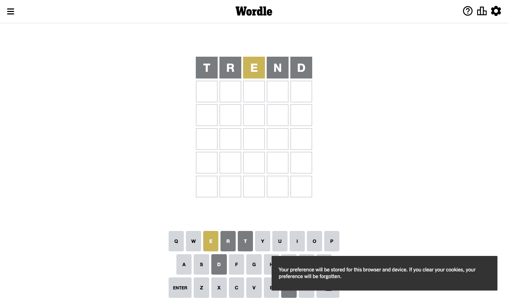
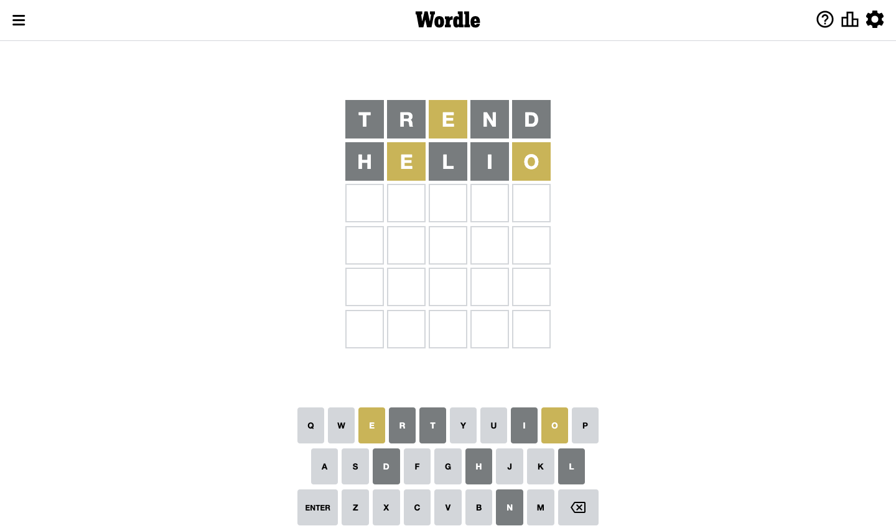
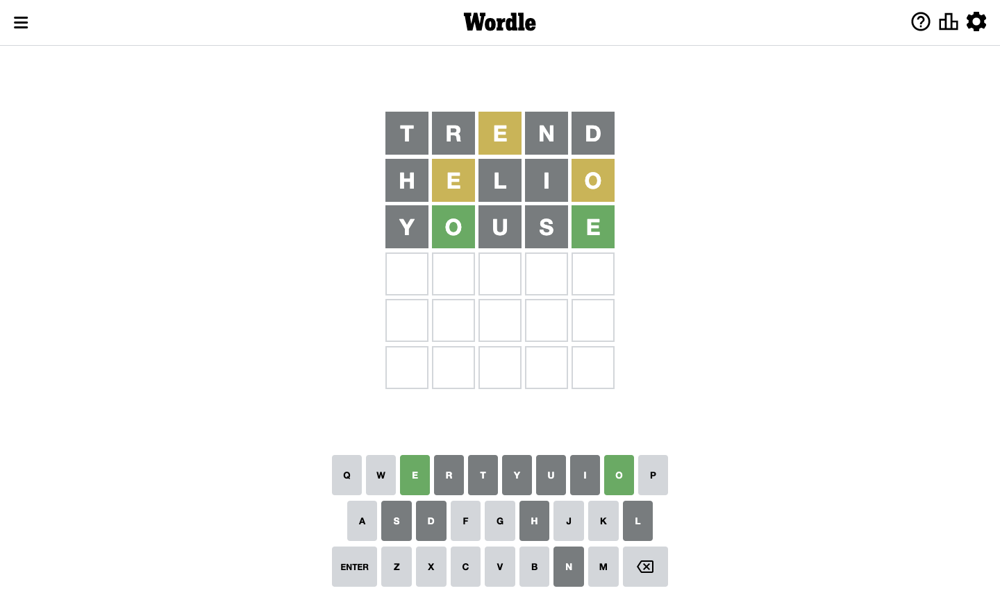
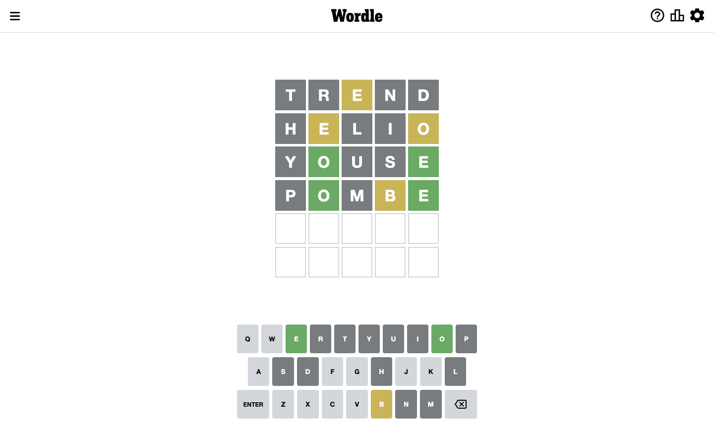
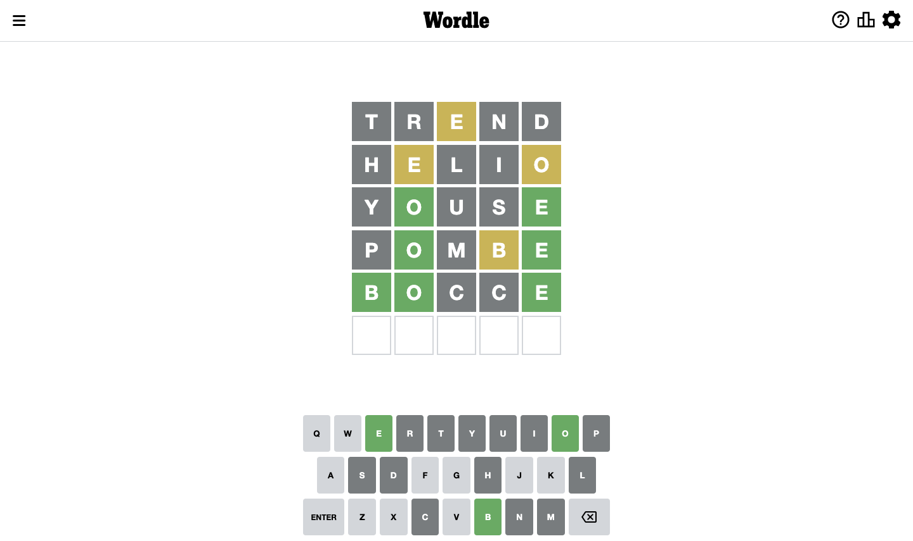
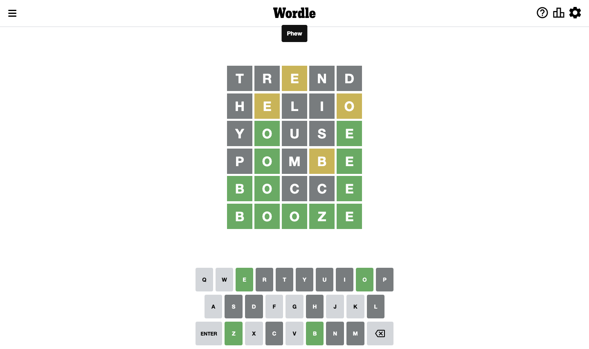

# Wordle for September 12, 2022

## Attempt 1

Right now we have 8497 words to choose from

Right now we know that possible letters are:

At position 1: `[a b c d e f g h i j k l m n o p q r s t u v w x y z]`

At position 2: `[a b c d e f g h i j k l m n o p q r s t u v w x y z]`

At position 3: `[a b c d e f g h i j k l m n o p q r s t u v w x y z]`

At position 4: `[a b c d e f g h i j k l m n o p q r s t u v w x y z]`

At position 5: `[a b c d e f g h i j k l m n o p q r s t u v w x y z]`

Trying word `trend`

Analyzing results for word `trend`

Letter `t` is not present in the word. We will not use it any more

Letter `r` is not present in the word. We will not use it any more

Letter `e` is on a different spot. This means that it cannot be at position 3

Letter `n` is not present in the word. We will not use it any more

Letter `d` is not present in the word. We will not use it any more

## Attempt 2

Right now we have 2135 words to choose from

Right now we know that possible letters are:

At position 1: `[a b c e f g h i j k l m o p q s u v w x y z]`

At position 2: `[a b c e f g h i j k l m o p q s u v w x y z]`

At position 3: `[a b c f g h i j k l m o p q s u v w x y z]`

At position 4: `[a b c e f g h i j k l m o p q s u v w x y z]`

At position 5: `[a b c e f g h i j k l m o p q s u v w x y z]`

Trying word `helio`

Analyzing results for word `helio`

Letter `h` is not present in the word. We will not use it any more

Letter `e` is on a different spot. This means that it cannot be at position 2

Letter `l` is not present in the word. We will not use it any more

Letter `i` is not present in the word. We will not use it any more

Letter `o` is on a different spot. This means that it cannot be at position 5

## Attempt 3

Right now we have 503 words to choose from

Right now we know that possible letters are:

At position 1: `[a b c e f g j k m o p q s u v w x y z]`

At position 2: `[a b c f g j k m o p q s u v w x y z]`

At position 3: `[a b c f g j k m o p q s u v w x y z]`

At position 4: `[a b c e f g j k m o p q s u v w x y z]`

At position 5: `[a b c e f g j k m p q s u v w x y z]`

Trying word `youse`

Analyzing results for word `youse`

Letter `y` is not present in the word. We will not use it any more

Now we know that letter `o` should be at position 2

Letter `u` is not present in the word. We will not use it any more

Letter `s` is not present in the word. We will not use it any more

Now we know that letter `e` should be at position 5

## Attempt 4

Right now we have 10 words to choose from

Right now we know that possible letters are:

At position 1: `[a b c e f g j k m o p q v w x z]`

At position 2: `[o]`

At position 3: `[a b c f g j k m o p q v w x z]`

At position 4: `[a b c e f g j k m o p q v w x z]`

At position 5: `[e]`

Trying word `pombe`

Analyzing results for word `pombe`

Letter `p` is not present in the word. We will not use it any more

Letter `m` is not present in the word. We will not use it any more

Letter `b` is on a different spot. This means that it cannot be at position 4

## Attempt 5

Right now we have 5 words to choose from

These words are: `[bocce booze bozze cooee goave]`

Right now we know that possible letters are:

At position 1: `[a b c e f g j k o q v w x z]`

At position 2: `[o]`

At position 3: `[a b c f g j k o q v w x z]`

At position 4: `[a c e f g j k o q v w x z]`

At position 5: `[e]`

Trying word `bocce`

Analyzing results for word `bocce`

Now we know that letter `b` should be at position 1

Letter `c` is not present in the word. We will not use it any more

Letter `c` is not present in the word. We will not use it any more

## Attempt 6

Right now we have 2 words to choose from

These words are: `[booze bozze]`

Right now we know that possible letters are:

At position 1: `[b]`

At position 2: `[o]`

At position 3: `[a b f g j k o q v w x z]`

At position 4: `[a e f g j k o q v w x z]`

At position 5: `[e]`

Trying word `booze`

Analyzing results for word `booze`

Now we know that letter `o` should be at position 3

Now we know that letter `z` should be at position 4

## Conclusion

Today's word is `booze` and it took 6 attempts to guess it

