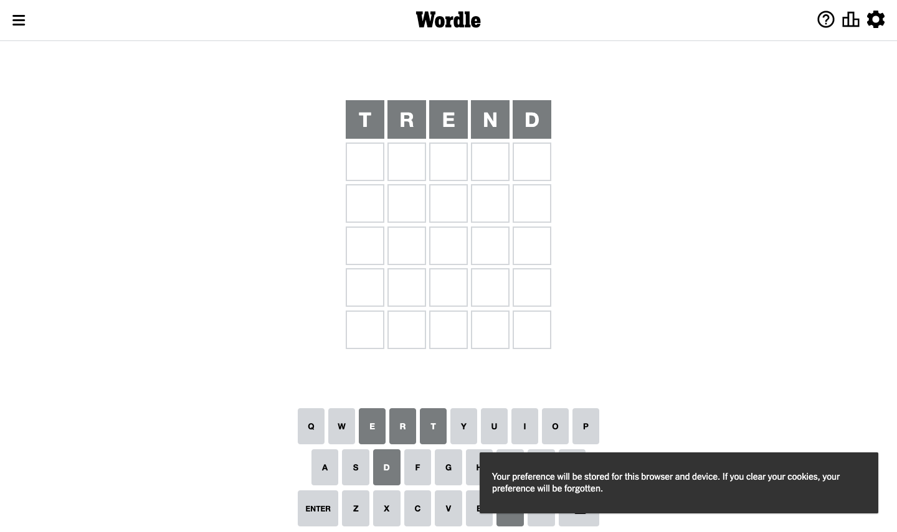
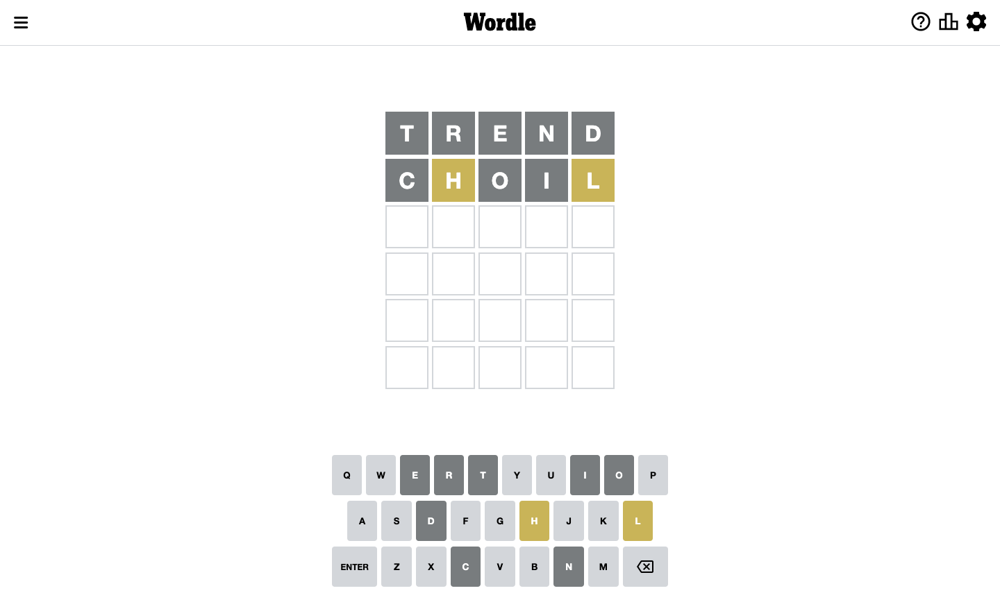
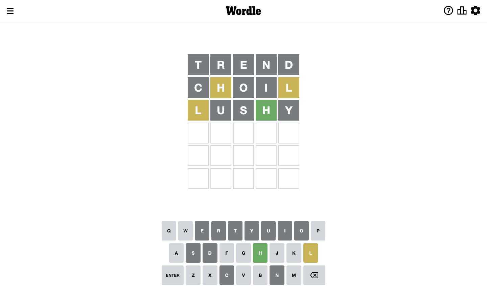
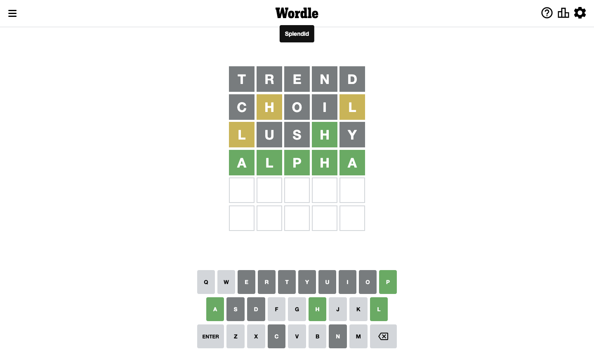

# Wordle for September 13, 2022

## Attempt 1

Right now we have 8497 words to choose from

So far we know that possible letters are:

At position 1: `[a b c d e f g h i j k l m n o p q r s t u v w x y z]`

At position 2: `[a b c d e f g h i j k l m n o p q r s t u v w x y z]`

At position 3: `[a b c d e f g h i j k l m n o p q r s t u v w x y z]`

At position 4: `[a b c d e f g h i j k l m n o p q r s t u v w x y z]`

At position 5: `[a b c d e f g h i j k l m n o p q r s t u v w x y z]`

Trying word `trend`

Analyzing results for word `trend`

Letter `t` is not present in the word. We will not use it any more

Letter `r` is not present in the word. We will not use it any more

Letter `e` is not present in the word. We will not use it any more

Letter `n` is not present in the word. We will not use it any more

Letter `d` is not present in the word. We will not use it any more

## Attempt 2

Right now we have 1410 words to choose from

So far we know that possible letters are:

At position 1: `[a b c f g h i j k l m o p q s u v w x y z]`

At position 2: `[a b c f g h i j k l m o p q s u v w x y z]`

At position 3: `[a b c f g h i j k l m o p q s u v w x y z]`

At position 4: `[a b c f g h i j k l m o p q s u v w x y z]`

At position 5: `[a b c f g h i j k l m o p q s u v w x y z]`

Trying word `choil`

Analyzing results for word `choil`

Letter `c` is not present in the word. We will not use it any more

Letter `h` is on a different spot. This means that it cannot be at position 2

Letter `o` is not present in the word. We will not use it any more

Letter `i` is not present in the word. We will not use it any more

Letter `l` is on a different spot. This means that it cannot be at position 5

## Attempt 3

Right now we have 362 words to choose from

So far we know that possible letters are:

At position 1: `[a b f g h j k l m p q s u v w x y z]`

At position 2: `[a b f g j k l m p q s u v w x y z]`

At position 3: `[a b f g h j k l m p q s u v w x y z]`

At position 4: `[a b f g h j k l m p q s u v w x y z]`

At position 5: `[a b f g h j k m p q s u v w x y z]`

Trying word `lushy`

Analyzing results for word `lushy`

Letter `l` is on a different spot. This means that it cannot be at position 1

Letter `u` is not present in the word. We will not use it any more

Letter `s` is not present in the word. We will not use it any more

Now we know that letter `h` should be at position 4

Letter `y` is not present in the word. We will not use it any more

## Attempt 4

Right now we have 1 words to choose from

These words are: `[alpha]`

So far we know that possible letters are:

At position 1: `[a b f g h j k m p q v w x z]`

At position 2: `[a b f g j k l m p q v w x z]`

At position 3: `[a b f g h j k l m p q v w x z]`

At position 4: `[h]`

At position 5: `[a b f g h j k m p q v w x z]`

Trying word `alpha`

Analyzing results for word `alpha`

Now we know that letter `a` should be at position 1

Now we know that letter `l` should be at position 2

Now we know that letter `p` should be at position 3

Now we know that letter `a` should be at position 5

## Conclusion

Today's word is `alpha` and it took 4 attempts to guess it

