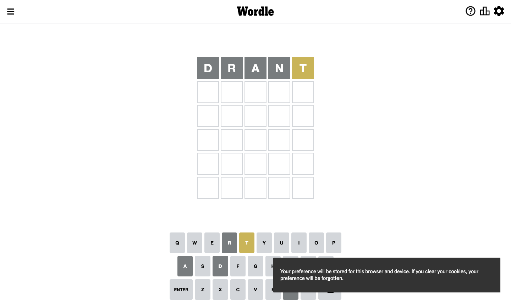
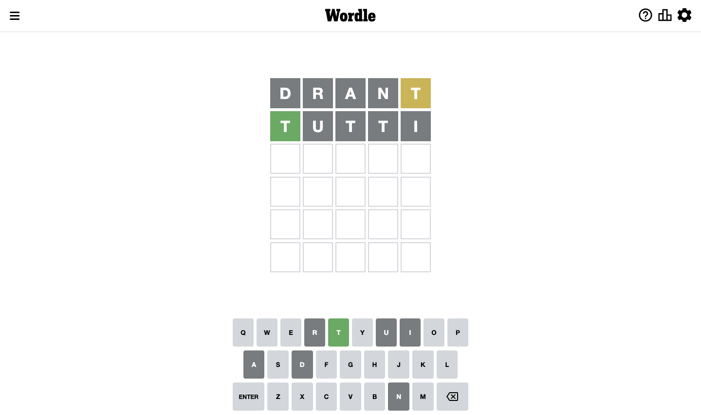
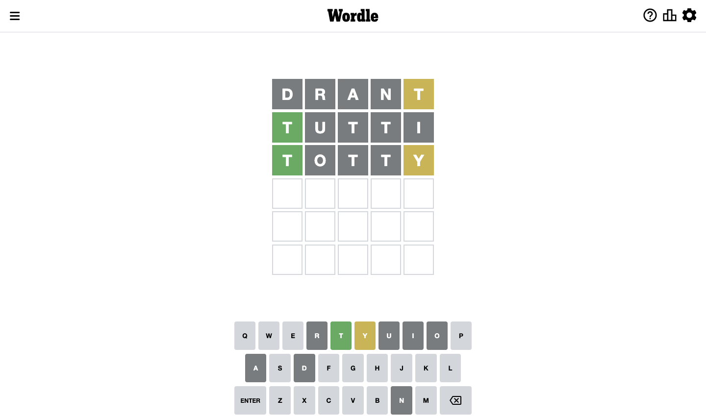
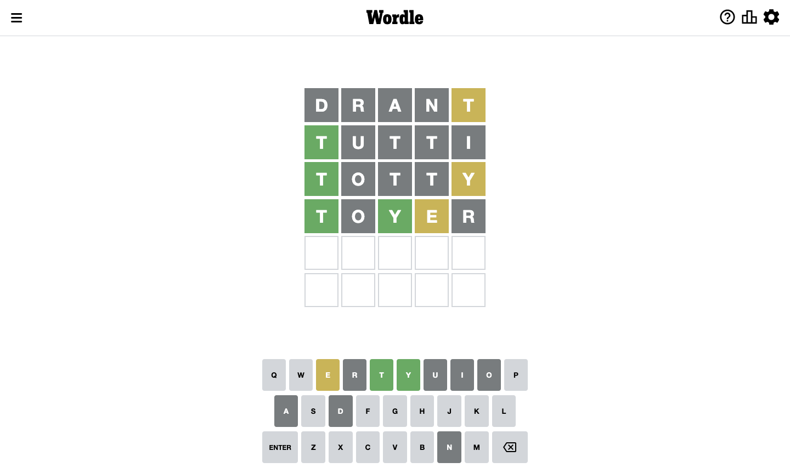
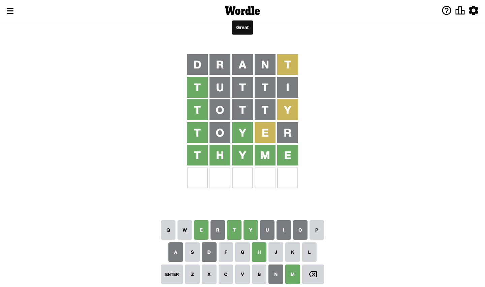

# Wordle for September 14, 2022

## Attempt 1

Right now we have 8497 words to choose from

So far we know that possible letters are:

At position 1: `[a b c d e f g h i j k l m n o p q r s t u v w x y z]`

At position 2: `[a b c d e f g h i j k l m n o p q r s t u v w x y z]`

At position 3: `[a b c d e f g h i j k l m n o p q r s t u v w x y z]`

At position 4: `[a b c d e f g h i j k l m n o p q r s t u v w x y z]`

At position 5: `[a b c d e f g h i j k l m n o p q r s t u v w x y z]`

Let's start with word `drant`

Analyzing results for word `drant`

Letter `d` is not present in the word. We will not use it any more

Letter `r` is not present in the word. We will not use it any more

Letter `a` is not present in the word. We will not use it any more

Letter `n` is not present in the word. We will not use it any more

Letter `t` is on a different spot. This means that it cannot be at position 5

Some letters are missing (like `d`, `r`, `a`, `n`) but it's also important piece of information

## Attempt 2

Right now we have 3438 words to choose from

So far we know that possible letters are:

At position 1: `[b c d e f g h i j k l m o p q s t u v w x y z]`

At position 2: `[b c e f g h i j k l m o p q r s t u v w x y z]`

At position 3: `[a b c e f g h i j k l m o p q s t u v w x y z]`

At position 4: `[b c e f g h i j k l m n o p q s t u v w x y z]`

At position 5: `[a b c d e f g h i j k l m n o p q r s u v w x y z]`

Next guess is `tutti`, that seems to be the best candidate so far

Analyzing results for word `tutti`

Now we know that letter `t` should be at position 1

Letter `u` is not present in the word. We will not use it any more

Letter `t` is not present in the word. We will not use it any more

Letter `t` is not present in the word. We will not use it any more

Letter `i` is not present in the word. We will not use it any more

We got information about the correct letters and it should make next attempt easier

Some letters are missing (like `u`, `t`, `t`, `i`) but it's also important piece of information

## Attempt 3

Right now we have 150 words to choose from

So far we know that possible letters are:

At position 1: `[t]`

At position 2: `[b c e f g h j k l m o p q r s u v w x y z]`

At position 3: `[a b c e f g h j k l m o p q s t v w x y z]`

At position 4: `[b c e f g h j k l m n o p q s t v w x y z]`

At position 5: `[a b c d e f g h i j k l m n o p q r s v w x y z]`

Next guess is `totty`, that seems to be the best candidate so far

Analyzing results for word `totty`

Letter `o` is not present in the word. We will not use it any more

Letter `t` is not present in the word. We will not use it any more

Letter `t` is not present in the word. We will not use it any more

Letter `y` is on a different spot. This means that it cannot be at position 5

Some letters are missing (like `o`, `t`, `t`) but it's also important piece of information

## Attempt 4

Right now we have 91 words to choose from

So far we know that possible letters are:

At position 1: `[t]`

At position 2: `[b c e f g h j k l m o p q r s u v w x y z]`

At position 3: `[a b c e f g h j k l m p q s t v w x y z]`

At position 4: `[b c e f g h j k l m n p q s t v w x y z]`

At position 5: `[a b c d e f g h i j k l m n o p q r s v w x z]`

Next guess is `tyste`, that seems to be the best candidate so far

Wordle does not know word `tyste`, need to try something different

## Attempt 4

Right now we have 90 words to choose from

So far we know that possible letters are:

At position 1: `[t]`

At position 2: `[b c e f g h j k l m o p q r s u v w x y z]`

At position 3: `[a b c e f g h j k l m p q s t v w x y z]`

At position 4: `[b c e f g h j k l m n p q s t v w x y z]`

At position 5: `[a b c d e f g h i j k l m n o p q r s v w x z]`

Next guess is `telyn`, that seems to be the best candidate so far

Wordle does not know word `telyn`, need to try something different

## Attempt 4

Right now we have 89 words to choose from

So far we know that possible letters are:

At position 1: `[t]`

At position 2: `[b c e f g h j k l m o p q r s u v w x y z]`

At position 3: `[a b c e f g h j k l m p q s t v w x y z]`

At position 4: `[b c e f g h j k l m n p q s t v w x y z]`

At position 5: `[a b c d e f g h i j k l m n o p q r s v w x z]`

Next guess is `thatn`, that seems to be the best candidate so far

Wordle does not know word `thatn`, need to try something different

## Attempt 4

Right now we have 88 words to choose from

So far we know that possible letters are:

At position 1: `[t]`

At position 2: `[b c e f g h j k l m o p q r s u v w x y z]`

At position 3: `[a b c e f g h j k l m p q s t v w x y z]`

At position 4: `[b c e f g h j k l m n p q s t v w x y z]`

At position 5: `[a b c d e f g h i j k l m n o p q r s v w x z]`

Next guess is `toyer`, that seems to be the best candidate so far

Analyzing results for word `toyer`

Letter `o` is not present in the word. We will not use it any more

Now we know that letter `y` should be at position 3

Letter `e` is on a different spot. This means that it cannot be at position 4

Letter `r` is not present in the word. We will not use it any more

We got information about the correct letters and it should make next attempt easier

Some letters are missing (like `o`, `r`) but it's also important piece of information

## Attempt 5

Right now we have 1 words to choose from

These words are: `[thyme]`

So far we know that possible letters are:

At position 1: `[t]`

At position 2: `[b c e f g h j k l m o p q s u v w x y z]`

At position 3: `[y]`

At position 4: `[b c f g h j k l m n p q s t v w x y z]`

At position 5: `[a b c d e f g h i j k l m n p q r s v w x z]`

Next guess is `thyme`, that seems to be the best candidate so far

That's the correct answer! The word is `thyme`!

## Conclusion

Today's word is `thyme` and it took 5 attempts to guess it

