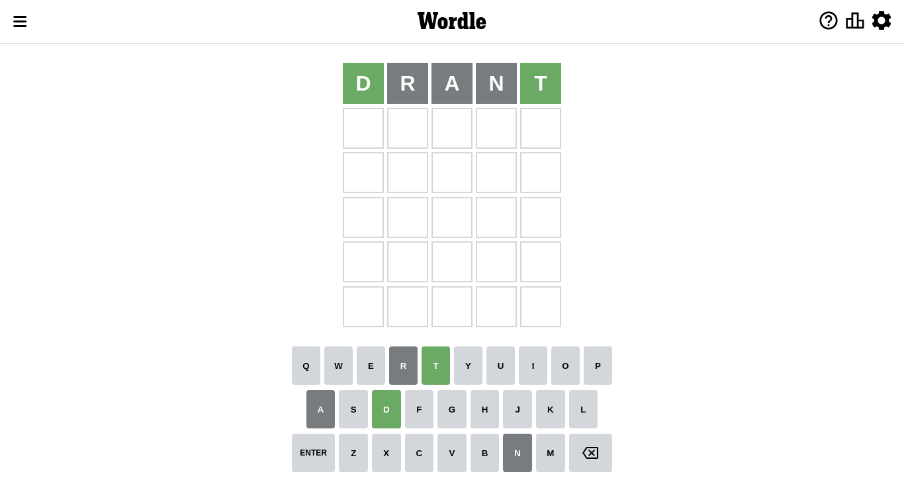
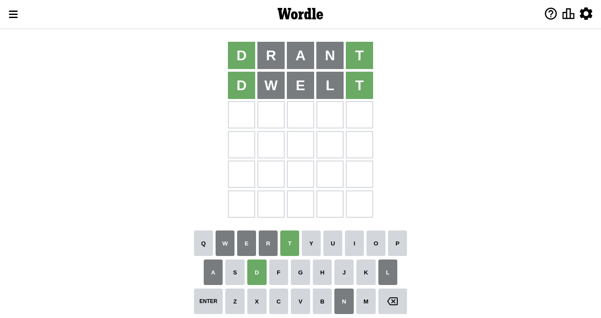
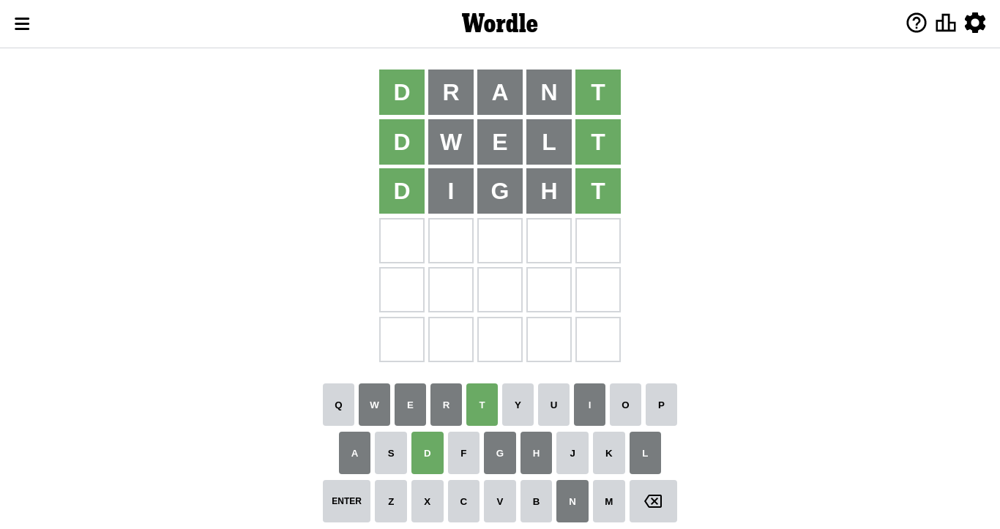
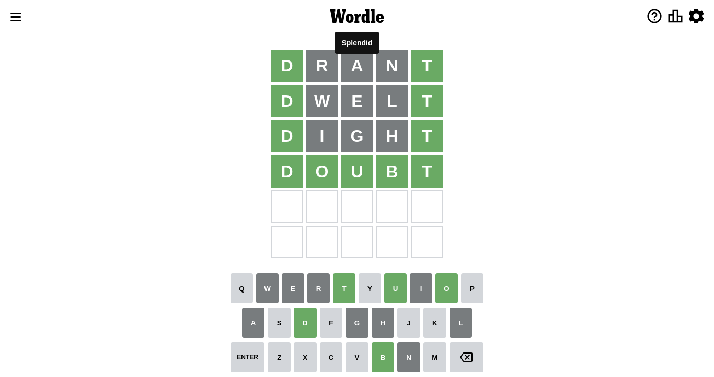

# Wordle for September 15, 2022

## Attempt 1

Right now we have 8497 words to choose from

So far we know that possible letters are:

At position 1: `[a b c d e f g h i j k l m n o p q r s t u v w x y z]`

At position 2: `[a b c d e f g h i j k l m n o p q r s t u v w x y z]`

At position 3: `[a b c d e f g h i j k l m n o p q r s t u v w x y z]`

At position 4: `[a b c d e f g h i j k l m n o p q r s t u v w x y z]`

At position 5: `[a b c d e f g h i j k l m n o p q r s t u v w x y z]`

Let's start with word `drant`

Analyzing results for word `drant`

Now we know that letter `d` should be at position 1

Letter `r` is not present in the word. We will not use it any more

Letter `a` is not present in the word. We will not use it any more

Letter `n` is not present in the word. We will not use it any more

Now we know that letter `t` should be at position 5

We got information about the correct letters and it should make next attempt easier

Some letters are missing (like `r`, `a`, `n`) but it's also important piece of information

## Attempt 2

Right now we have 19 words to choose from

So far we know that possible letters are:

At position 1: `[d]`

At position 2: `[b c d e f g h i j k l m o p q s t u v w x y z]`

At position 3: `[b c d e f g h i j k l m o p q s t u v w x y z]`

At position 4: `[b c d e f g h i j k l m o p q s t u v w x y z]`

At position 5: `[t]`

Next guess is `dwelt`, that seems to be the best candidate so far

Analyzing results for word `dwelt`

Letter `w` is not present in the word. We will not use it any more

Letter `e` is not present in the word. We will not use it any more

Letter `l` is not present in the word. We will not use it any more

Some letters are missing (like `w`, `e`, `l`) but it's also important piece of information

## Attempt 3

Right now we have 10 words to choose from

So far we know that possible letters are:

At position 1: `[d]`

At position 2: `[b c d f g h i j k m o p q s t u v x y z]`

At position 3: `[b c d f g h i j k m o p q s t u v x y z]`

At position 4: `[b c d f g h i j k m o p q s t u v x y z]`

At position 5: `[t]`

Next guess is `dight`, that seems to be the best candidate so far

Analyzing results for word `dight`

Letter `i` is not present in the word. We will not use it any more

Letter `g` is not present in the word. We will not use it any more

Letter `h` is not present in the word. We will not use it any more

Some letters are missing (like `i`, `g`, `h`) but it's also important piece of information

## Attempt 4

Right now we have 2 words to choose from

These words are: `[dompt doubt]`

So far we know that possible letters are:

At position 1: `[d]`

At position 2: `[b c d f j k m o p q s t u v x y z]`

At position 3: `[b c d f j k m o p q s t u v x y z]`

At position 4: `[b c d f j k m o p q s t u v x y z]`

At position 5: `[t]`

Next guess is `doubt`, that seems to be the best candidate so far

That's the correct answer! The word is `doubt`!

## Conclusion

Today's word is `doubt` and it took 4 attempts to guess it

