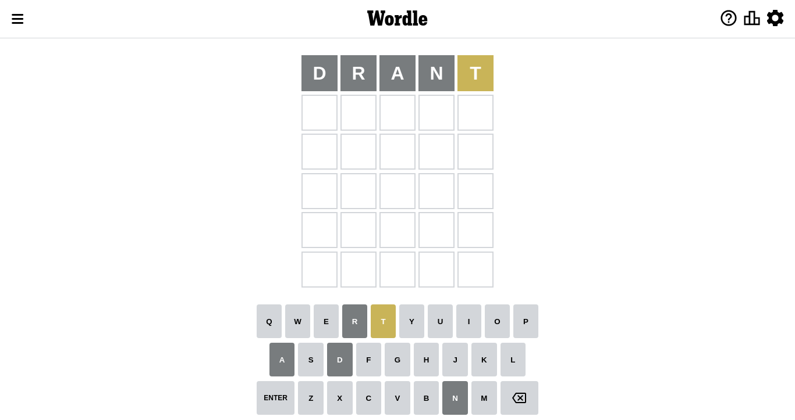
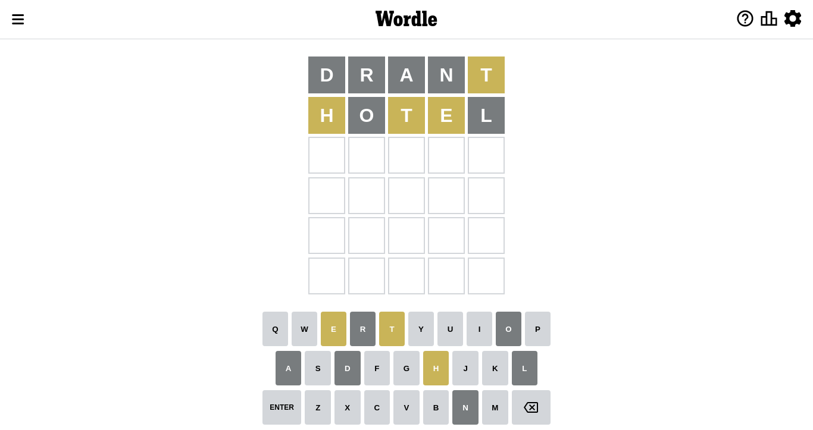
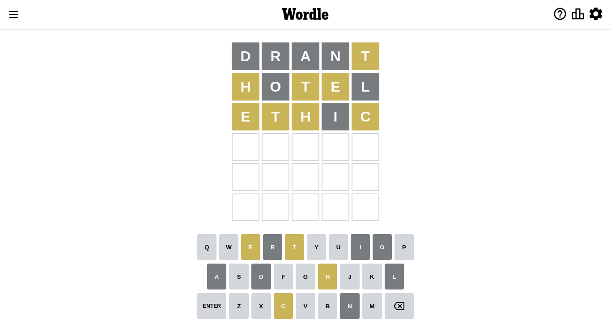
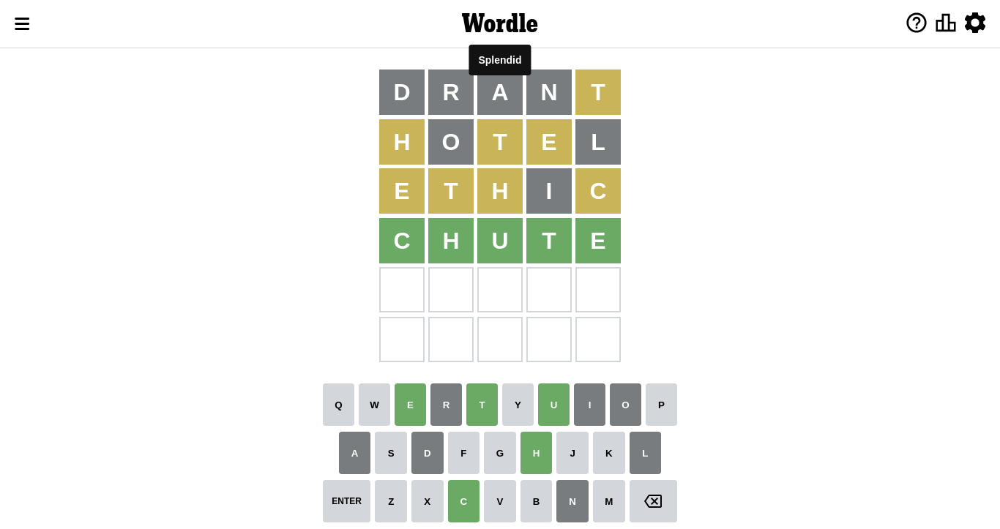

# Wordle for September 17, 2022

## Attempt 1

Right now we have 8497 words to choose from

So far we know that possible letters are:

At position 1: `[a b c d e f g h i j k l m n o p q r s t u v w x y z]`

At position 2: `[a b c d e f g h i j k l m n o p q r s t u v w x y z]`

At position 3: `[a b c d e f g h i j k l m n o p q r s t u v w x y z]`

At position 4: `[a b c d e f g h i j k l m n o p q r s t u v w x y z]`

At position 5: `[a b c d e f g h i j k l m n o p q r s t u v w x y z]`

Let's start with word `drant`

Analyzing results for word `drant`

Letter `d` is not present in the word. We will not use it any more

Letter `r` is not present in the word. We will not use it any more

Letter `a` is not present in the word. We will not use it any more

Letter `n` is not present in the word. We will not use it any more

Letter `t` is on a different spot. This means that it cannot be at position 5

Some letters are missing (like `d`, `r`, `a`, `n`) but it's also important piece of information

## Attempt 2

Right now we have 1583 words to choose from

So far we know that possible letters are:

At position 1: `[b c e f g h i j k l m o p q s t u v w x y z]`

At position 2: `[b c e f g h i j k l m o p q s t u v w x y z]`

At position 3: `[b c e f g h i j k l m o p q s t u v w x y z]`

At position 4: `[b c e f g h i j k l m o p q s t u v w x y z]`

At position 5: `[b c e f g h i j k l m o p q s u v w x y z]`

Next guess is `hotel`, that seems to be the best candidate so far

Analyzing results for word `hotel`

Letter `h` is on a different spot. This means that it cannot be at position 1

Letter `o` is not present in the word. We will not use it any more

Letter `t` is on a different spot. This means that it cannot be at position 3

Letter `e` is on a different spot. This means that it cannot be at position 4

Letter `l` is not present in the word. We will not use it any more

Some letters are missing (like `o`, `l`) but it's also important piece of information

## Attempt 3

Right now we have 412 words to choose from

So far we know that possible letters are:

At position 1: `[b c e f g i j k m p q s t u v w x y z]`

At position 2: `[b c e f g h i j k m p q s t u v w x y z]`

At position 3: `[b c e f g h i j k m p q s u v w x y z]`

At position 4: `[b c f g h i j k m p q s t u v w x y z]`

At position 5: `[b c e f g h i j k m p q s u v w x y z]`

Next guess is `ethic`, that seems to be the best candidate so far

Analyzing results for word `ethic`

Letter `e` is on a different spot. This means that it cannot be at position 1

Letter `t` is on a different spot. This means that it cannot be at position 2

Letter `h` is on a different spot. This means that it cannot be at position 3

Letter `i` is not present in the word. We will not use it any more

Letter `c` is on a different spot. This means that it cannot be at position 5

Some letters are missing (like `i`) but it's also important piece of information

## Attempt 4

Right now we have 182 words to choose from

So far we know that possible letters are:

At position 1: `[b c f g j k m p q s t u v w x y z]`

At position 2: `[b c e f g h j k m p q s u v w x y z]`

At position 3: `[b c e f g j k m p q s u v w x y z]`

At position 4: `[b c f g h j k m p q s t u v w x y z]`

At position 5: `[b e f g h j k m p q s u v w x y z]`

Next guess is `chute`, that seems to be the best candidate so far

That's the correct answer! The word is `chute`!

## Conclusion

Today's word is `chute` and it took 4 attempts to guess it

