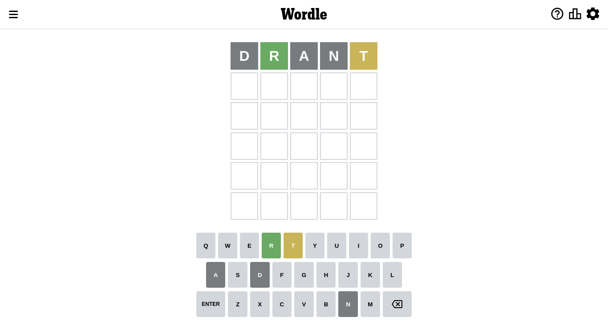
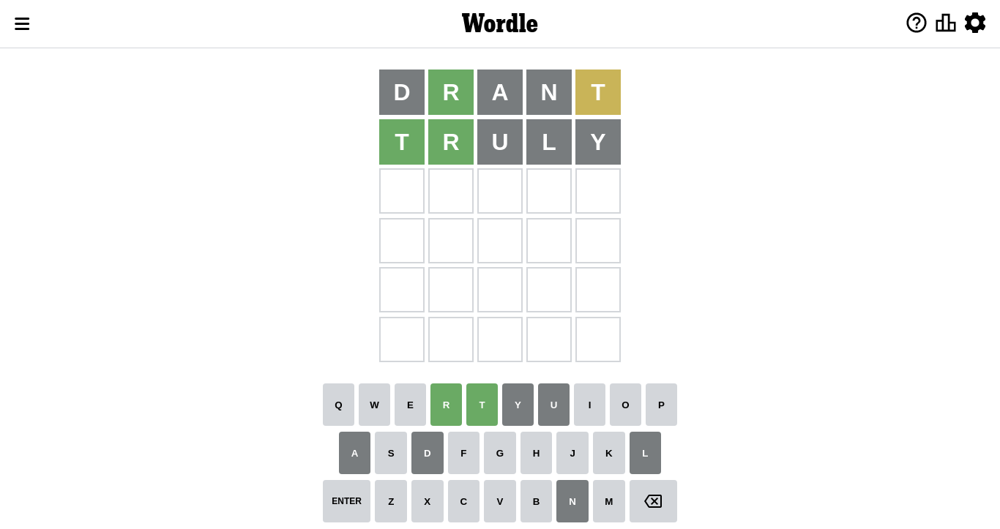
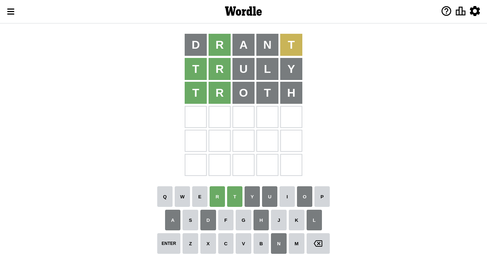
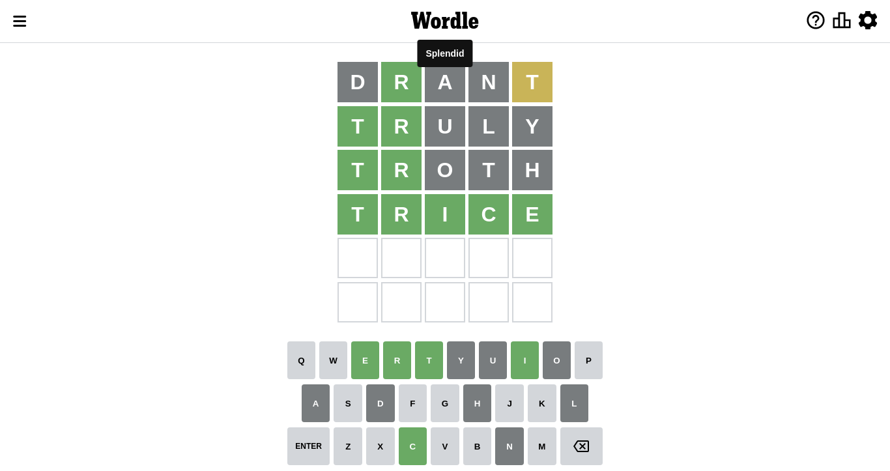

# Wordle for September 19, 2022 - \#457

## Attempt 1

Right now we have 8497 words to choose from

So far we know that possible letters are:

At position 1: `[a b c d e f g h i j k l m n o p q r s t u v w x y z]`

At position 2: `[a b c d e f g h i j k l m n o p q r s t u v w x y z]`

At position 3: `[a b c d e f g h i j k l m n o p q r s t u v w x y z]`

At position 4: `[a b c d e f g h i j k l m n o p q r s t u v w x y z]`

At position 5: `[a b c d e f g h i j k l m n o p q r s t u v w x y z]`

Let's start with word `drant`

Analyzing results for word `drant`

Letter `d` is not present in the word. We will not use it any more

Now we know that letter `r` should be at position 2

Letter `a` is not present in the word. We will not use it any more

Letter `n` is not present in the word. We will not use it any more

Letter `t` is on a different spot. This means that it cannot be at position 5

We got information about the correct letters and it should make next attempt easier

Some letters are missing (like `d`, `a`, `n`) but it's also important piece of information

## Attempt 2

Right now we have 227 words to choose from

So far we know that possible letters are:

At position 1: `[b c e f g h i j k l m o p q r s t u v w x y z]`

At position 2: `[r]`

At position 3: `[b c e f g h i j k l m o p q r s t u v w x y z]`

At position 4: `[b c e f g h i j k l m o p q r s t u v w x y z]`

At position 5: `[b c e f g h i j k l m o p q r s u v w x y z]`

Next guess is `truly`, that seems to be the best candidate so far

Analyzing results for word `truly`

Now we know that letter `t` should be at position 1

Letter `u` is not present in the word. We will not use it any more

Letter `l` is not present in the word. We will not use it any more

Letter `y` is not present in the word. We will not use it any more

We got information about the correct letters and it should make next attempt easier

Some letters are missing (like `u`, `l`, `y`) but it's also important piece of information

## Attempt 3

Right now we have 19 words to choose from

So far we know that possible letters are:

At position 1: `[t]`

At position 2: `[r]`

At position 3: `[b c e f g h i j k m o p q r s t v w x z]`

At position 4: `[b c e f g h i j k m o p q r s t v w x z]`

At position 5: `[b c e f g h i j k m o p q r s v w x z]`

Next guess is `troth`, that seems to be the best candidate so far

Analyzing results for word `troth`

Letter `o` is not present in the word. We will not use it any more

Letter `t` is not present in the word. We will not use it any more

Letter `h` is not present in the word. We will not use it any more

Some letters are missing (like `o`, `t`, `h`) but it's also important piece of information

## Attempt 4

Right now we have 8 words to choose from

These words are: `[tress trews tribe trice trick trier trike tripe]`

So far we know that possible letters are:

At position 1: `[t]`

At position 2: `[r]`

At position 3: `[b c e f g i j k m p q r s v w x z]`

At position 4: `[b c e f g i j k m p q r s v w x z]`

At position 5: `[b c e f g i j k m p q r s v w x z]`

Next guess is `trice`, that seems to be the best candidate so far

That's the correct answer! The word is `trice`!

## Conclusion

Today's word is `trice` and it took 4 attempts to guess it

