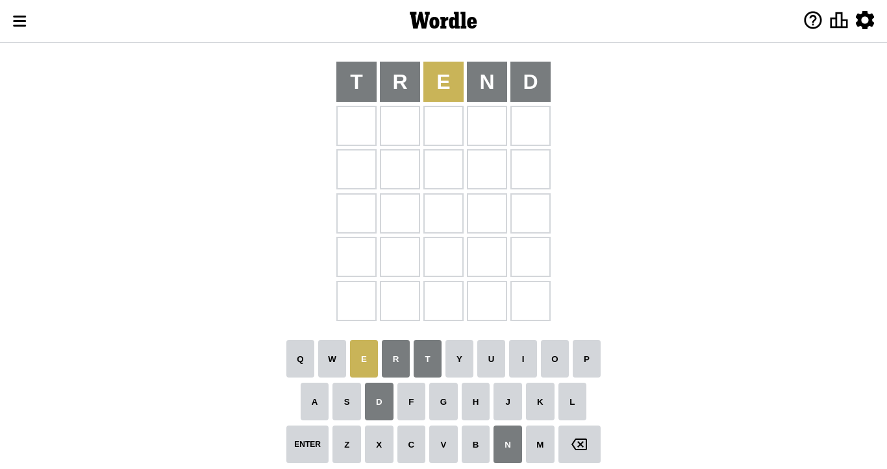
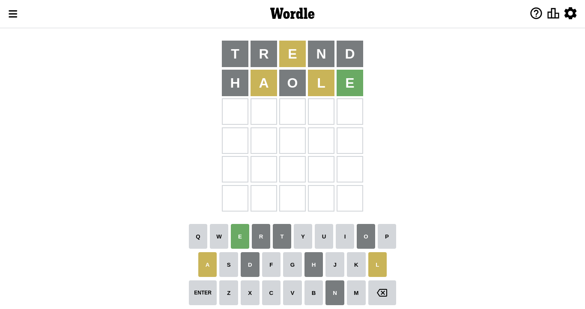
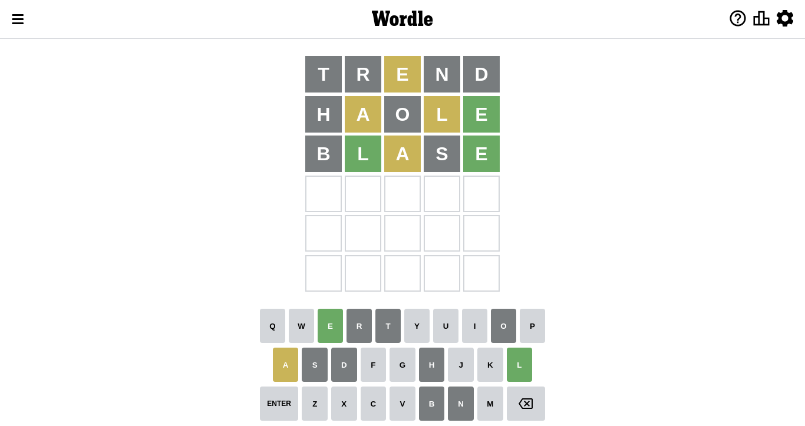
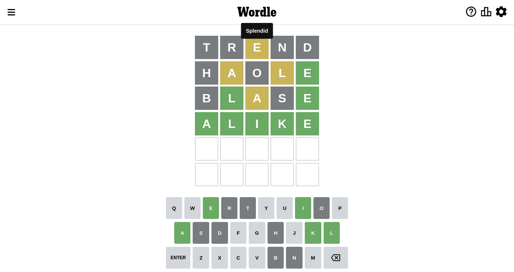

# Wordle for September 20, 2022

## Attempt 1

Right now we have 8497 words to choose from and best of them seem to be `[trend lenth alert alter artel]`

So far we know that possible letters are:

At position 1: `[a b c d e f g h i j k l m n o p q r s t u v w x y z]`

At position 2: `[a b c d e f g h i j k l m n o p q r s t u v w x y z]`

At position 3: `[a b c d e f g h i j k l m n o p q r s t u v w x y z]`

At position 4: `[a b c d e f g h i j k l m n o p q r s t u v w x y z]`

At position 5: `[a b c d e f g h i j k l m n o p q r s t u v w x y z]`

Let's start with word `trend`

Attempt for `trend` gives us 0 correct letters, 1 present letters and 4 wrong letters.

If we look into details, we can see that:

Letter `t` is not present in the word and we will not use it any more

Letter `r` is not present in the word and we will not use it any more

Letter `e` is on a different spot - this means that it cannot be at position 3

Letter `n` is not present in the word and we will not use it any more

Letter `d` is not present in the word and we will not use it any more

Some letters are missing (like `t`, `r`, `n`, `d`) but it's also important piece of information

Word should contain letters `[e]`

Could be a better guess

## Attempt 2

Right now we have 2135 words to choose from and best of them seem to be `[haole halse leash selah shale]`

So far we know that possible letters are:

At position 1: `[a b c e f g h i j k l m o p q s u v w x y z]`

At position 2: `[a b c e f g h i j k l m o p q s u v w x y z]`

At position 3: `[a b c f g h i j k l m o p q s u v w x y z]`

At position 4: `[a b c e f g h i j k l m o p q s u v w x y z]`

At position 5: `[a b c e f g h i j k l m o p q s u v w x y z]`

Next guess is `haole`, let's see what it gives us

Attempt for `haole` gives us 1 correct letters, 2 present letters and 2 wrong letters.

If we look into details, we can see that:

Letter `h` is not present in the word and we will not use it any more

Letter `a` is on a different spot - this means that it cannot be at position 2

Letter `o` is not present in the word and we will not use it any more

Letter `l` is on a different spot - this means that it cannot be at position 4

Letter `e` should be at position 5

We got information about the correct letters and it should make next attempt easier

Some letters are missing (like `h`, `o`) but it's also important piece of information

Word should contain letters `[e a l]`

That was a great guess that limited number of remaining words

## Attempt 3

Right now we have 139 words to choose from and best of them seem to be `[slape blase alike slake alive]`

So far we know that possible letters are:

At position 1: `[a b c e f g i j k l m p q s u v w x y z]`

At position 2: `[b c e f g i j k l m p q s u v w x y z]`

At position 3: `[a b c f g i j k l m p q s u v w x y z]`

At position 4: `[a b c e f g i j k m p q s u v w x y z]`

At position 5: `[e]`

Next guess is `slape`, let's see what it gives us

Wordle does not know word `slape`, need to try something different

## Attempt 3

Right now we have 138 words to choose from and best of them seem to be `[blase alike slake alive gulae]`

So far we know that possible letters are:

At position 1: `[a b c e f g i j k l m p q s u v w x y z]`

At position 2: `[b c e f g i j k l m p q s u v w x y z]`

At position 3: `[a b c f g i j k l m p q s u v w x y z]`

At position 4: `[a b c e f g i j k m p q s u v w x y z]`

At position 5: `[e]`

Next guess is `blase`, let's see what it gives us

Attempt for `blase` gives us 2 correct letters, 1 present letters and 2 wrong letters.

If we look into details, we can see that:

Letter `b` is not present in the word and we will not use it any more

Letter `l` should be at position 2

Letter `a` is on a different spot - this means that it cannot be at position 3

Letter `s` is not present in the word and we will not use it any more

We got information about the correct letters and it should make next attempt easier

Some letters are missing (like `b`, `s`) but it's also important piece of information

Word should contain letters `[e a l]`

That was a great guess that limited number of remaining words

## Attempt 4

Right now we have 13 words to choose from and best of them seem to be `[alike alive algae clime glime]`

So far we know that possible letters are:

At position 1: `[a c e f g i j k l m p q u v w x y z]`

At position 2: `[l]`

At position 3: `[c f g i j k l m p q u v w x y z]`

At position 4: `[a c e f g i j k m p q u v w x y z]`

At position 5: `[e]`

Next guess is `alike`, let's see what it gives us

That's the correct answer! The word is `alike`!

To be honest that was a pretty lucky guess, but it worked out well.

## Conclusion

Today's word is `alike` and it took 4 attempts to guess it

