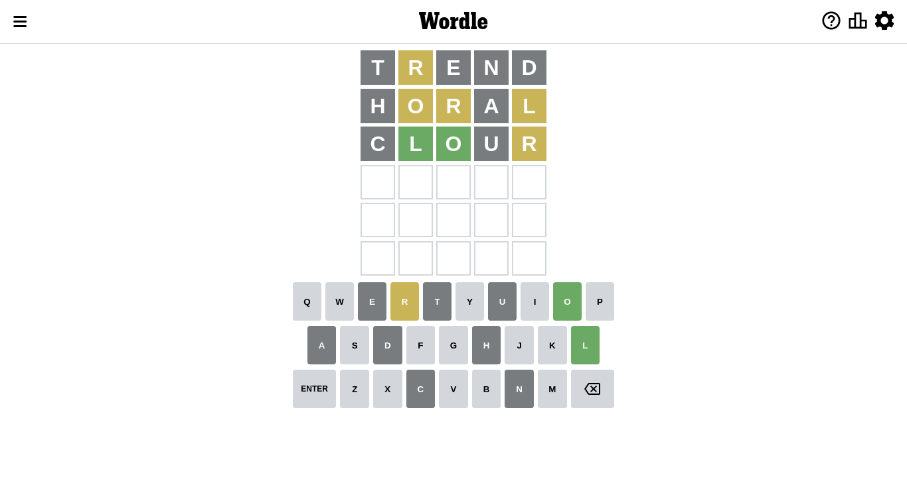
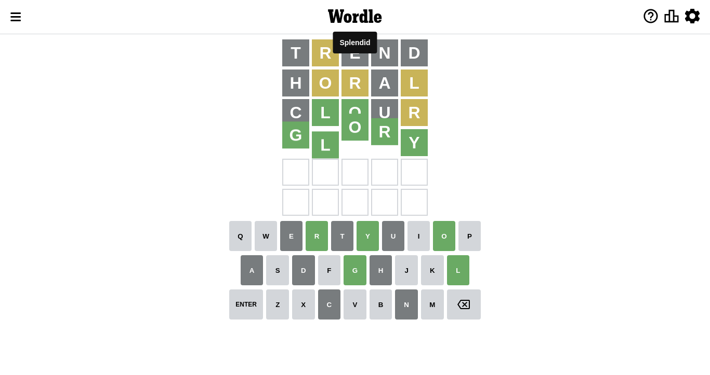

# Wordle for September 23, 2022 - \#461

## Attempt 1

Right now we have 8497 words to choose from and best of them seem to be `[trend lenth alert alter artel]`

So far we know that possible letters are:

At position 1: `[a b c d e f g h i j k l m n o p q r s t u v w x y z]`

At position 2: `[a b c d e f g h i j k l m n o p q r s t u v w x y z]`

At position 3: `[a b c d e f g h i j k l m n o p q r s t u v w x y z]`

At position 4: `[a b c d e f g h i j k l m n o p q r s t u v w x y z]`

At position 5: `[a b c d e f g h i j k l m n o p q r s t u v w x y z]`

Let's start with word `trend`

Attempt for `trend` gives us 0 correct letters, 1 present letters and 4 wrong letters.

If we look into details, we can see that:

Letter `t` is not present in the word and we will not use it any more

Letter `r` is on a different spot - this means that it cannot be at position 2

Letter `e` is not present in the word and we will not use it any more

Letter `n` is not present in the word and we will not use it any more

Letter `d` is not present in the word and we will not use it any more

Some letters are missing (like `t`, `e`, `n`, `d`) but it's also important piece of information

Word should contain letters `[r]`

Not a bad guess in general

## Attempt 2

Right now we have 1977 words to choose from and best of them seem to be `[horal larch ralph wharl shirl]`

So far we know that possible letters are:

At position 1: `[a b c f g h i j k l m o p q r s u v w x y z]`

At position 2: `[a b c f g h i j k l m o p q s u v w x y z]`

At position 3: `[a b c f g h i j k l m o p q r s u v w x y z]`

At position 4: `[a b c f g h i j k l m o p q r s u v w x y z]`

At position 5: `[a b c f g h i j k l m o p q r s u v w x y z]`

Next guess is `horal`, let's see what it gives us

Attempt for `horal` gives us 0 correct letters, 3 present letters and 2 wrong letters.

If we look into details, we can see that:

Letter `h` is not present in the word and we will not use it any more

Letter `o` is on a different spot - this means that it cannot be at position 2

Letter `r` is on a different spot - this means that it cannot be at position 3

Letter `a` is not present in the word and we will not use it any more

Letter `l` is on a different spot - this means that it cannot be at position 5

Some letters are missing (like `h`, `a`) but it's also important piece of information

Word should contain letters `[r o l]`

That was a great guess that limited number of remaining words

## Attempt 3

Right now we have 341 words to choose from and best of them seem to be `[slour slorp clour livor glory]`

So far we know that possible letters are:

At position 1: `[b c f g i j k l m o p q r s u v w x y z]`

At position 2: `[b c f g i j k l m p q s u v w x y z]`

At position 3: `[b c f g i j k l m o p q s u v w x y z]`

At position 4: `[b c f g i j k l m o p q r s u v w x y z]`

At position 5: `[b c f g i j k m o p q r s u v w x y z]`

Next guess is `slour`, let's see what it gives us

Wordle does not know word `slour`, need to try something different

## Attempt 3

Right now we have 340 words to choose from and best of them seem to be `[slorp clour livor glory flour]`

So far we know that possible letters are:

At position 1: `[b c f g i j k l m o p q r s u v w x y z]`

At position 2: `[b c f g i j k l m p q s u v w x y z]`

At position 3: `[b c f g i j k l m o p q s u v w x y z]`

At position 4: `[b c f g i j k l m o p q r s u v w x y z]`

At position 5: `[b c f g i j k m o p q r s u v w x y z]`

Next guess is `slorp`, let's see what it gives us

Wordle does not know word `slorp`, need to try something different

## Attempt 3

Right now we have 339 words to choose from and best of them seem to be `[clour livor glory flour fluor]`

So far we know that possible letters are:

At position 1: `[b c f g i j k l m o p q r s u v w x y z]`

At position 2: `[b c f g i j k l m p q s u v w x y z]`

At position 3: `[b c f g i j k l m o p q s u v w x y z]`

At position 4: `[b c f g i j k l m o p q r s u v w x y z]`

At position 5: `[b c f g i j k m o p q r s u v w x y z]`

Next guess is `clour`, let's see what it gives us

Attempt for `clour` gives us 2 correct letters, 1 present letters and 2 wrong letters.

If we look into details, we can see that:

Letter `c` is not present in the word and we will not use it any more

Letter `l` should be at position 2

Letter `o` should be at position 3

Letter `u` is not present in the word and we will not use it any more

Letter `r` is on a different spot - this means that it cannot be at position 5

We got information about the correct letters and it should make next attempt easier

Some letters are missing (like `c`, `u`) but it's also important piece of information

Word should contain letters `[r o l]`

That was a great guess that limited number of remaining words

## Attempt 4

Right now we have 18 words to choose from and best of them seem to be `[glory flory slopy klops globy]`

So far we know that possible letters are:

At position 1: `[b f g i j k l m o p q r s v w x y z]`

At position 2: `[l]`

At position 3: `[o]`

At position 4: `[b f g i j k l m o p q r s v w x y z]`

At position 5: `[b f g i j k m o p q s v w x y z]`

Next guess is `glory`, let's see what it gives us

That's the correct answer! The word is `glory`!

To be honest that was a pretty lucky guess, but it worked out well.

## Conclusion

Today's word is `glory` and it took 4 attempts to guess it

