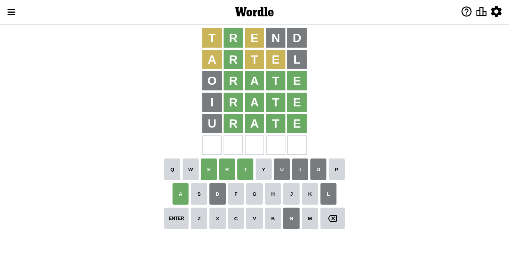

# Wordle for September 24, 2022 - \#462

## Attempt 1

Right now we have 8497 words to choose from and best of them seem to be `[trend lenth alert alter artel]`

So far we know that possible letters are:

At position 1: `[a b c d e f g h i j k l m n o p q r s t u v w x y z]`

At position 2: `[a b c d e f g h i j k l m n o p q r s t u v w x y z]`

At position 3: `[a b c d e f g h i j k l m n o p q r s t u v w x y z]`

At position 4: `[a b c d e f g h i j k l m n o p q r s t u v w x y z]`

At position 5: `[a b c d e f g h i j k l m n o p q r s t u v w x y z]`

Let's start with word `trend`

Attempt for `trend` gives us 1 correct letters, 2 present letters and 2 wrong letters.

If we look into details, we can see that:

Letter `t` is on a different spot - this means that it cannot be at position 1

Letter `r` should be at position 2

Letter `e` is on a different spot - this means that it cannot be at position 3

Letter `n` is not present in the word and we will not use it any more

Letter `d` is not present in the word and we will not use it any more

We got information about the correct letters and it should make next attempt easier

Some letters are missing (like `n`, `d`) but it's also important piece of information

Word should contain letters `[t r e]`

That was a great guess that limited number of remaining words

## Attempt 2

Right now we have 338 words to choose from and best of them seem to be `[artel orlet orate arite irate]`

So far we know that possible letters are:

At position 1: `[a b c e f g h i j k l m o p q r s u v w x y z]`

At position 2: `[r]`

At position 3: `[a b c f g h i j k l m o p q r s t u v w x y z]`

At position 4: `[a b c e f g h i j k l m o p q r s t u v w x y z]`

At position 5: `[a b c e f g h i j k l m o p q r s t u v w x y z]`

Next guess is `artel`, let's see what it gives us

Attempt for `artel` gives us 1 correct letters, 3 present letters and 1 wrong letters.

If we look into details, we can see that:

Letter `a` is on a different spot - this means that it cannot be at position 1

Letter `t` is on a different spot - this means that it cannot be at position 3

Letter `e` is on a different spot - this means that it cannot be at position 4

Letter `l` is not present in the word and we will not use it any more

Some letters are missing (like `l`) but it's also important piece of information

Word should contain letters `[t r e a]`

That was a great guess that limited number of remaining words

## Attempt 3

Right now we have 239 words to choose from and best of them seem to be `[orate irate urate crate prate]`

So far we know that possible letters are:

At position 1: `[b c e f g h i j k m o p q r s u v w x y z]`

At position 2: `[r]`

At position 3: `[a b c f g h i j k m o p q r s u v w x y z]`

At position 4: `[a b c f g h i j k m o p q r s t u v w x y z]`

At position 5: `[a b c e f g h i j k m o p q r s t u v w x y z]`

Next guess is `orate`, let's see what it gives us

Attempt for `orate` gives us 4 correct letters, 0 present letters and 1 wrong letters.

If we look into details, we can see that:

Letter `o` is not present in the word and we will not use it any more

Letter `a` should be at position 3

Letter `t` should be at position 4

Letter `e` should be at position 5

We got information about the correct letters and it should make next attempt easier

Some letters are missing (like `o`) but it's also important piece of information

Word should contain letters `[t r e a]`

That was a great guess that limited number of remaining words

## Attempt 4

Right now we have 5 words to choose from and best of them seem to be `[irate urate crate prate grate]`

So far we know that possible letters are:

At position 1: `[b c e f g h i j k m p q r s u v w x y z]`

At position 2: `[r]`

At position 3: `[a]`

At position 4: `[t]`

At position 5: `[e]`

Next guess is `irate`, let's see what it gives us

Attempt for `irate` gives us 4 correct letters, 0 present letters and 1 wrong letters.

If we look into details, we can see that:

Letter `i` is not present in the word and we will not use it any more

Some letters are missing (like `i`) but it's also important piece of information

Word should contain letters `[t r e a]`

That was a great guess that limited number of remaining words

## Attempt 5

Right now we have 4 words to choose from and best of them seem to be `[urate crate prate grate]`

So far we know that possible letters are:

At position 1: `[b c e f g h j k m p q r s u v w x y z]`

At position 2: `[r]`

At position 3: `[a]`

At position 4: `[t]`

At position 5: `[e]`

Next guess is `urate`, let's see what it gives us

Attempt for `urate` gives us 4 correct letters, 0 present letters and 1 wrong letters.

If we look into details, we can see that:

Letter `u` is not present in the word and we will not use it any more

Some letters are missing (like `u`) but it's also important piece of information

Word should contain letters `[t r e a]`

That was a great guess that limited number of remaining words

## Attempt 6

Right now we have 3 words to choose from and best of them seem to be `[crate prate grate]`

So far we know that possible letters are:

At position 1: `[b c e f g h j k m p q r s v w x y z]`

At position 2: `[r]`

At position 3: `[a]`

At position 4: `[t]`

At position 5: `[e]`

Next guess is `crate`, let's see what it gives us

Attempt for `crate` gives us 4 correct letters, 0 present letters and 1 wrong letters.

If we look into details, we can see that:

Letter `c` is not present in the word and we will not use it any more

Some letters are missing (like `c`) but it's also important piece of information

Word should contain letters `[t r e a]`

That was a great guess that limited number of remaining words

## Conclusion

Today we failed to guess the word after 6 attempts, that was really tricky. Maybe we will be more lucky next time.

