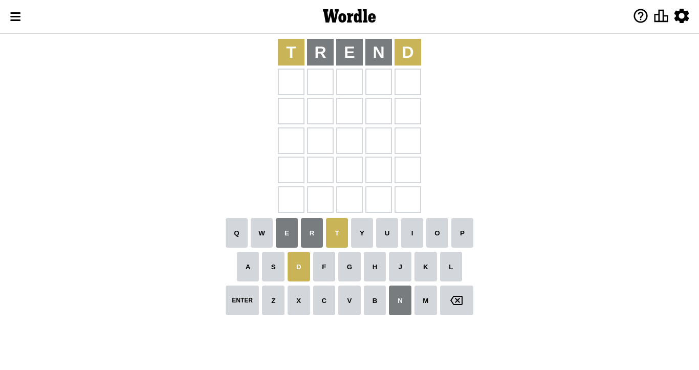
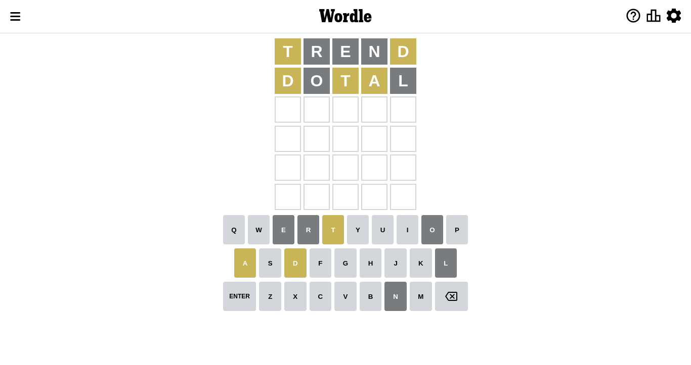
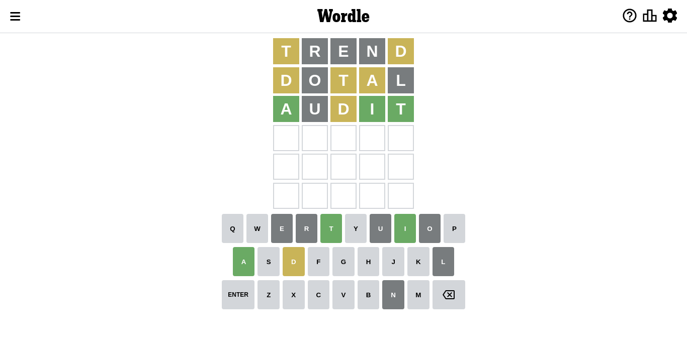
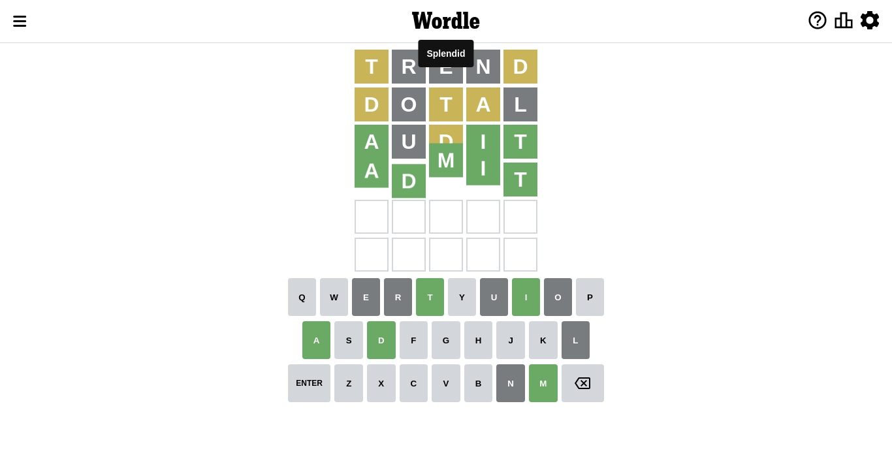

# Wordle for September 25, 2022 - \#463

## Attempt 1

Right now we have 8497 words to choose from and best of them seem to be `[trend lenth alert alter artel]`

So far we know that possible letters are:

At position 1: `[a b c d e f g h i j k l m n o p q r s t u v w x y z]`

At position 2: `[a b c d e f g h i j k l m n o p q r s t u v w x y z]`

At position 3: `[a b c d e f g h i j k l m n o p q r s t u v w x y z]`

At position 4: `[a b c d e f g h i j k l m n o p q r s t u v w x y z]`

At position 5: `[a b c d e f g h i j k l m n o p q r s t u v w x y z]`

Let's start with word `trend`

Attempt for `trend` gives us 0 correct letters, 2 present letters and 3 wrong letters.

If we look into details, we can see that:

Letter `t` is on a different spot - this means that it cannot be at position 1

Letter `r` is not present in the word and we will not use it any more

Letter `e` is not present in the word and we will not use it any more

Letter `n` is not present in the word and we will not use it any more

Letter `d` is on a different spot - this means that it cannot be at position 5

Some letters are missing (like `r`, `e`, `n`) but it's also important piece of information

Word should contain letters `[t d]`

Not a bad guess in general

## Attempt 2

Right now we have 2118 words to choose from and best of them seem to be `[dotal datil dital adult duhat]`

So far we know that possible letters are:

At position 1: `[a b c d f g h i j k l m o p q s u v w x y z]`

At position 2: `[a b c d f g h i j k l m o p q s t u v w x y z]`

At position 3: `[a b c d f g h i j k l m o p q s t u v w x y z]`

At position 4: `[a b c d f g h i j k l m o p q s t u v w x y z]`

At position 5: `[a b c f g h i j k l m o p q s t u v w x y z]`

Next guess is `dotal`, let's see what it gives us

Attempt for `dotal` gives us 0 correct letters, 3 present letters and 2 wrong letters.

If we look into details, we can see that:

Letter `d` is on a different spot - this means that it cannot be at position 1

Letter `o` is not present in the word and we will not use it any more

Letter `t` is on a different spot - this means that it cannot be at position 3

Letter `a` is on a different spot - this means that it cannot be at position 4

Letter `l` is not present in the word and we will not use it any more

Some letters are missing (like `o`, `l`) but it's also important piece of information

Word should contain letters `[t d a]`

That was a great guess that limited number of remaining words

## Attempt 3

Right now we have 629 words to choose from and best of them seem to be `[audit adust admit adati adyta]`

So far we know that possible letters are:

At position 1: `[a b c f g h i j k m p q s u v w x y z]`

At position 2: `[a b c d f g h i j k m p q s t u v w x y z]`

At position 3: `[a b c d f g h i j k m p q s u v w x y z]`

At position 4: `[b c d f g h i j k m p q s t u v w x y z]`

At position 5: `[a b c f g h i j k m p q s t u v w x y z]`

Next guess is `audit`, let's see what it gives us

Attempt for `audit` gives us 3 correct letters, 1 present letters and 1 wrong letters.

If we look into details, we can see that:

Letter `a` should be at position 1

Letter `u` is not present in the word and we will not use it any more

Letter `d` is on a different spot - this means that it cannot be at position 3

Letter `i` should be at position 4

Letter `t` should be at position 5

We got information about the correct letters and it should make next attempt easier

Some letters are missing (like `u`) but it's also important piece of information

Word should contain letters `[t d a i]`

That was a great guess that limited number of remaining words

## Attempt 4

Right now we have 4 words to choose from and best of them seem to be `[admit absit ambit await]`

So far we know that possible letters are:

At position 1: `[a]`

At position 2: `[a b c d f g h i j k m p q s t v w x y z]`

At position 3: `[a b c f g h i j k m p q s v w x y z]`

At position 4: `[i]`

At position 5: `[t]`

Next guess is `admit`, let's see what it gives us

That's the correct answer! The word is `admit`!

## Conclusion

Today's word is `admit` and it took 4 attempts to guess it

