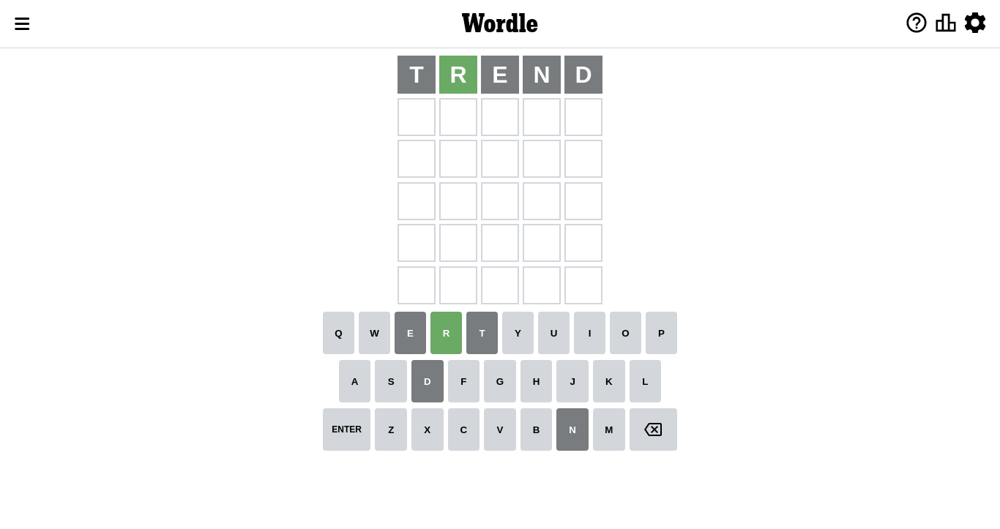
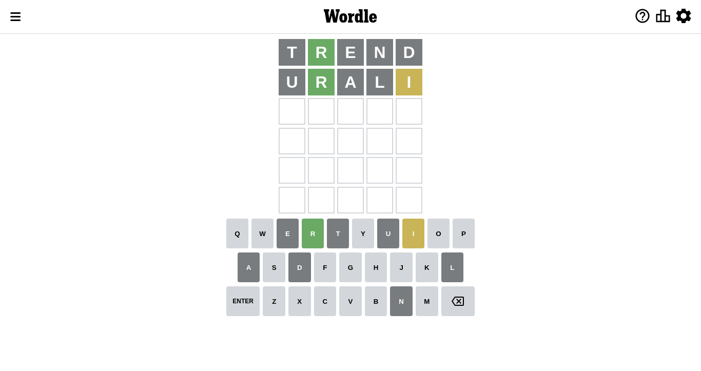
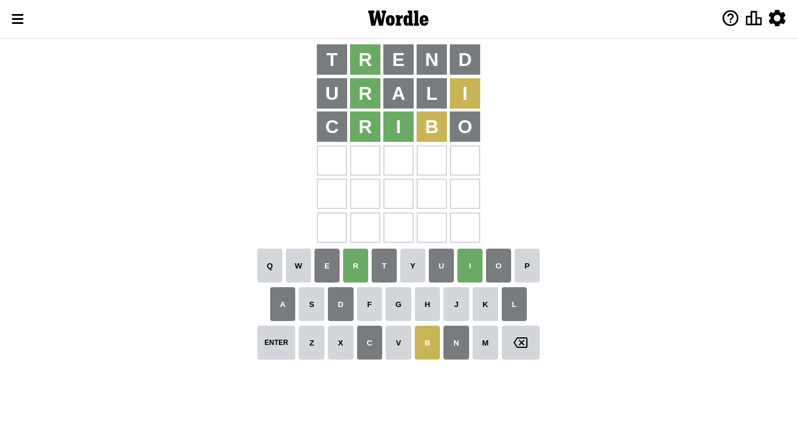
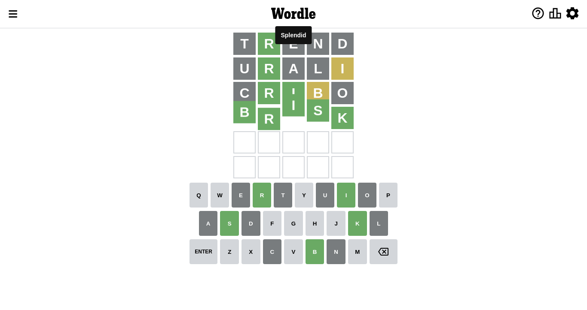

# Wordle for September 26, 2022 - \#464

## Attempt 1

Right now we have 8497 words to choose from and best of them seem to be `[trend lenth alert alter artel]`

So far we know that possible letters are:

At position 1: `[a b c d e f g h i j k l m n o p q r s t u v w x y z]`

At position 2: `[a b c d e f g h i j k l m n o p q r s t u v w x y z]`

At position 3: `[a b c d e f g h i j k l m n o p q r s t u v w x y z]`

At position 4: `[a b c d e f g h i j k l m n o p q r s t u v w x y z]`

At position 5: `[a b c d e f g h i j k l m n o p q r s t u v w x y z]`

Let's start with word `trend`

Attempt for `trend` gives us 1 correct letters, 0 present letters and 4 wrong letters.

If we look into details, we can see that:

Letter `t` is not present in the word and we will not use it any more

Letter `r` should be at position 2

Letter `e` is not present in the word and we will not use it any more

Letter `n` is not present in the word and we will not use it any more

Letter `d` is not present in the word and we will not use it any more

We got information about the correct letters and it should make next attempt easier

Some letters are missing (like `t`, `e`, `n`, `d`) but it's also important piece of information

Word should contain letters `[r]`

That was a great guess that limited number of remaining words

## Attempt 2

Right now we have 177 words to choose from and best of them seem to be `[urali urial ursal proal arsyl]`

So far we know that possible letters are:

At position 1: `[a b c f g h i j k l m o p q r s u v w x y z]`

At position 2: `[r]`

At position 3: `[a b c f g h i j k l m o p q r s u v w x y z]`

At position 4: `[a b c f g h i j k l m o p q r s u v w x y z]`

At position 5: `[a b c f g h i j k l m o p q r s u v w x y z]`

Next guess is `urali`, let's see what it gives us

Attempt for `urali` gives us 1 correct letters, 1 present letters and 3 wrong letters.

If we look into details, we can see that:

Letter `u` is not present in the word and we will not use it any more

Letter `a` is not present in the word and we will not use it any more

Letter `l` is not present in the word and we will not use it any more

Letter `i` is on a different spot - this means that it cannot be at position 5

Some letters are missing (like `u`, `a`, `l`) but it's also important piece of information

Word should contain letters `[r i]`

That was a great guess that limited number of remaining words

## Attempt 3

Right now we have 53 words to choose from and best of them seem to be `[prich cribo orbic orgic crisp]`

So far we know that possible letters are:

At position 1: `[b c f g h i j k m o p q r s v w x y z]`

At position 2: `[r]`

At position 3: `[b c f g h i j k m o p q r s v w x y z]`

At position 4: `[b c f g h i j k m o p q r s v w x y z]`

At position 5: `[b c f g h j k m o p q r s v w x y z]`

Next guess is `prich`, let's see what it gives us

Wordle does not know word `prich`, need to try something different

## Attempt 3

Right now we have 52 words to choose from and best of them seem to be `[cribo orbic orgic crisp orris]`

So far we know that possible letters are:

At position 1: `[b c f g h i j k m o p q r s v w x y z]`

At position 2: `[r]`

At position 3: `[b c f g h i j k m o p q r s v w x y z]`

At position 4: `[b c f g h i j k m o p q r s v w x y z]`

At position 5: `[b c f g h j k m o p q r s v w x y z]`

Next guess is `cribo`, let's see what it gives us

Attempt for `cribo` gives us 2 correct letters, 1 present letters and 2 wrong letters.

If we look into details, we can see that:

Letter `c` is not present in the word and we will not use it any more

Letter `i` should be at position 3

Letter `b` is on a different spot - this means that it cannot be at position 4

Letter `o` is not present in the word and we will not use it any more

We got information about the correct letters and it should make next attempt easier

Some letters are missing (like `c`, `o`) but it's also important piece of information

Word should contain letters `[r i b]`

That was a great guess that limited number of remaining words

## Attempt 4

Right now we have 14 words to choose from and best of them seem to be `[brisk briss brizz prism primy]`

So far we know that possible letters are:

At position 1: `[b f g h i j k m p q r s v w x y z]`

At position 2: `[r]`

At position 3: `[i]`

At position 4: `[f g h i j k m p q r s v w x y z]`

At position 5: `[b f g h j k m p q r s v w x y z]`

Next guess is `brisk`, let's see what it gives us

That's the correct answer! The word is `brisk`!

To be honest that was a pretty lucky guess, but it worked out well.

## Conclusion

Today's word is `brisk` and it took 4 attempts to guess it

