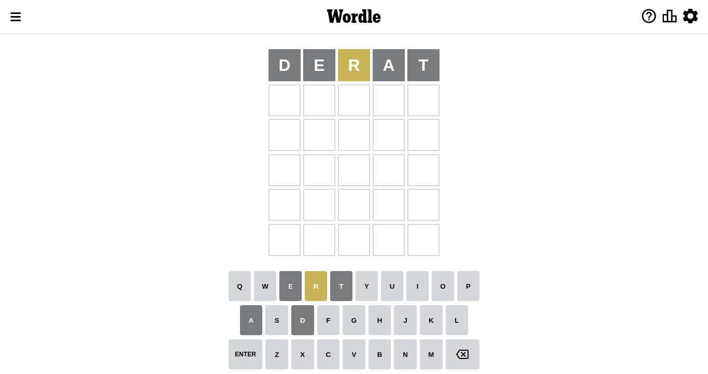
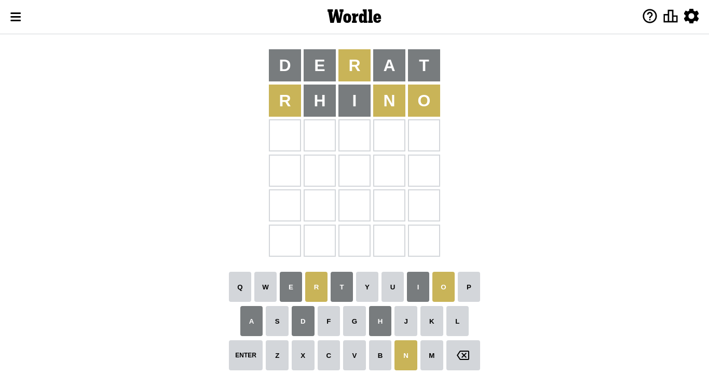
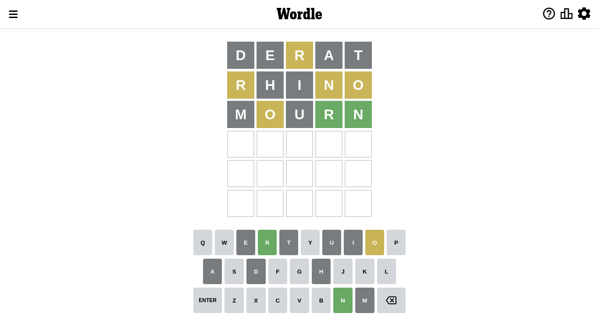
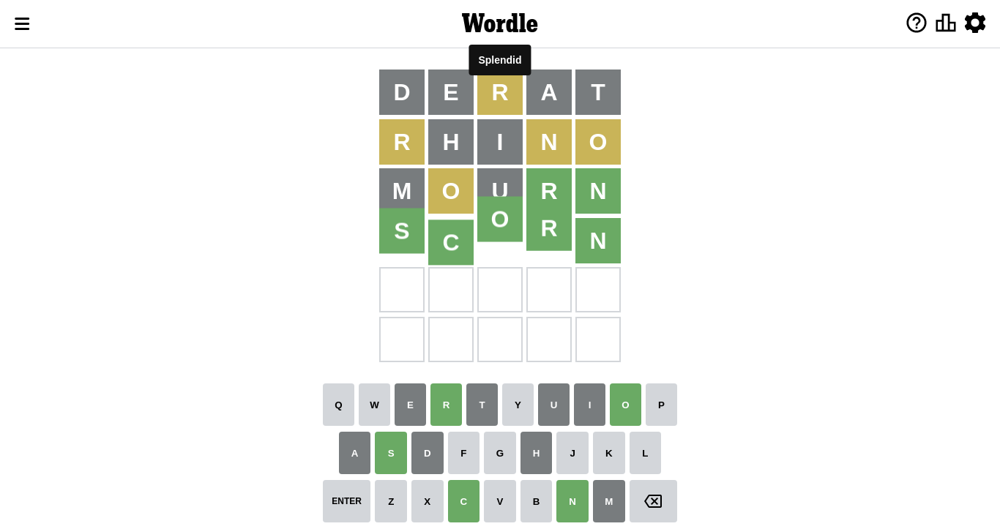

# Wordle for September 30, 2022

## Attempt 1

This is the first attempt and we'll choose a random word to start with.

Let's start with word `derat`

Attempt for `derat` gives us 0 correct letters, 1 present letters and 4 wrong letters.

If we look into details, we can see that:

Letter `d` is not present in the word and we will not use it any more

Letter `e` is not present in the word and we will not use it any more

Letter `r` is on a different spot - this means that it cannot be at position 3

Letter `a` is not present in the word and we will not use it any more

Letter `t` is not present in the word and we will not use it any more

Some letters are missing (like `d`, `e`, `a`, `t`) but it's also important piece of information

Word should contain letters `[r]`

Not a bad guess in general

## Attempt 2

Right now we have 1146 words to choose from and best of them seem to be `[snirl snurl knurl flurn shirl]`

So far we know that possible letters are:

At position 1: `[b c f g h i j k l m n o p q r s u v w x y z]`

At position 2: `[b c f g h i j k l m n o p q r s u v w x y z]`

At position 3: `[b c f g h i j k l m n o p q s u v w x y z]`

At position 4: `[b c f g h i j k l m n o p q r s u v w x y z]`

At position 5: `[b c f g h i j k l m n o p q r s u v w x y z]`

Next guess is `snirl`, let's see what it gives us

Wordle does not know word `snirl`, need to try something different

## Attempt 2

Right now we have 1145 words to choose from and best of them seem to be `[snurl knurl flurn shirl chlor]`

So far we know that possible letters are:

At position 1: `[b c f g h i j k l m n o p q r s u v w x y z]`

At position 2: `[b c f g h i j k l m n o p q r s u v w x y z]`

At position 3: `[b c f g h i j k l m n o p q s u v w x y z]`

At position 4: `[b c f g h i j k l m n o p q r s u v w x y z]`

At position 5: `[b c f g h i j k l m n o p q r s u v w x y z]`

Next guess is `flurn`, let's see what it gives us

Wordle does not know word `flurn`, need to try something different

## Attempt 2

Right now we have 1144 words to choose from and best of them seem to be `[snurl knurl shirl chlor rhino]`

So far we know that possible letters are:

At position 1: `[b c f g h i j k l m n o p q r s u v w x y z]`

At position 2: `[b c f g h i j k l m n o p q r s u v w x y z]`

At position 3: `[b c f g h i j k l m n o p q s u v w x y z]`

At position 4: `[b c f g h i j k l m n o p q r s u v w x y z]`

At position 5: `[b c f g h i j k l m n o p q r s u v w x y z]`

Next guess is `chlor`, let's see what it gives us

Wordle does not know word `chlor`, need to try something different

## Attempt 2

Right now we have 1143 words to choose from and best of them seem to be `[snurl knurl shirl rhino shorn]`

So far we know that possible letters are:

At position 1: `[b c f g h i j k l m n o p q r s u v w x y z]`

At position 2: `[b c f g h i j k l m n o p q r s u v w x y z]`

At position 3: `[b c f g h i j k l m n o p q s u v w x y z]`

At position 4: `[b c f g h i j k l m n o p q r s u v w x y z]`

At position 5: `[b c f g h i j k l m n o p q r s u v w x y z]`

Next guess is `shirl`, let's see what it gives us

Wordle does not know word `shirl`, need to try something different

## Attempt 2

Right now we have 1142 words to choose from and best of them seem to be `[snurl knurl rhino shorn whorl]`

So far we know that possible letters are:

At position 1: `[b c f g h i j k l m n o p q r s u v w x y z]`

At position 2: `[b c f g h i j k l m n o p q r s u v w x y z]`

At position 3: `[b c f g h i j k l m n o p q s u v w x y z]`

At position 4: `[b c f g h i j k l m n o p q r s u v w x y z]`

At position 5: `[b c f g h i j k l m n o p q r s u v w x y z]`

Next guess is `rhino`, let's see what it gives us

Attempt for `rhino` gives us 0 correct letters, 3 present letters and 2 wrong letters.

If we look into details, we can see that:

Letter `r` is on a different spot - this means that it cannot be at position 1

Letter `h` is not present in the word and we will not use it any more

Letter `i` is not present in the word and we will not use it any more

Letter `n` is on a different spot - this means that it cannot be at position 4

Letter `o` is on a different spot - this means that it cannot be at position 5

Some letters are missing (like `h`, `i`) but it's also important piece of information

Word should contain letters `[r n o]`

That was a great guess that limited number of remaining words

## Attempt 3

Right now we have 427 words to choose from and best of them seem to be `[urson scorn yourn snork mourn]`

So far we know that possible letters are:

At position 1: `[b c f g j k l m n o p q s u v w x y z]`

At position 2: `[b c f g j k l m n o p q r s u v w x y z]`

At position 3: `[b c f g j k l m n o p q s u v w x y z]`

At position 4: `[b c f g j k l m o p q r s u v w x y z]`

At position 5: `[b c f g j k l m n p q r s u v w x y z]`

Next guess is `mourn`, let's see what it gives us

Attempt for `mourn` gives us 2 correct letters, 1 present letters and 2 wrong letters.

If we look into details, we can see that:

Letter `m` is not present in the word and we will not use it any more

Letter `o` is on a different spot - this means that it cannot be at position 2

Letter `u` is not present in the word and we will not use it any more

Letter `r` should be at position 4

Letter `n` should be at position 5

We got information about the correct letters and it should make next attempt easier

Some letters are missing (like `m`, `u`) but it's also important piece of information

Word should contain letters `[r n o]`

That was a great guess that limited number of remaining words

## Attempt 4

Right now we have 2 words to choose from and best of them seem to be `[scorn sworn]`

So far we know that possible letters are:

At position 1: `[b c f g j k l n o p q s v w x y z]`

At position 2: `[b c f g j k l n p q r s v w x y z]`

At position 3: `[b c f g j k l n o p q s v w x y z]`

At position 4: `[r]`

At position 5: `[n]`

Next guess is `scorn`, let's see what it gives us

That's the correct answer! The word is `scorn`!

## Conclusion

Today's word is `scorn` and it took 4 attempts to guess it

