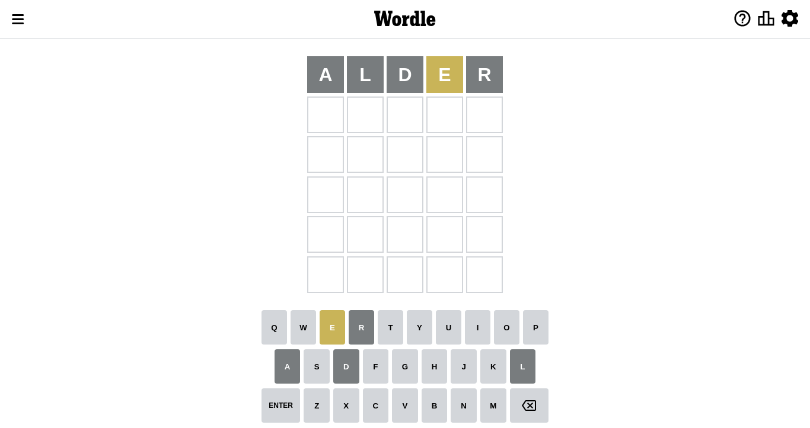
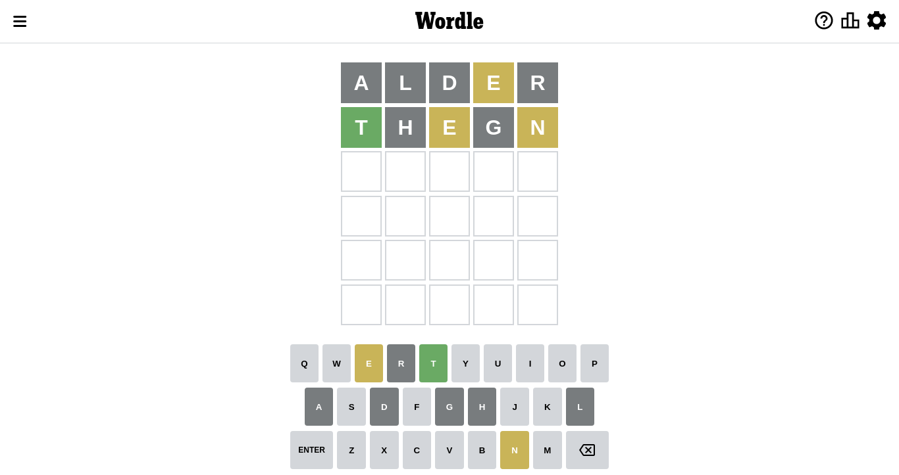
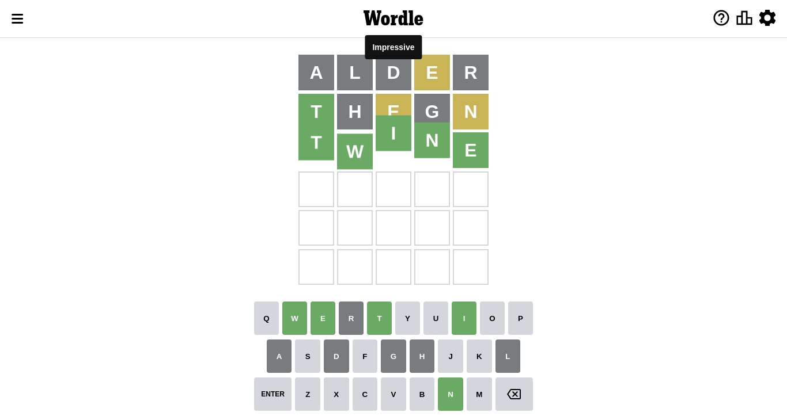

# Wordle for October 2, 2022

## Attempt 1

This is the first attempt and we'll choose a random word to start with.

Let's start with word `alder`

Attempt for `alder` gives us 0 correct letters, 1 present letters and 4 wrong letters.

If we look into details, we can see that:

Letter `a` is not present in the word and we will not use it any more

Letter `l` is not present in the word and we will not use it any more

Letter `d` is not present in the word and we will not use it any more

Letter `e` is on a different spot - this means that it cannot be at position 4

Letter `r` is not present in the word and we will not use it any more

Some letters are missing (like `a`, `l`, `d`, `r`) but it's also important piece of information

Word should contain letters `[e]`

Not a bad guess in general

## Attempt 2

Right now we have 1503 words to choose from and best of them seem to be `[thone thine tench thegn tenth]`

So far we know that possible letters are:

At position 1: `[b c e f g h i j k m n o p q s t u v w x y z]`

At position 2: `[b c e f g h i j k m n o p q s t u v w x y z]`

At position 3: `[b c e f g h i j k m n o p q s t u v w x y z]`

At position 4: `[b c f g h i j k m n o p q s t u v w x y z]`

At position 5: `[b c e f g h i j k m n o p q s t u v w x y z]`

Next guess is `thegn`, let's see what it gives us

Attempt for `thegn` gives us 1 correct letters, 2 present letters and 2 wrong letters.

If we look into details, we can see that:

Letter `t` should be at position 1

Letter `h` is not present in the word and we will not use it any more

Letter `e` is on a different spot - this means that it cannot be at position 3

Letter `g` is not present in the word and we will not use it any more

Letter `n` is on a different spot - this means that it cannot be at position 5

We got information about the correct letters and it should make next attempt easier

Some letters are missing (like `h`, `g`) but it's also important piece of information

Word should contain letters `[e t n]`

That was a great guess that limited number of remaining words

## Attempt 3

Right now we have 70 words to choose from and best of them seem to be `[tenio tsine twine tense tenty]`

So far we know that possible letters are:

At position 1: `[t]`

At position 2: `[b c e f i j k m n o p q s t u v w x y z]`

At position 3: `[b c f i j k m n o p q s t u v w x y z]`

At position 4: `[b c f i j k m n o p q s t u v w x y z]`

At position 5: `[b c e f i j k m o p q s t u v w x y z]`

Next guess is `twine`, let's see what it gives us

That's the correct answer! The word is `twine`!

To be honest that was a pretty lucky guess, but it worked out well.

## Conclusion

Today's word is `twine` and it took 3 attempts to guess it

