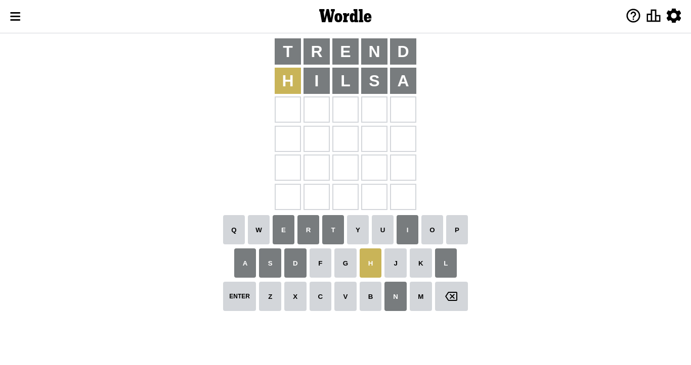

# Wordle for October 4, 2022 - \#472

## Attempt 1

This is the first attempt and we'll choose a random word to start with.

Let's start with word `trend`

Attempt for `trend` gives us 0 correct letters, 0 present letters and 5 wrong letters.

If we look into details, we can see that:

Letter `t` is not present in the word and we will not use it any more

Letter `r` is not present in the word and we will not use it any more

Letter `e` is not present in the word and we will not use it any more

Letter `n` is not present in the word and we will not use it any more

Letter `d` is not present in the word and we will not use it any more

Some letters are missing (like `t`, `r`, `e`, `n`, `d`) but it's also important piece of information

So far we don't know any of the letters!

Not a bad guess in general

## Attempt 2

Right now we have 1410 words to choose from and best of them seem to be `[holia shoal shola alish hilsa]`

So far we know that possible letters are:

At position 1: `[a b c f g h i j k l m o p q s u v w x y z]`

At position 2: `[a b c f g h i j k l m o p q s u v w x y z]`

At position 3: `[a b c f g h i j k l m o p q s u v w x y z]`

At position 4: `[a b c f g h i j k l m o p q s u v w x y z]`

At position 5: `[a b c f g h i j k l m o p q s u v w x y z]`

Next guess is `hilsa`, let's see what it gives us

Attempt for `hilsa` gives us 0 correct letters, 1 present letters and 4 wrong letters.

If we look into details, we can see that:

Letter `h` is on a different spot - this means that it cannot be at position 1

Letter `i` is not present in the word and we will not use it any more

Letter `l` is not present in the word and we will not use it any more

Letter `s` is not present in the word and we will not use it any more

Letter `a` is not present in the word and we will not use it any more

Some letters are missing (like `i`, `l`, `s`, `a`) but it's also important piece of information

Word should contain letters `[h]`

That was a great guess that limited number of remaining words

## Attempt 3

Right now we have 121 words to choose from and best of them seem to be `[choup pouch cough bough chomp]`

So far we know that possible letters are:

At position 1: `[b c f g j k m o p q u v w x y z]`

At position 2: `[b c f g h j k m o p q u v w x y z]`

At position 3: `[b c f g h j k m o p q u v w x y z]`

At position 4: `[b c f g h j k m o p q u v w x y z]`

At position 5: `[b c f g h j k m o p q u v w x y z]`

Next guess is `bough`, let's see what it gives us

That's the correct answer! The word is `bough`!

To be honest that was a pretty lucky guess, but it worked out well.

## Conclusion

Today's word is `bough` and it took 3 attempts to guess it

