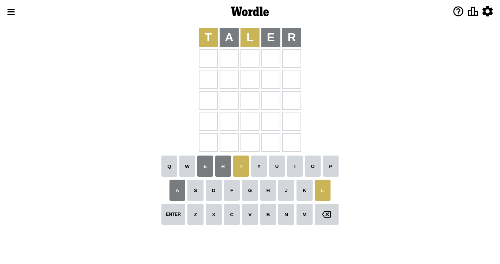
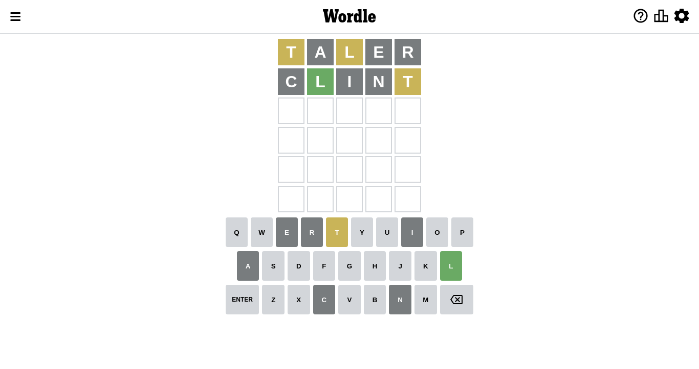
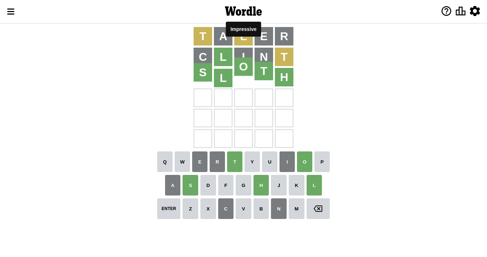

# Wordle for October 6, 2022

## Attempt 1

This is the first attempt and we'll choose a random word to start with.

Let's start with word `taler`

Attempt for `taler` gives us 0 correct letters, 2 present letters and 3 wrong letters.

If we look into details, we can see that:

Letter `t` is on a different spot - this means that it cannot be at position 1

Letter `a` is not present in the word and we will not use it any more

Letter `l` is on a different spot - this means that it cannot be at position 3

Letter `e` is not present in the word and we will not use it any more

Letter `r` is not present in the word and we will not use it any more

Some letters are missing (like `a`, `e`, `r`) but it's also important piece of information

Word should contain letters `[t l]`

Not a bad guess in general

## Attempt 2

Right now we have 1326 words to choose from and best of them seem to be `[until linty clint glint flint]`

So far we know that possible letters are:

At position 1: `[b c d f g h i j k l m n o p q s u v w x y z]`

At position 2: `[b c d f g h i j k l m n o p q s t u v w x y z]`

At position 3: `[b c d f g h i j k m n o p q s t u v w x y z]`

At position 4: `[b c d f g h i j k l m n o p q s t u v w x y z]`

At position 5: `[b c d f g h i j k l m n o p q s t u v w x y z]`

Next guess is `clint`, let's see what it gives us

Attempt for `clint` gives us 1 correct letters, 1 present letters and 3 wrong letters.

If we look into details, we can see that:

Letter `c` is not present in the word and we will not use it any more

Letter `l` should be at position 2

Letter `i` is not present in the word and we will not use it any more

Letter `n` is not present in the word and we will not use it any more

Letter `t` is on a different spot - this means that it cannot be at position 5

We got information about the correct letters and it should make next attempt easier

Some letters are missing (like `c`, `i`, `n`) but it's also important piece of information

Word should contain letters `[t l]`

That was a great guess that limited number of remaining words

## Attempt 3

Right now we have 44 words to choose from and best of them seem to be `[sloth zloty fluty sloyd klosh]`

So far we know that possible letters are:

At position 1: `[b d f g h j k l m o p q s u v w x y z]`

At position 2: `[l]`

At position 3: `[b d f g h j k m o p q s t u v w x y z]`

At position 4: `[b d f g h j k l m o p q s t u v w x y z]`

At position 5: `[b d f g h j k l m o p q s u v w x y z]`

Next guess is `sloth`, let's see what it gives us

That's the correct answer! The word is `sloth`!

To be honest that was a pretty lucky guess, but it worked out well.

## Conclusion

Today's word is `sloth` and it took 3 attempts to guess it

