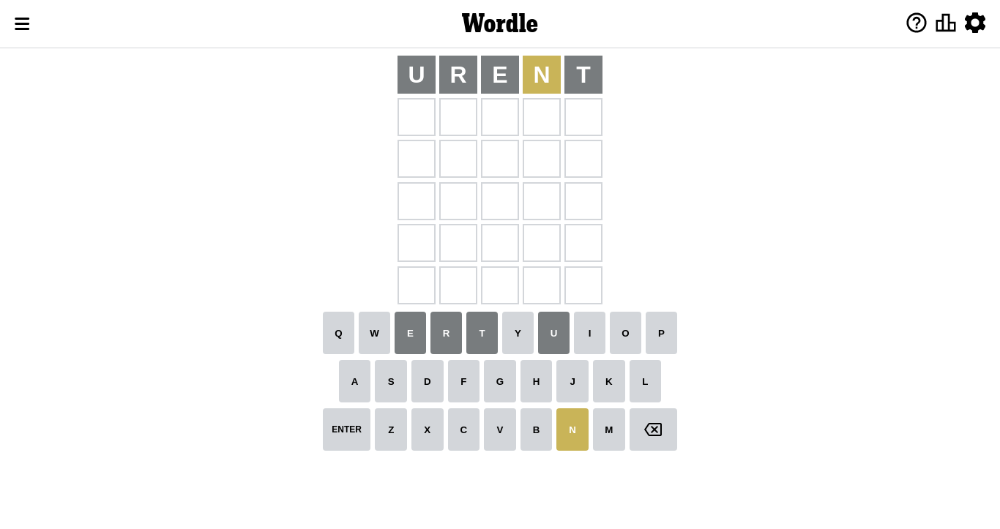
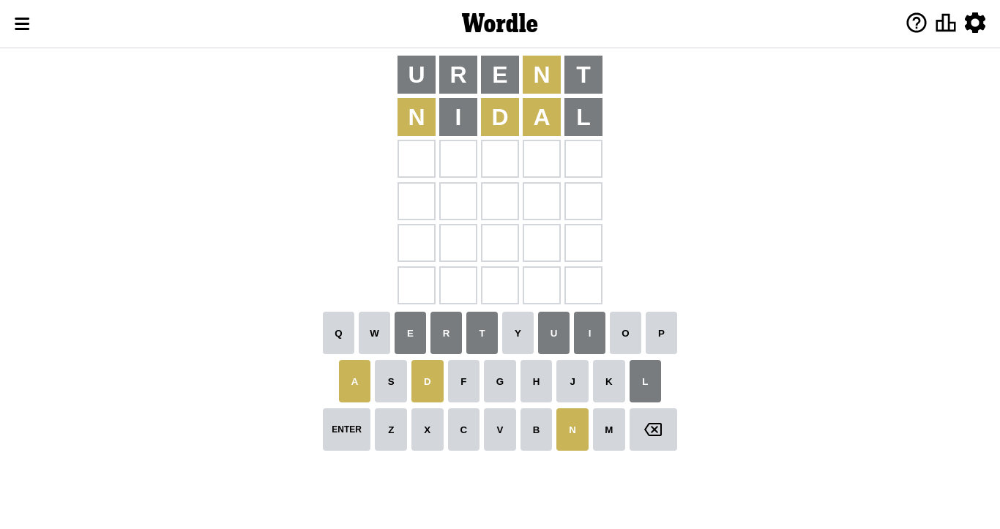
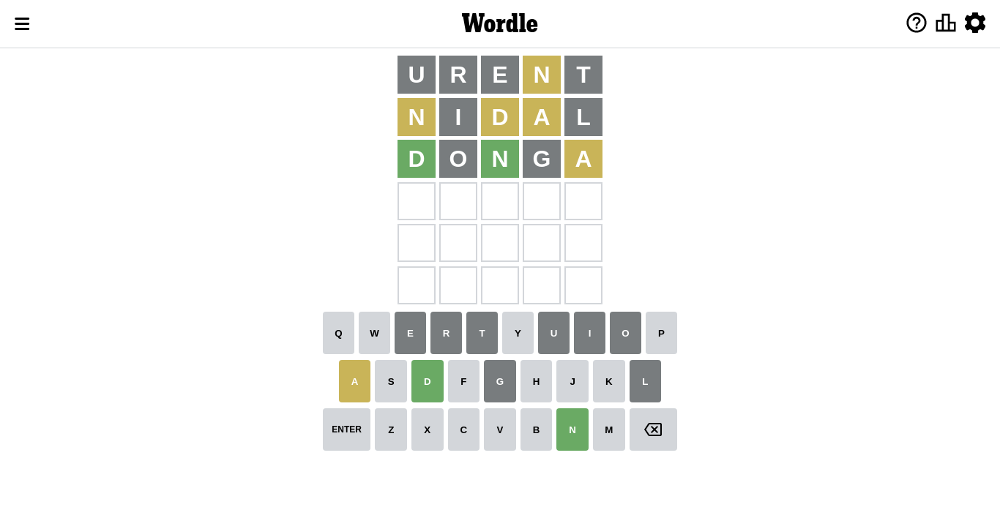
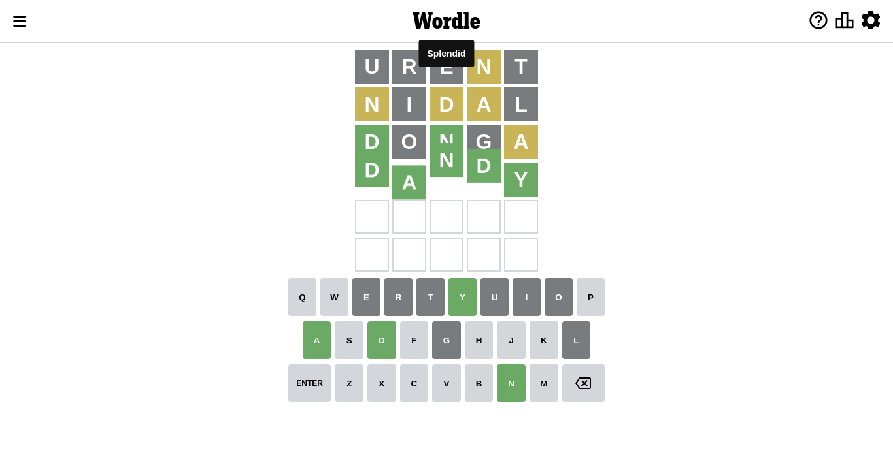

# Wordle for October 7, 2022 - \#475

## Attempt 1

This is the first attempt and we'll choose a random word to start with.

Let's start with word `urent`

Attempt for `urent` gives us 0 correct letters, 1 present letters and 4 wrong letters.

If we look into details, we can see that:

Letter `u` is not present in the word and we will not use it any more

Letter `r` is not present in the word and we will not use it any more

Letter `e` is not present in the word and we will not use it any more

Letter `n` is on a different spot - this means that it cannot be at position 4

Letter `t` is not present in the word and we will not use it any more

Some letters are missing (like `u`, `r`, `e`, `t`) but it's also important piece of information

Word should contain letters `[n]`

Not a bad guess in general

## Attempt 2

Right now we have 1623 words to choose from and best of them seem to be `[nodal danli nidal lohan linha]`

So far we know that possible letters are:

At position 1: `[a b c d f g h i j k l m n o p q s v w x y z]`

At position 2: `[a b c d f g h i j k l m n o p q s v w x y z]`

At position 3: `[a b c d f g h i j k l m n o p q s v w x y z]`

At position 4: `[a b c d f g h i j k l m o p q s v w x y z]`

At position 5: `[a b c d f g h i j k l m n o p q s v w x y z]`

Next guess is `nidal`, let's see what it gives us

Attempt for `nidal` gives us 0 correct letters, 3 present letters and 2 wrong letters.

If we look into details, we can see that:

Letter `n` is on a different spot - this means that it cannot be at position 1

Letter `i` is not present in the word and we will not use it any more

Letter `d` is on a different spot - this means that it cannot be at position 3

Letter `a` is on a different spot - this means that it cannot be at position 4

Letter `l` is not present in the word and we will not use it any more

Some letters are missing (like `i`, `l`) but it's also important piece of information

Word should contain letters `[n d a]`

That was a great guess that limited number of remaining words

## Attempt 3

Right now we have 460 words to choose from and best of them seem to be `[honda handy sandy bando donga]`

So far we know that possible letters are:

At position 1: `[a b c d f g h j k m o p q s v w x y z]`

At position 2: `[a b c d f g h j k m n o p q s v w x y z]`

At position 3: `[a b c f g h j k m n o p q s v w x y z]`

At position 4: `[b c d f g h j k m o p q s v w x y z]`

At position 5: `[a b c d f g h j k m n o p q s v w x y z]`

Next guess is `donga`, let's see what it gives us

Attempt for `donga` gives us 2 correct letters, 1 present letters and 2 wrong letters.

If we look into details, we can see that:

Letter `d` should be at position 1

Letter `o` is not present in the word and we will not use it any more

Letter `n` should be at position 3

Letter `g` is not present in the word and we will not use it any more

Letter `a` is on a different spot - this means that it cannot be at position 5

We got information about the correct letters and it should make next attempt easier

Some letters are missing (like `o`, `g`) but it's also important piece of information

Word should contain letters `[n d a]`

That was a great guess that limited number of remaining words

## Attempt 4

Right now we have 1 words to choose from and best of them seem to be `[dandy]`

So far we know that possible letters are:

At position 1: `[d]`

At position 2: `[a b c d f h j k m n p q s v w x y z]`

At position 3: `[n]`

At position 4: `[b c d f h j k m p q s v w x y z]`

At position 5: `[b c d f h j k m n p q s v w x y z]`

Next guess is `dandy`, let's see what it gives us

That's the correct answer! The word is `dandy`!

## Conclusion

Today's word is `dandy` and it took 4 attempts to guess it

