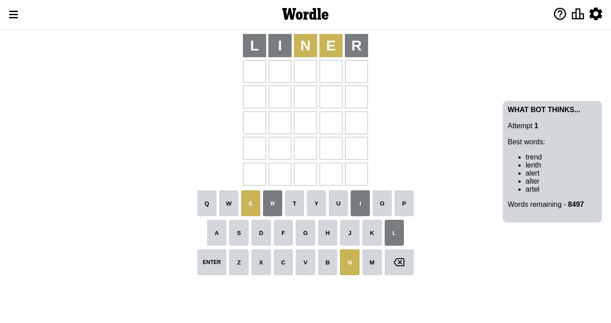
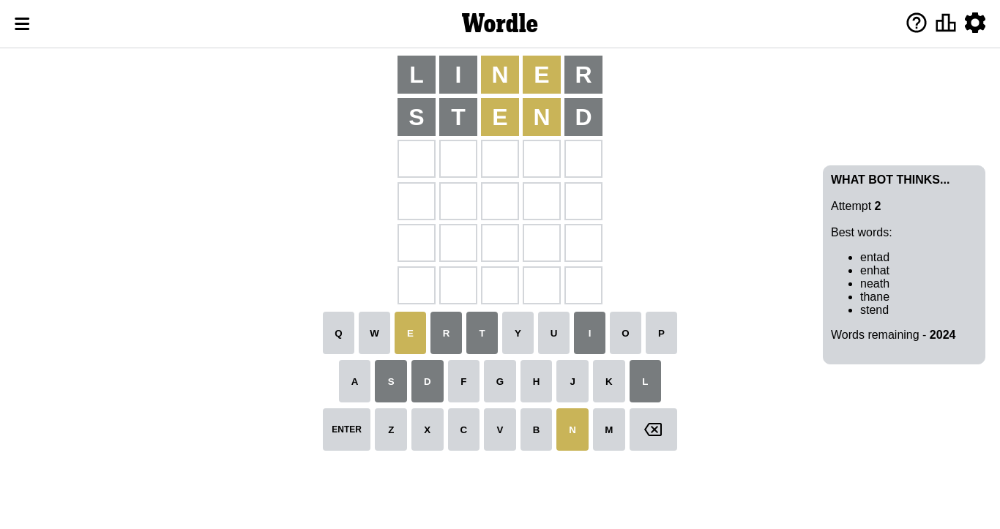
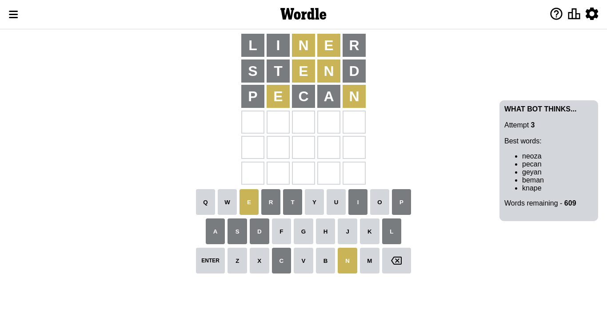
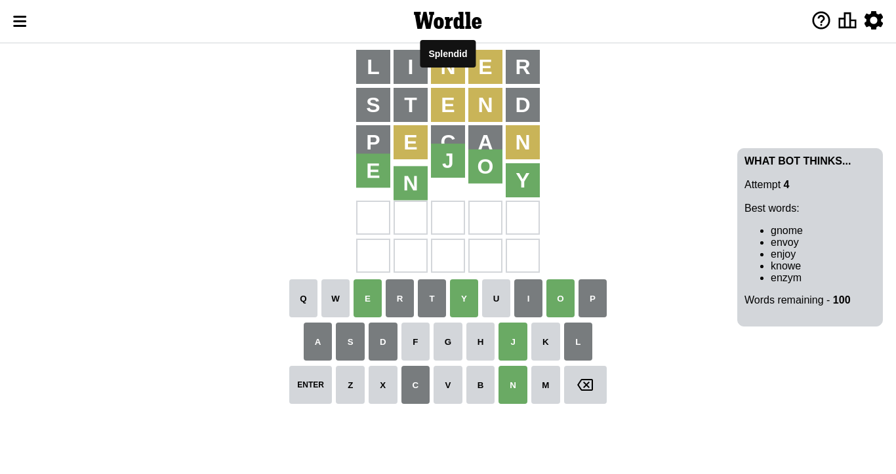

# Wordle for October 10, 2022 - \#478

## Attempt 1

This is the first attempt and we'll choose a random word to start with.

Let's start with word `liner`

Attempt for `liner` gives us 0 correct letters, 2 present letters and 3 wrong letters.

If we look into details, we can see that:

Letter `l` is not present in the word and we will not use it any more

Letter `i` is not present in the word and we will not use it any more

Letter `n` is on a different spot - this means that it cannot be at position 3

Letter `e` is on a different spot - this means that it cannot be at position 4

Letter `r` is not present in the word and we will not use it any more

Some letters are missing (like `l`, `i`, `r`) but it's also important piece of information

Word should contain letters `[n e]`

Not a bad guess in general

## Attempt 2

Right now we have 2025 words to choose from and best of them seem to be `[entad enhat nathe neath thane]`

So far we know that possible letters are:

At position 1: `[a b c d e f g h j k m n o p q s t u v w x y z]`

At position 2: `[a b c d e f g h j k m n o p q s t u v w x y z]`

At position 3: `[a b c d e f g h j k m o p q s t u v w x y z]`

At position 4: `[a b c d f g h j k m n o p q s t u v w x y z]`

At position 5: `[a b c d e f g h j k m n o p q s t u v w x y z]`

Next guess is `nathe`, let's see what it gives us

Wordle does not know word `nathe`, need to try something different

## Attempt 2

Right now we have 2024 words to choose from and best of them seem to be `[entad enhat neath thane stend]`

So far we know that possible letters are:

At position 1: `[a b c d e f g h j k m n o p q s t u v w x y z]`

At position 2: `[a b c d e f g h j k m n o p q s t u v w x y z]`

At position 3: `[a b c d e f g h j k m o p q s t u v w x y z]`

At position 4: `[a b c d f g h j k m n o p q s t u v w x y z]`

At position 5: `[a b c d e f g h j k m n o p q s t u v w x y z]`

Next guess is `stend`, let's see what it gives us

Attempt for `stend` gives us 0 correct letters, 2 present letters and 3 wrong letters.

If we look into details, we can see that:

Letter `s` is not present in the word and we will not use it any more

Letter `t` is not present in the word and we will not use it any more

Letter `e` is on a different spot - this means that it cannot be at position 3

Letter `n` is on a different spot - this means that it cannot be at position 4

Letter `d` is not present in the word and we will not use it any more

Some letters are missing (like `s`, `t`, `d`) but it's also important piece of information

Word should contain letters `[n e]`

That was a great guess that limited number of remaining words

## Attempt 3

Right now we have 610 words to choose from and best of them seem to be `[neuma neoza pecan geyan beman]`

So far we know that possible letters are:

At position 1: `[a b c e f g h j k m n o p q u v w x y z]`

At position 2: `[a b c e f g h j k m n o p q u v w x y z]`

At position 3: `[a b c f g h j k m o p q u v w x y z]`

At position 4: `[a b c f g h j k m o p q u v w x y z]`

At position 5: `[a b c e f g h j k m n o p q u v w x y z]`

Next guess is `neuma`, let's see what it gives us

Wordle does not know word `neuma`, need to try something different

## Attempt 3

Right now we have 609 words to choose from and best of them seem to be `[neoza pecan geyan beman knape]`

So far we know that possible letters are:

At position 1: `[a b c e f g h j k m n o p q u v w x y z]`

At position 2: `[a b c e f g h j k m n o p q u v w x y z]`

At position 3: `[a b c f g h j k m o p q u v w x y z]`

At position 4: `[a b c f g h j k m o p q u v w x y z]`

At position 5: `[a b c e f g h j k m n o p q u v w x y z]`

Next guess is `pecan`, let's see what it gives us

Attempt for `pecan` gives us 0 correct letters, 2 present letters and 3 wrong letters.

If we look into details, we can see that:

Letter `p` is not present in the word and we will not use it any more

Letter `e` is on a different spot - this means that it cannot be at position 2

Letter `c` is not present in the word and we will not use it any more

Letter `a` is not present in the word and we will not use it any more

Letter `n` is on a different spot - this means that it cannot be at position 5

Some letters are missing (like `p`, `c`, `a`) but it's also important piece of information

Word should contain letters `[n e]`

That was a great guess that limited number of remaining words

## Attempt 4

Right now we have 100 words to choose from and best of them seem to be `[gnome envoy enjoy knowe enzym]`

So far we know that possible letters are:

At position 1: `[b e f g h j k m n o q u v w x y z]`

At position 2: `[b f g h j k m n o q u v w x y z]`

At position 3: `[b f g h j k m o q u v w x y z]`

At position 4: `[b f g h j k m o q u v w x y z]`

At position 5: `[b e f g h j k m o q u v w x y z]`

Next guess is `enjoy`, let's see what it gives us

That's the correct answer! The word is `enjoy`!

To be honest that was a pretty lucky guess, but it worked out well.

## Conclusion

Today's word is `enjoy` and it took 4 attempts to guess it

