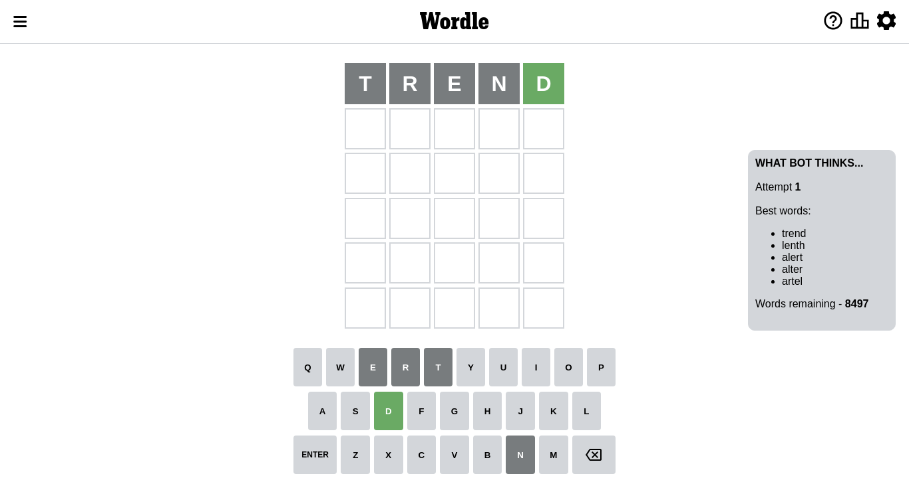
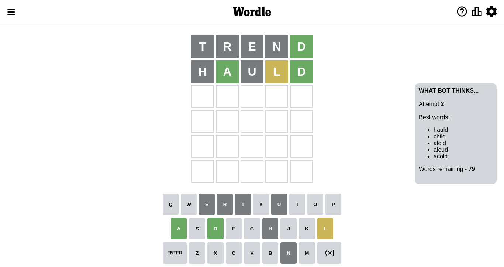
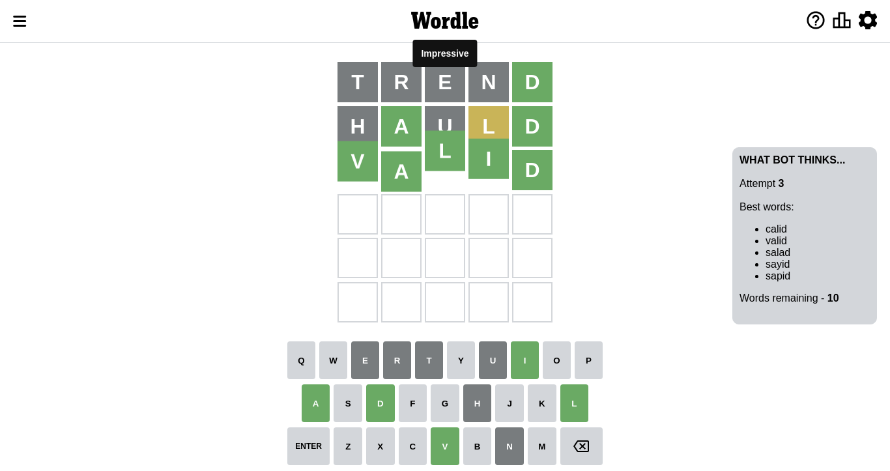

# Wordle for October 11, 2022 - \#479

## Attempt 1

This is the first attempt and we'll choose a random word to start with.

Let's start with word `trend`

Attempt for `trend` gives us 1 correct letters, 0 present letters and 4 wrong letters.

If we look into details, we can see that:

Letter `t` is not present in the word and we will not use it any more

Letter `r` is not present in the word and we will not use it any more

Letter `e` is not present in the word and we will not use it any more

Letter `n` is not present in the word and we will not use it any more

Letter `d` should be at position 5

We got information about the correct letters and it should make next attempt easier

Some letters are missing (like `t`, `r`, `e`, `n`) but it's also important piece of information

Word should contain letters `[d]`

That was a great guess that limited number of remaining words

## Attempt 2

Right now we have 80 words to choose from and best of them seem to be `[hauld chold child aloid aloud]`

So far we know that possible letters are:

At position 1: `[a b c d f g h i j k l m o p q s u v w x y z]`

At position 2: `[a b c d f g h i j k l m o p q s u v w x y z]`

At position 3: `[a b c d f g h i j k l m o p q s u v w x y z]`

At position 4: `[a b c d f g h i j k l m o p q s u v w x y z]`

At position 5: `[d]`

Next guess is `chold`, let's see what it gives us

Wordle does not know word `chold`, need to try something different

## Attempt 2

Right now we have 79 words to choose from and best of them seem to be `[hauld child aloid aloud acold]`

So far we know that possible letters are:

At position 1: `[a b c d f g h i j k l m o p q s u v w x y z]`

At position 2: `[a b c d f g h i j k l m o p q s u v w x y z]`

At position 3: `[a b c d f g h i j k l m o p q s u v w x y z]`

At position 4: `[a b c d f g h i j k l m o p q s u v w x y z]`

At position 5: `[d]`

Next guess is `hauld`, let's see what it gives us

Attempt for `hauld` gives us 2 correct letters, 1 present letters and 2 wrong letters.

If we look into details, we can see that:

Letter `h` is not present in the word and we will not use it any more

Letter `a` should be at position 2

Letter `u` is not present in the word and we will not use it any more

Letter `l` is on a different spot - this means that it cannot be at position 4

We got information about the correct letters and it should make next attempt easier

Some letters are missing (like `h`, `u`) but it's also important piece of information

Word should contain letters `[d a l]`

That was a great guess that limited number of remaining words

## Attempt 3

Right now we have 10 words to choose from and best of them seem to be `[calid valid salad sayid sapid]`

So far we know that possible letters are:

At position 1: `[a b c d f g i j k l m o p q s v w x y z]`

At position 2: `[a]`

At position 3: `[a b c d f g i j k l m o p q s v w x y z]`

At position 4: `[a b c d f g i j k m o p q s v w x y z]`

At position 5: `[d]`

Next guess is `valid`, let's see what it gives us

That's the correct answer! The word is `valid`!

## Conclusion

Today's word is `valid` and it took 3 attempts to guess it

