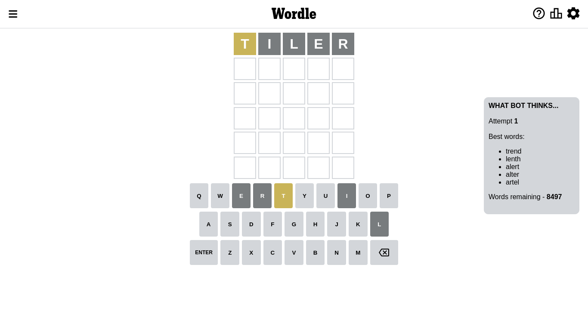
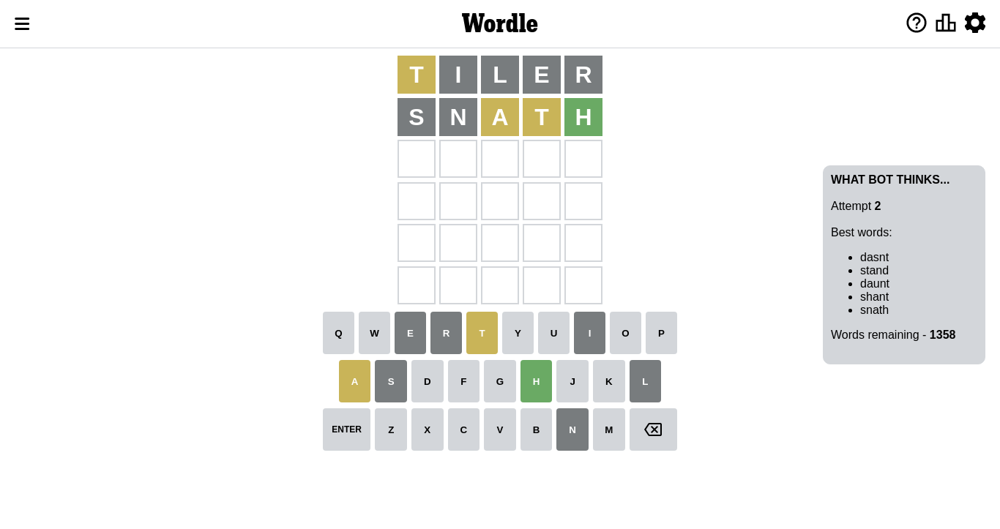
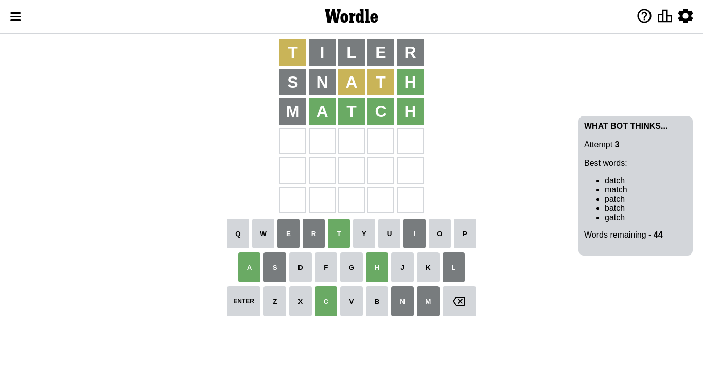
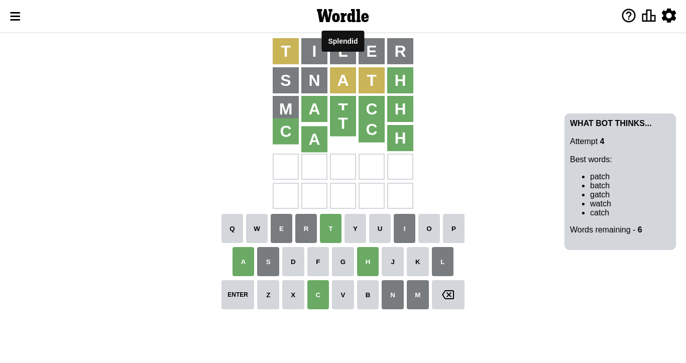

# Wordle for October 15, 2022 - \#483

## Attempt 1

This is the first attempt and we'll choose a random word to start with.

Let's start with word `tiler`

Attempt for `tiler` gives us 0 correct letters, 1 present letters and 4 wrong letters.

If we look into details, we can see that:

Letter `t` is on a different spot - this means that it cannot be at position 1

Letter `i` is not present in the word and we will not use it any more

Letter `l` is not present in the word and we will not use it any more

Letter `e` is not present in the word and we will not use it any more

Letter `r` is not present in the word and we will not use it any more

Some letters are missing (like `i`, `l`, `e`, `r`) but it's also important piece of information

Word should contain letters `[t]`

Not a bad guess in general

## Attempt 2

Right now we have 1358 words to choose from and best of them seem to be `[dasnt stand daunt shant snath]`

So far we know that possible letters are:

At position 1: `[a b c d f g h j k m n o p q s u v w x y z]`

At position 2: `[a b c d f g h j k m n o p q s t u v w x y z]`

At position 3: `[a b c d f g h j k m n o p q s t u v w x y z]`

At position 4: `[a b c d f g h j k m n o p q s t u v w x y z]`

At position 5: `[a b c d f g h j k m n o p q s t u v w x y z]`

Next guess is `snath`, let's see what it gives us

Attempt for `snath` gives us 1 correct letters, 2 present letters and 2 wrong letters.

If we look into details, we can see that:

Letter `s` is not present in the word and we will not use it any more

Letter `n` is not present in the word and we will not use it any more

Letter `a` is on a different spot - this means that it cannot be at position 3

Letter `t` is on a different spot - this means that it cannot be at position 4

Letter `h` should be at position 5

We got information about the correct letters and it should make next attempt easier

Some letters are missing (like `s`, `n`) but it's also important piece of information

Word should contain letters `[t a h]`

That was a great guess that limited number of remaining words

## Attempt 3

Right now we have 44 words to choose from and best of them seem to be `[datch match patch batch gatch]`

So far we know that possible letters are:

At position 1: `[a b c d f g h j k m o p q u v w x y z]`

At position 2: `[a b c d f g h j k m o p q t u v w x y z]`

At position 3: `[b c d f g h j k m o p q t u v w x y z]`

At position 4: `[a b c d f g h j k m o p q u v w x y z]`

At position 5: `[h]`

Next guess is `match`, let's see what it gives us

Attempt for `match` gives us 4 correct letters, 0 present letters and 1 wrong letters.

If we look into details, we can see that:

Letter `m` is not present in the word and we will not use it any more

Letter `a` should be at position 2

Letter `t` should be at position 3

Letter `c` should be at position 4

We got information about the correct letters and it should make next attempt easier

Some letters are missing (like `m`) but it's also important piece of information

Word should contain letters `[t a h c]`

That was a great guess that limited number of remaining words

## Attempt 4

Right now we have 7 words to choose from and best of them seem to be `[datch patch batch gatch watch]`

So far we know that possible letters are:

At position 1: `[a b c d f g h j k o p q u v w x y z]`

At position 2: `[a]`

At position 3: `[t]`

At position 4: `[c]`

At position 5: `[h]`

Next guess is `datch`, let's see what it gives us

Wordle does not know word `datch`, need to try something different

## Attempt 4

Right now we have 6 words to choose from and best of them seem to be `[patch batch gatch watch catch]`

So far we know that possible letters are:

At position 1: `[a b c d f g h j k o p q u v w x y z]`

At position 2: `[a]`

At position 3: `[t]`

At position 4: `[c]`

At position 5: `[h]`

Next guess is `catch`, let's see what it gives us

That's the correct answer! The word is `catch`!

## Conclusion

Today's word is `catch` and it took 4 attempts to guess it

