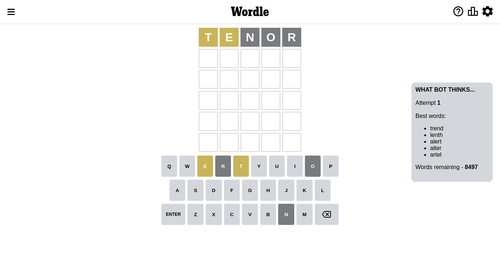
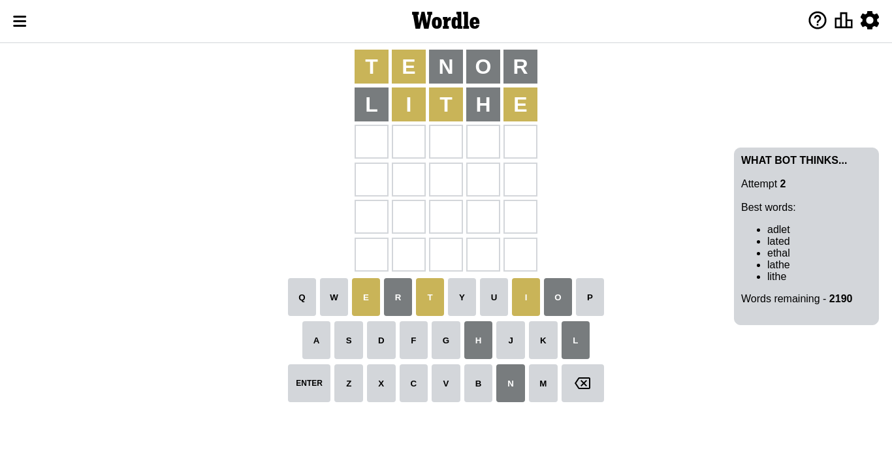
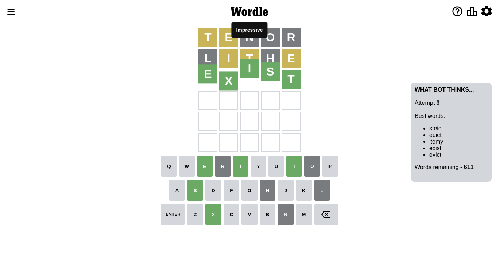

# Wordle for October 18, 2022 - \#486

## Attempt 1

This is the first attempt and we'll choose a random word to start with.

Let's start with word `tenor`

Attempt for `tenor` gives us 0 correct letters, 2 present letters and 3 wrong letters.

If we look into details, we can see that:

Letter `t` is on a different spot - this means that it cannot be at position 1

Letter `e` is on a different spot - this means that it cannot be at position 2

Letter `n` is not present in the word and we will not use it any more

Letter `o` is not present in the word and we will not use it any more

Letter `r` is not present in the word and we will not use it any more

Some letters are missing (like `n`, `o`, `r`) but it's also important piece of information

Word should contain letters `[t e]`

Could be a better guess

## Attempt 2

Right now we have 2190 words to choose from and best of them seem to be `[adlet lated ethal lathe lithe]`

So far we know that possible letters are:

At position 1: `[a b c d e f g h i j k l m p q s u v w x y z]`

At position 2: `[a b c d f g h i j k l m p q s t u v w x y z]`

At position 3: `[a b c d e f g h i j k l m p q s t u v w x y z]`

At position 4: `[a b c d e f g h i j k l m p q s t u v w x y z]`

At position 5: `[a b c d e f g h i j k l m p q s t u v w x y z]`

Next guess is `lithe`, let's see what it gives us

Attempt for `lithe` gives us 0 correct letters, 3 present letters and 2 wrong letters.

If we look into details, we can see that:

Letter `l` is not present in the word and we will not use it any more

Letter `i` is on a different spot - this means that it cannot be at position 2

Letter `t` is on a different spot - this means that it cannot be at position 3

Letter `h` is not present in the word and we will not use it any more

Letter `e` is on a different spot - this means that it cannot be at position 5

Some letters are missing (like `l`, `h`) but it's also important piece of information

Word should contain letters `[t e i]`

That was a great guess that limited number of remaining words

## Attempt 3

Right now we have 611 words to choose from and best of them seem to be `[steid edict itemy exist evict]`

So far we know that possible letters are:

At position 1: `[a b c d e f g i j k m p q s u v w x y z]`

At position 2: `[a b c d f g j k m p q s t u v w x y z]`

At position 3: `[a b c d e f g i j k m p q s u v w x y z]`

At position 4: `[a b c d e f g i j k m p q s t u v w x y z]`

At position 5: `[a b c d f g i j k m p q s t u v w x y z]`

Next guess is `exist`, let's see what it gives us

That's the correct answer! The word is `exist`!

To be honest that was a pretty lucky guess, but it worked out well.

## Conclusion

Today's word is `exist` and it took 3 attempts to guess it

