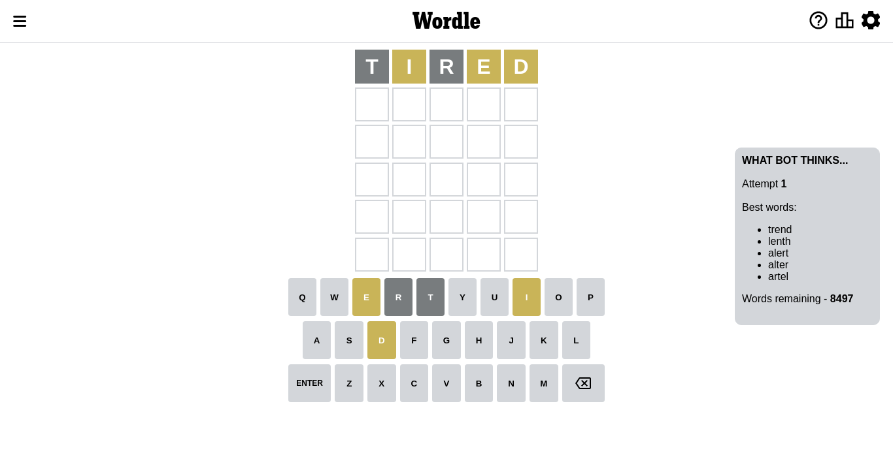
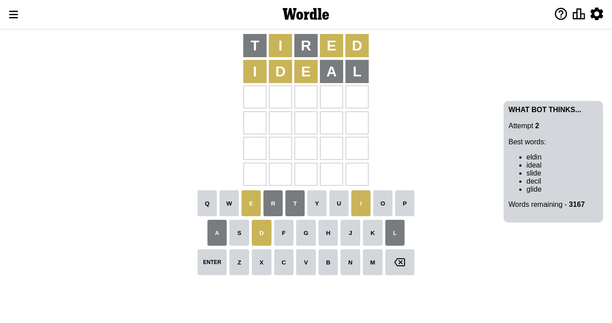
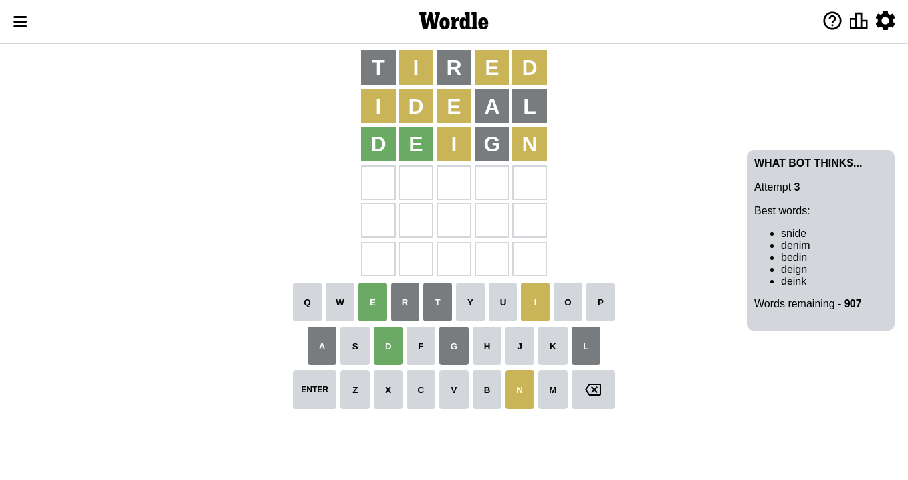
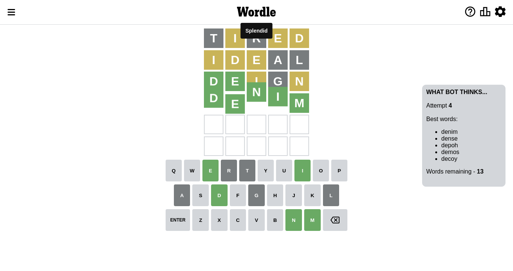

# Wordle for October 20, 2022 - \#488

## Attempt 1

This is the first attempt and we'll choose a random word to start with.

Let's start with word `tired`

Attempt for `tired` gives us 0 correct letters, 3 present letters and 2 wrong letters.

If we look into details, we can see that:

Letter `t` is not present in the word and we will not use it any more

Letter `i` is on a different spot - this means that it cannot be at position 2

Letter `r` is not present in the word and we will not use it any more

Letter `e` is on a different spot - this means that it cannot be at position 4

Letter `d` is on a different spot - this means that it cannot be at position 5

Some letters are missing (like `t`, `r`) but it's also important piece of information

Word should contain letters `[i e d]`

Could be a better guess

## Attempt 2

Right now we have 3167 words to choose from and best of them seem to be `[eldin ideal slide decil glide]`

So far we know that possible letters are:

At position 1: `[a b c d e f g h i j k l m n o p q s u v w x y z]`

At position 2: `[a b c d e f g h j k l m n o p q s u v w x y z]`

At position 3: `[a b c d e f g h i j k l m n o p q s u v w x y z]`

At position 4: `[a b c d f g h i j k l m n o p q s u v w x y z]`

At position 5: `[a b c e f g h i j k l m n o p q s u v w x y z]`

Next guess is `ideal`, let's see what it gives us

Attempt for `ideal` gives us 0 correct letters, 3 present letters and 2 wrong letters.

If we look into details, we can see that:

Letter `i` is on a different spot - this means that it cannot be at position 1

Letter `d` is on a different spot - this means that it cannot be at position 2

Letter `e` is on a different spot - this means that it cannot be at position 3

Letter `a` is not present in the word and we will not use it any more

Letter `l` is not present in the word and we will not use it any more

Some letters are missing (like `a`, `l`) but it's also important piece of information

Word should contain letters `[i e d]`

That was a great guess that limited number of remaining words

## Attempt 3

Right now we have 907 words to choose from and best of them seem to be `[snide denim bedin deign deink]`

So far we know that possible letters are:

At position 1: `[b c d e f g h j k m n o p q s u v w x y z]`

At position 2: `[b c e f g h j k m n o p q s u v w x y z]`

At position 3: `[b c d f g h i j k m n o p q s u v w x y z]`

At position 4: `[b c d f g h i j k m n o p q s u v w x y z]`

At position 5: `[b c e f g h i j k m n o p q s u v w x y z]`

Next guess is `deign`, let's see what it gives us

Attempt for `deign` gives us 2 correct letters, 2 present letters and 1 wrong letters.

If we look into details, we can see that:

Letter `d` should be at position 1

Letter `e` should be at position 2

Letter `i` is on a different spot - this means that it cannot be at position 3

Letter `g` is not present in the word and we will not use it any more

Letter `n` is on a different spot - this means that it cannot be at position 5

We got information about the correct letters and it should make next attempt easier

Some letters are missing (like `g`) but it's also important piece of information

Word should contain letters `[i e d n]`

That was a great guess that limited number of remaining words

## Attempt 4

Right now we have 13 words to choose from and best of them seem to be `[denim dense depoh demos decoy]`

So far we know that possible letters are:

At position 1: `[d]`

At position 2: `[e]`

At position 3: `[b c d f h j k m n o p q s u v w x y z]`

At position 4: `[b c d f h i j k m n o p q s u v w x y z]`

At position 5: `[b c e f h i j k m o p q s u v w x y z]`

Next guess is `denim`, let's see what it gives us

That's the correct answer! The word is `denim`!

To be honest that was a pretty lucky guess, but it worked out well.

## Conclusion

Today's word is `denim` and it took 4 attempts to guess it

