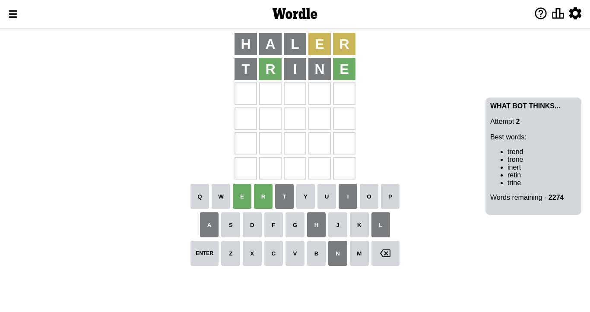

# Wordle for October 21, 2022 - \#489

## Attempt 1

This is the first attempt and we'll choose a random word to start with.

Let's start with word `arent`

Wordle does not know word `arent`, need to try something different

## Attempt 1

This is the first attempt and we'll choose a random word to start with.

Let's start with word `haler`

Attempt for `haler` gives us 0 correct letters, 2 present letters and 3 wrong letters.

If we look into details, we can see that:

Letter `h` is not present in the word and we will not use it any more

Letter `a` is not present in the word and we will not use it any more

Letter `l` is not present in the word and we will not use it any more

Letter `e` is on a different spot - this means that it cannot be at position 4

Letter `r` is on a different spot - this means that it cannot be at position 5

Some letters are missing (like `h`, `a`, `l`) but it's also important piece of information

Word should contain letters `[e r]`

Could be a better guess

## Attempt 2

Right now we have 2274 words to choose from and best of them seem to be `[trend trone inert retin trine]`

So far we know that possible letters are:

At position 1: `[b c d e f g i j k m n o p q r s t u v w x y z]`

At position 2: `[b c d e f g i j k m n o p q r s t u v w x y z]`

At position 3: `[b c d e f g i j k m n o p q r s t u v w x y z]`

At position 4: `[b c d f g i j k m n o p q r s t u v w x y z]`

At position 5: `[b c d e f g i j k m n o p q s t u v w x y z]`

Next guess is `trine`, let's see what it gives us

Attempt for `trine` gives us 2 correct letters, 0 present letters and 3 wrong letters.

If we look into details, we can see that:

Letter `t` is not present in the word and we will not use it any more

Letter `r` should be at position 2

Letter `i` is not present in the word and we will not use it any more

Letter `n` is not present in the word and we will not use it any more

Letter `e` should be at position 5

We got information about the correct letters and it should make next attempt easier

Some letters are missing (like `t`, `i`, `n`) but it's also important piece of information

Word should contain letters `[e r]`

That was a great guess that limited number of remaining words

## Attempt 3

Right now we have 40 words to choose from and best of them seem to be `[druse drome crude drove drupe]`

So far we know that possible letters are:

At position 1: `[b c d e f g j k m o p q r s u v w x y z]`

At position 2: `[r]`

At position 3: `[b c d e f g j k m o p q r s u v w x y z]`

At position 4: `[b c d f g j k m o p q r s u v w x y z]`

At position 5: `[e]`

Next guess is `drove`, let's see what it gives us

Attempt for `drove` gives us 4 correct letters, 0 present letters and 1 wrong letters.

If we look into details, we can see that:

Letter `d` is not present in the word and we will not use it any more

Letter `o` should be at position 3

Letter `v` should be at position 4

We got information about the correct letters and it should make next attempt easier

Some letters are missing (like `d`) but it's also important piece of information

Word should contain letters `[e r o v]`

That was a great guess that limited number of remaining words

## Attempt 4

Right now we have 2 words to choose from and best of them seem to be `[prove grove]`

So far we know that possible letters are:

At position 1: `[b c e f g j k m o p q r s u v w x y z]`

At position 2: `[r]`

At position 3: `[o]`

At position 4: `[v]`

At position 5: `[e]`

Next guess is `grove`, let's see what it gives us

That's the correct answer! The word is `grove`!

## Conclusion

Today's word is `grove` and it took 4 attempts to guess it

