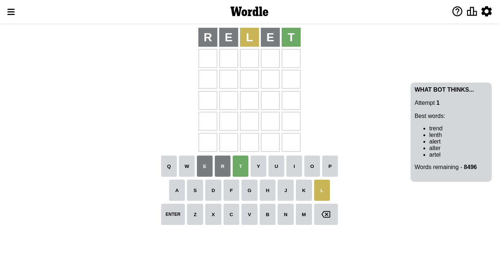

# Wordle for October 24, 2022 - \#492

## Attempt 1

This is the first attempt and we'll choose a random word to start with.

Let's start with word `enrut`

Wordle does not know word `enrut`, need to try something different

## Attempt 1

This is the first attempt and we'll choose a random word to start with.

Let's start with word `relet`

Attempt for `relet` gives us 1 correct letters, 1 present letters and 3 wrong letters.

If we look into details, we can see that:

Letter `r` is not present in the word and we will not use it any more

Letter `e` is not present in the word and we will not use it any more

Letter `l` is on a different spot - this means that it cannot be at position 3

Letter `e` is not present in the word and we will not use it any more

Letter `t` should be at position 5

We got information about the correct letters and it should make next attempt easier

Some letters are missing (like `r`, `e`) but it's also important piece of information

Word should contain letters `[l t]`

That was a great guess that limited number of remaining words

## Attempt 2

Right now we have 274 words to choose from and best of them seem to be `[slant plant clint glint flint]`

So far we know that possible letters are:

At position 1: `[a b c d f g h i j k l m n o p q s t u v w x y z]`

At position 2: `[a b c d f g h i j k l m n o p q s t u v w x y z]`

At position 3: `[a b c d f g h i j k m n o p q s t u v w x y z]`

At position 4: `[a b c d f g h i j k l m n o p q s t u v w x y z]`

At position 5: `[t]`

Next guess is `slant`, let's see what it gives us

Attempt for `slant` gives us 1 correct letters, 2 present letters and 2 wrong letters.

If we look into details, we can see that:

Letter `s` is not present in the word and we will not use it any more

Letter `l` is on a different spot - this means that it cannot be at position 2

Letter `a` is on a different spot - this means that it cannot be at position 3

Letter `n` is not present in the word and we will not use it any more

Some letters are missing (like `s`, `n`) but it's also important piece of information

Word should contain letters `[l t a]`

That was a great guess that limited number of remaining words

## Attempt 3

Right now we have 85 words to choose from and best of them seem to be `[adult gault fault vault light]`

So far we know that possible letters are:

At position 1: `[a b c d f g h i j k l m o p q t u v w x y z]`

At position 2: `[a b c d f g h i j k m o p q t u v w x y z]`

At position 3: `[b c d f g h i j k m o p q t u v w x y z]`

At position 4: `[a b c d f g h i j k l m o p q t u v w x y z]`

At position 5: `[t]`

Next guess is `vault`, let's see what it gives us

Attempt for `vault` gives us 4 correct letters, 0 present letters and 1 wrong letters.

If we look into details, we can see that:

Letter `v` is not present in the word and we will not use it any more

Letter `a` should be at position 2

Letter `u` should be at position 3

Letter `l` should be at position 4

We got information about the correct letters and it should make next attempt easier

Some letters are missing (like `v`) but it's also important piece of information

Word should contain letters `[l t a u]`

That was a great guess that limited number of remaining words

## Attempt 4

Right now we have 2 words to choose from and best of them seem to be `[gault fault]`

So far we know that possible letters are:

At position 1: `[a b c d f g h i j k l m o p q t u w x y z]`

At position 2: `[a]`

At position 3: `[u]`

At position 4: `[l]`

At position 5: `[t]`

Next guess is `fault`, let's see what it gives us

That's the correct answer! The word is `fault`!

## Conclusion

Today's word is `fault` and it took 4 attempts to guess it

