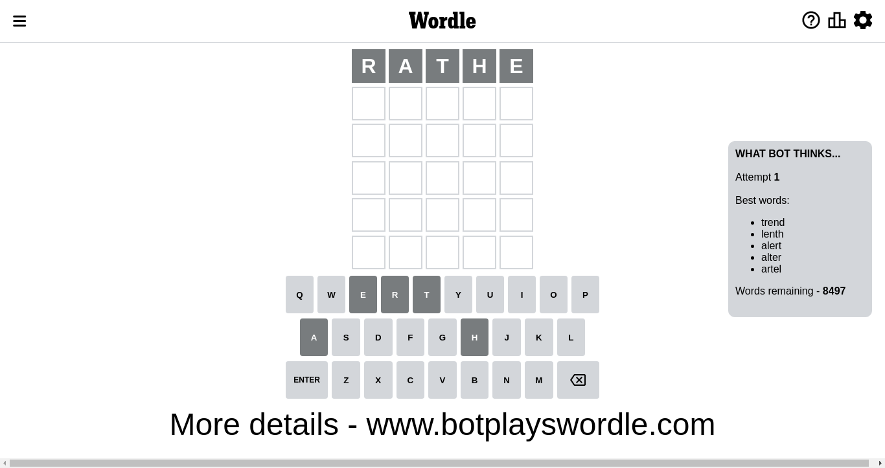
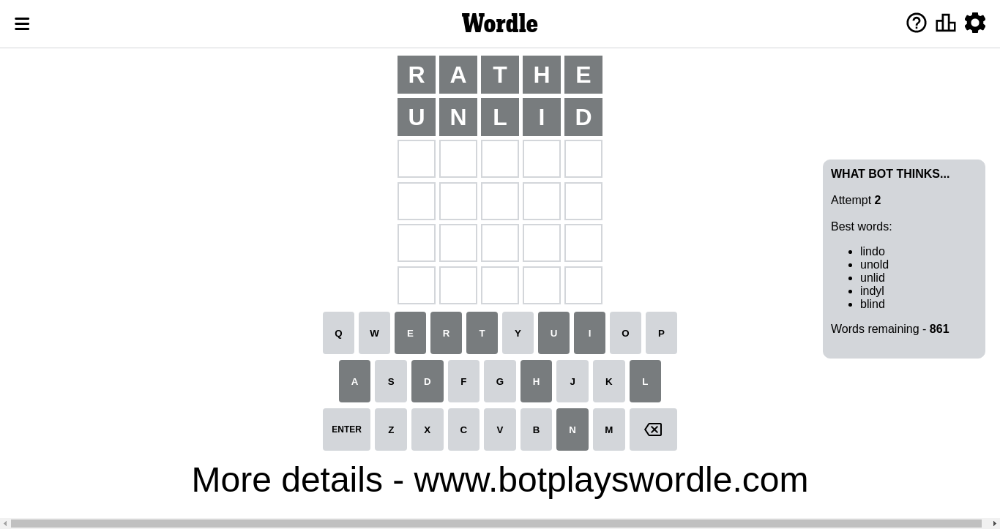
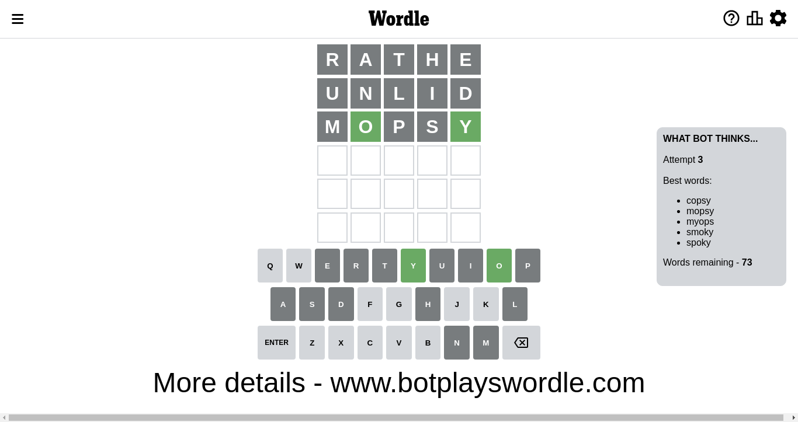
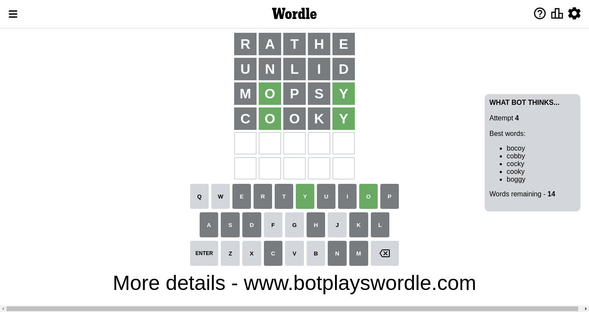
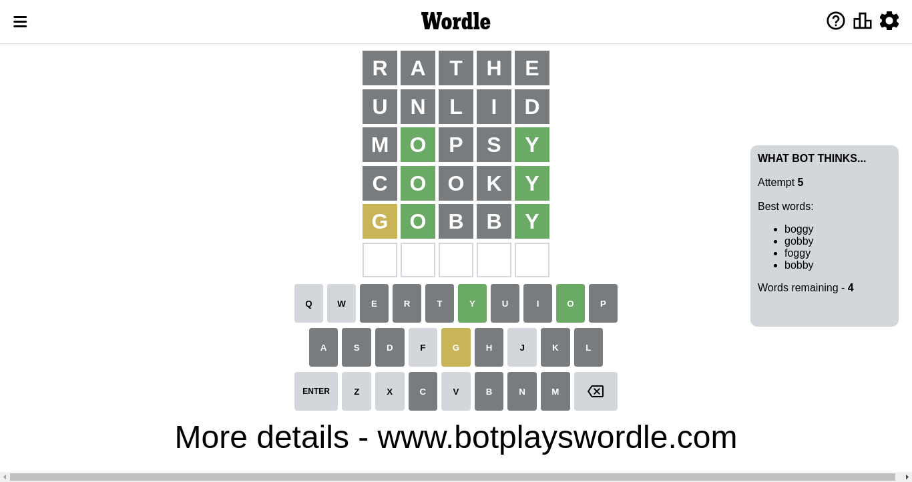
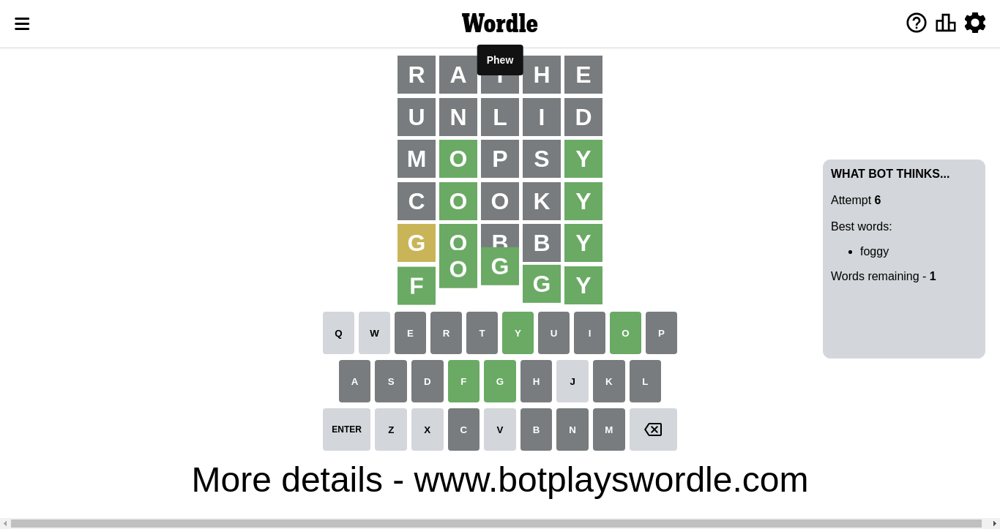

# Wordle for October 25, 2022 - \#493

## Attempt 1

This is the first attempt and we'll choose a random word to start with.

Let's start with word `rathe`

Attempt for `rathe` gives us 0 correct letters, 0 present letters and 5 wrong letters.

If we look into details, we can see that:

Letter `r` is not present in the word and we will not use it any more

Letter `a` is not present in the word and we will not use it any more

Letter `t` is not present in the word and we will not use it any more

Letter `h` is not present in the word and we will not use it any more

Letter `e` is not present in the word and we will not use it any more

Some letters are missing (like `r`, `a`, `t`, `h`, `e`) but it's also important piece of information

So far we don't know any of the letters!

That was a great guess that limited number of remaining words

## Attempt 2

Right now we have 861 words to choose from and best of them seem to be `[lindo unold unlid indyl blind]`

So far we know that possible letters are:

At position 1: `[b c d f g i j k l m n o p q s u v w x y z]`

At position 2: `[b c d f g i j k l m n o p q s u v w x y z]`

At position 3: `[b c d f g i j k l m n o p q s u v w x y z]`

At position 4: `[b c d f g i j k l m n o p q s u v w x y z]`

At position 5: `[b c d f g i j k l m n o p q s u v w x y z]`

Next guess is `unlid`, let's see what it gives us

Attempt for `unlid` gives us 0 correct letters, 0 present letters and 5 wrong letters.

If we look into details, we can see that:

Letter `u` is not present in the word and we will not use it any more

Letter `n` is not present in the word and we will not use it any more

Letter `l` is not present in the word and we will not use it any more

Letter `i` is not present in the word and we will not use it any more

Letter `d` is not present in the word and we will not use it any more

Some letters are missing (like `u`, `n`, `l`, `i`, `d`) but it's also important piece of information

So far we don't know any of the letters!

That was a great guess that limited number of remaining words

## Attempt 3

Right now we have 74 words to choose from and best of them seem to be `[copsy mopsy myops socky smoky]`

So far we know that possible letters are:

At position 1: `[b c f g j k m o p q s v w x y z]`

At position 2: `[b c f g j k m o p q s v w x y z]`

At position 3: `[b c f g j k m o p q s v w x y z]`

At position 4: `[b c f g j k m o p q s v w x y z]`

At position 5: `[b c f g j k m o p q s v w x y z]`

Next guess is `socky`, let's see what it gives us

Wordle does not know word `socky`, need to try something different

## Attempt 3

Right now we have 73 words to choose from and best of them seem to be `[copsy mopsy myops smoky spoky]`

So far we know that possible letters are:

At position 1: `[b c f g j k m o p q s v w x y z]`

At position 2: `[b c f g j k m o p q s v w x y z]`

At position 3: `[b c f g j k m o p q s v w x y z]`

At position 4: `[b c f g j k m o p q s v w x y z]`

At position 5: `[b c f g j k m o p q s v w x y z]`

Next guess is `mopsy`, let's see what it gives us

Attempt for `mopsy` gives us 2 correct letters, 0 present letters and 3 wrong letters.

If we look into details, we can see that:

Letter `m` is not present in the word and we will not use it any more

Letter `o` should be at position 2

Letter `p` is not present in the word and we will not use it any more

Letter `s` is not present in the word and we will not use it any more

Letter `y` should be at position 5

We got information about the correct letters and it should make next attempt easier

Some letters are missing (like `m`, `p`, `s`) but it's also important piece of information

Word should contain letters `[o y]`

That was a great guess that limited number of remaining words

## Attempt 4

Right now we have 14 words to choose from and best of them seem to be `[bocoy cobby cocky cooky boggy]`

So far we know that possible letters are:

At position 1: `[b c f g j k o q v w x y z]`

At position 2: `[o]`

At position 3: `[b c f g j k o q v w x y z]`

At position 4: `[b c f g j k o q v w x y z]`

At position 5: `[y]`

Next guess is `cooky`, let's see what it gives us

Attempt for `cooky` gives us 2 correct letters, 0 present letters and 3 wrong letters.

If we look into details, we can see that:

Letter `c` is not present in the word and we will not use it any more

Letter `o` is not present in the word and we will not use it any more

Letter `k` is not present in the word and we will not use it any more

Some letters are missing (like `c`, `o`, `k`) but it's also important piece of information

Word should contain letters `[o y]`

That was a great guess that limited number of remaining words

## Attempt 5

Right now we have 4 words to choose from and best of them seem to be `[boggy gobby foggy bobby]`

So far we know that possible letters are:

At position 1: `[b f g j q v w x y z]`

At position 2: `[o]`

At position 3: `[b f g j q v w x y z]`

At position 4: `[b f g j q v w x y z]`

At position 5: `[y]`

Next guess is `gobby`, let's see what it gives us

Attempt for `gobby` gives us 2 correct letters, 1 present letters and 2 wrong letters.

If we look into details, we can see that:

Letter `g` is on a different spot - this means that it cannot be at position 1

Letter `b` is not present in the word and we will not use it any more

Letter `b` is not present in the word and we will not use it any more

Some letters are missing (like `b`) but it's also important piece of information

Word should contain letters `[o y g]`

That was a great guess that limited number of remaining words

## Attempt 6

Right now we have 1 words to choose from and best of them seem to be `[foggy]`

So far we know that possible letters are:

At position 1: `[f j q v w x y z]`

At position 2: `[o]`

At position 3: `[f g j q v w x y z]`

At position 4: `[f g j q v w x y z]`

At position 5: `[y]`

Next guess is `foggy`, let's see what it gives us

That's the correct answer! The word is `foggy`!

## Conclusion

Today's word is `foggy` and it took 6 attempts to guess it

