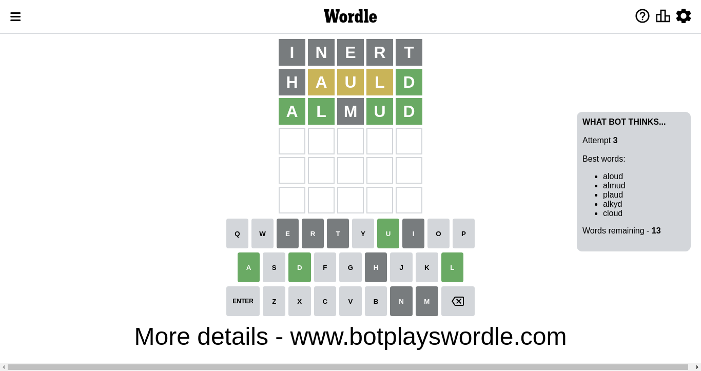

# Wordle for November 3, 2022 - \#502

## Attempt 1

This is the first attempt and we'll choose a random word to start with.

Let's start with word `inert`

Attempt for `inert` gives us 0 correct letters, 0 present letters and 5 wrong letters.

If we look into details, we can see that:

Letter `i` is not present in the word and we will not use it any more

Letter `n` is not present in the word and we will not use it any more

Letter `e` is not present in the word and we will not use it any more

Letter `r` is not present in the word and we will not use it any more

Letter `t` is not present in the word and we will not use it any more

Some letters are missing (like `i`, `n`, `e`, `r`, `t`) but it's also important piece of information

So far we don't know any of the letters!

Not a bad guess in general

## Attempt 2

Right now we have 1143 words to choose from and best of them seem to be `[hauld dhyal dhoul chold aloud]`

So far we know that possible letters are:

At position 1: `[a b c d f g h j k l m o p q s u v w x y z]`

At position 2: `[a b c d f g h j k l m o p q s u v w x y z]`

At position 3: `[a b c d f g h j k l m o p q s u v w x y z]`

At position 4: `[a b c d f g h j k l m o p q s u v w x y z]`

At position 5: `[a b c d f g h j k l m o p q s u v w x y z]`

Next guess is `hauld`, let's see what it gives us

Attempt for `hauld` gives us 1 correct letters, 3 present letters and 1 wrong letters.

If we look into details, we can see that:

Letter `h` is not present in the word and we will not use it any more

Letter `a` is on a different spot - this means that it cannot be at position 2

Letter `u` is on a different spot - this means that it cannot be at position 3

Letter `l` is on a different spot - this means that it cannot be at position 4

Letter `d` should be at position 5

We got information about the correct letters and it should make next attempt easier

Some letters are missing (like `h`) but it's also important piece of information

Word should contain letters `[a u l d]`

That was a great guess that limited number of remaining words

## Attempt 3

Right now we have 13 words to choose from and best of them seem to be `[aloud almud plaud alkyd cloud]`

So far we know that possible letters are:

At position 1: `[a b c d f g j k l m o p q s u v w x y z]`

At position 2: `[b c d f g j k l m o p q s u v w x y z]`

At position 3: `[a b c d f g j k l m o p q s v w x y z]`

At position 4: `[a b c d f g j k m o p q s u v w x y z]`

At position 5: `[d]`

Next guess is `almud`, let's see what it gives us

Attempt for `almud` gives us 4 correct letters, 0 present letters and 1 wrong letters.

If we look into details, we can see that:

Letter `a` should be at position 1

Letter `l` should be at position 2

Letter `m` is not present in the word and we will not use it any more

Letter `u` should be at position 4

We got information about the correct letters and it should make next attempt easier

Some letters are missing (like `m`) but it's also important piece of information

Word should contain letters `[a u l d]`

That was a great guess that limited number of remaining words

## Attempt 4

Right now we have 1 words to choose from and best of them seem to be `[aloud]`

So far we know that possible letters are:

At position 1: `[a]`

At position 2: `[l]`

At position 3: `[a b c d f g j k l o p q s v w x y z]`

At position 4: `[u]`

At position 5: `[d]`

Next guess is `aloud`, let's see what it gives us

That's the correct answer! The word is `aloud`!

## Conclusion

Today's word is `aloud` and it took 4 attempts to guess it

