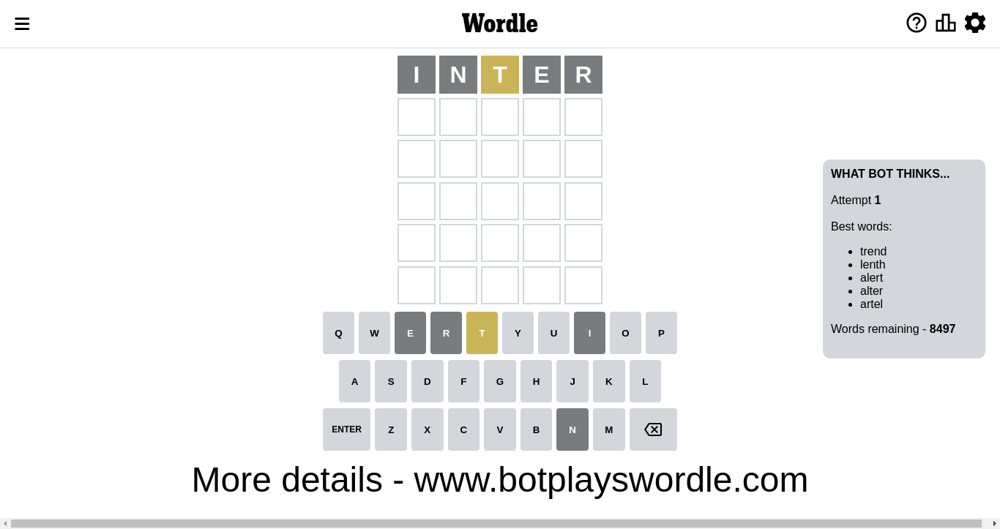
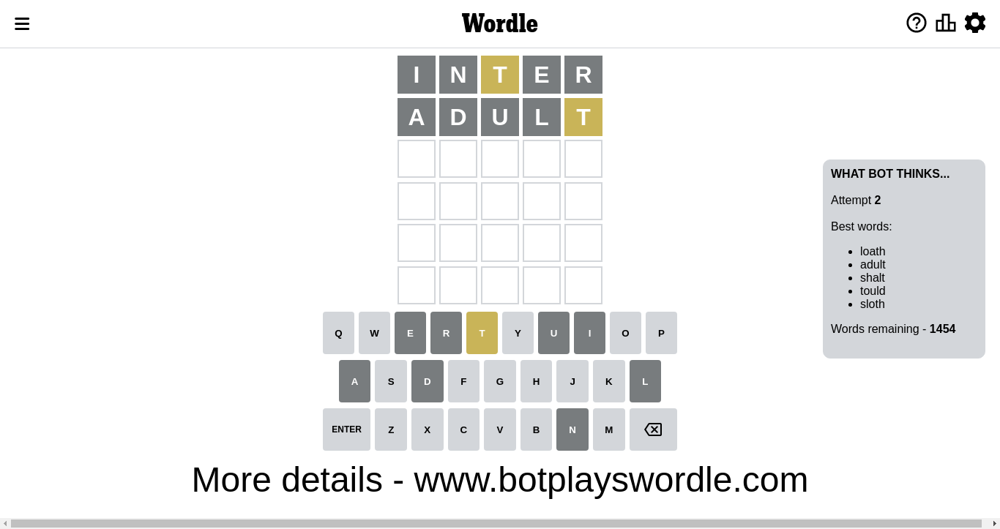
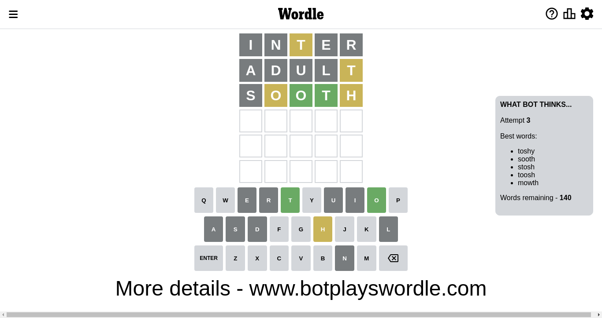
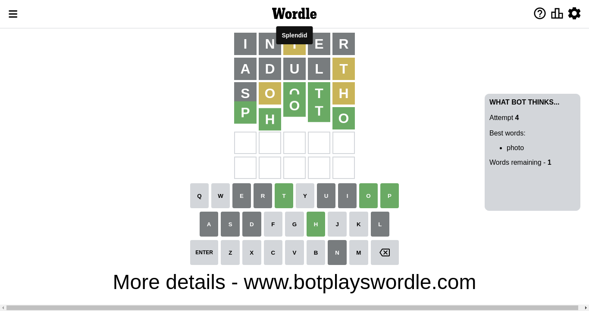

# Wordle for November 4, 2022 - \#503

## Attempt 1

This is the first attempt and we'll choose a random word to start with.

Let's start with word `inter`

Attempt for `inter` gives us 0 correct letters, 1 present letters and 4 wrong letters.

If we look into details, we can see that:

Letter `i` is not present in the word and we will not use it any more

Letter `n` is not present in the word and we will not use it any more

Letter `t` is on a different spot - this means that it cannot be at position 3

Letter `e` is not present in the word and we will not use it any more

Letter `r` is not present in the word and we will not use it any more

Some letters are missing (like `i`, `n`, `e`, `r`) but it's also important piece of information

Word should contain letters `[t]`

Not a bad guess in general

## Attempt 2

Right now we have 1455 words to choose from and best of them seem to be `[loath adult shalt slath tould]`

So far we know that possible letters are:

At position 1: `[a b c d f g h j k l m o p q s t u v w x y z]`

At position 2: `[a b c d f g h j k l m o p q s t u v w x y z]`

At position 3: `[a b c d f g h j k l m o p q s u v w x y z]`

At position 4: `[a b c d f g h j k l m o p q s t u v w x y z]`

At position 5: `[a b c d f g h j k l m o p q s t u v w x y z]`

Next guess is `slath`, let's see what it gives us

Wordle does not know word `slath`, need to try something different

## Attempt 2

Right now we have 1454 words to choose from and best of them seem to be `[loath adult shalt tould sloth]`

So far we know that possible letters are:

At position 1: `[a b c d f g h j k l m o p q s t u v w x y z]`

At position 2: `[a b c d f g h j k l m o p q s t u v w x y z]`

At position 3: `[a b c d f g h j k l m o p q s u v w x y z]`

At position 4: `[a b c d f g h j k l m o p q s t u v w x y z]`

At position 5: `[a b c d f g h j k l m o p q s t u v w x y z]`

Next guess is `adult`, let's see what it gives us

Attempt for `adult` gives us 0 correct letters, 1 present letters and 4 wrong letters.

If we look into details, we can see that:

Letter `a` is not present in the word and we will not use it any more

Letter `d` is not present in the word and we will not use it any more

Letter `u` is not present in the word and we will not use it any more

Letter `l` is not present in the word and we will not use it any more

Letter `t` is on a different spot - this means that it cannot be at position 5

Some letters are missing (like `a`, `d`, `u`, `l`) but it's also important piece of information

Word should contain letters `[t]`

That was a great guess that limited number of remaining words

## Attempt 3

Right now we have 141 words to choose from and best of them seem to be `[toshy smyth sooth stosh toosh]`

So far we know that possible letters are:

At position 1: `[b c f g h j k m o p q s t v w x y z]`

At position 2: `[b c f g h j k m o p q s t v w x y z]`

At position 3: `[b c f g h j k m o p q s v w x y z]`

At position 4: `[b c f g h j k m o p q s t v w x y z]`

At position 5: `[b c f g h j k m o p q s v w x y z]`

Next guess is `smyth`, let's see what it gives us

Wordle does not know word `smyth`, need to try something different

## Attempt 3

Right now we have 140 words to choose from and best of them seem to be `[toshy sooth stosh toosh mowth]`

So far we know that possible letters are:

At position 1: `[b c f g h j k m o p q s t v w x y z]`

At position 2: `[b c f g h j k m o p q s t v w x y z]`

At position 3: `[b c f g h j k m o p q s v w x y z]`

At position 4: `[b c f g h j k m o p q s t v w x y z]`

At position 5: `[b c f g h j k m o p q s v w x y z]`

Next guess is `sooth`, let's see what it gives us

Attempt for `sooth` gives us 2 correct letters, 2 present letters and 1 wrong letters.

If we look into details, we can see that:

Letter `s` is not present in the word and we will not use it any more

Letter `o` is on a different spot - this means that it cannot be at position 2

Letter `o` should be at position 3

Letter `t` should be at position 4

Letter `h` is on a different spot - this means that it cannot be at position 5

We got information about the correct letters and it should make next attempt easier

Some letters are missing (like `s`) but it's also important piece of information

Word should contain letters `[t o h]`

That was a great guess that limited number of remaining words

## Attempt 4

Right now we have 1 words to choose from and best of them seem to be `[photo]`

So far we know that possible letters are:

At position 1: `[b c f g h j k m o p q t v w x y z]`

At position 2: `[b c f g h j k m p q t v w x y z]`

At position 3: `[o]`

At position 4: `[t]`

At position 5: `[b c f g j k m o p q v w x y z]`

Next guess is `photo`, let's see what it gives us

That's the correct answer! The word is `photo`!

## Conclusion

Today's word is `photo` and it took 4 attempts to guess it

