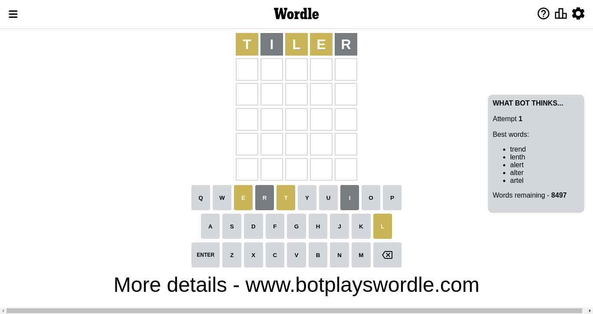
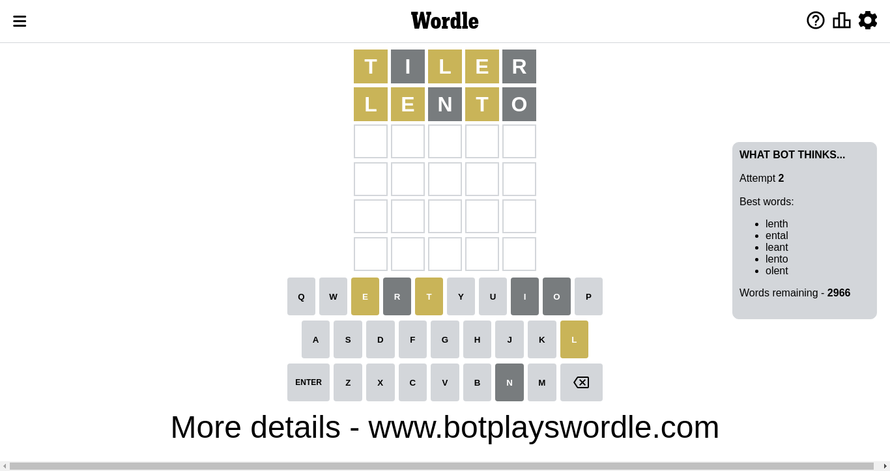
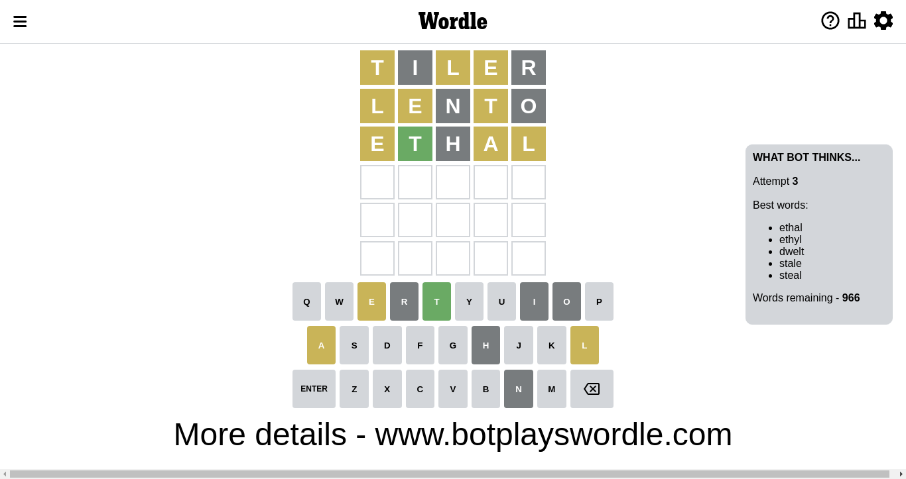
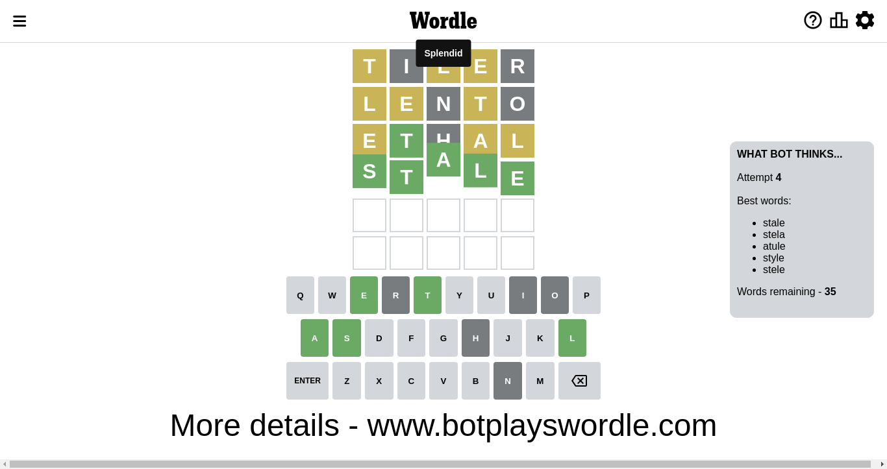

# Wordle for November 6, 2022 - \#505

## Attempt 1

This is the first attempt and we'll choose a random word to start with.

Let's start with word `tiler`

Attempt for `tiler` gives us 0 correct letters, 3 present letters and 2 wrong letters.

If we look into details, we can see that:

Letter `t` is on a different spot - this means that it cannot be at position 1

Letter `i` is not present in the word and we will not use it any more

Letter `l` is on a different spot - this means that it cannot be at position 3

Letter `e` is on a different spot - this means that it cannot be at position 4

Letter `r` is not present in the word and we will not use it any more

Some letters are missing (like `i`, `r`) but it's also important piece of information

Word should contain letters `[t l e]`

Could be a better guess

## Attempt 2

Right now we have 2966 words to choose from and best of them seem to be `[lenth ental leant lento olent]`

So far we know that possible letters are:

At position 1: `[a b c d e f g h j k l m n o p q s u v w x y z]`

At position 2: `[a b c d e f g h j k l m n o p q s t u v w x y z]`

At position 3: `[a b c d e f g h j k m n o p q s t u v w x y z]`

At position 4: `[a b c d f g h j k l m n o p q s t u v w x y z]`

At position 5: `[a b c d e f g h j k l m n o p q s t u v w x y z]`

Next guess is `lento`, let's see what it gives us

Attempt for `lento` gives us 0 correct letters, 3 present letters and 2 wrong letters.

If we look into details, we can see that:

Letter `l` is on a different spot - this means that it cannot be at position 1

Letter `e` is on a different spot - this means that it cannot be at position 2

Letter `n` is not present in the word and we will not use it any more

Letter `t` is on a different spot - this means that it cannot be at position 4

Letter `o` is not present in the word and we will not use it any more

Some letters are missing (like `n`, `o`) but it's also important piece of information

Word should contain letters `[t l e]`

That was a great guess that limited number of remaining words

## Attempt 3

Right now we have 966 words to choose from and best of them seem to be `[ethal ethyl dwelt stale steal]`

So far we know that possible letters are:

At position 1: `[a b c d e f g h j k m p q s u v w x y z]`

At position 2: `[a b c d f g h j k l m p q s t u v w x y z]`

At position 3: `[a b c d e f g h j k m p q s t u v w x y z]`

At position 4: `[a b c d f g h j k l m p q s u v w x y z]`

At position 5: `[a b c d e f g h j k l m p q s t u v w x y z]`

Next guess is `ethal`, let's see what it gives us

Attempt for `ethal` gives us 1 correct letters, 3 present letters and 1 wrong letters.

If we look into details, we can see that:

Letter `e` is on a different spot - this means that it cannot be at position 1

Letter `t` should be at position 2

Letter `h` is not present in the word and we will not use it any more

Letter `a` is on a different spot - this means that it cannot be at position 4

Letter `l` is on a different spot - this means that it cannot be at position 5

We got information about the correct letters and it should make next attempt easier

Some letters are missing (like `h`) but it's also important piece of information

Word should contain letters `[t l e a]`

That was a great guess that limited number of remaining words

## Attempt 4

Right now we have 35 words to choose from and best of them seem to be `[stale stela atule style stele]`

So far we know that possible letters are:

At position 1: `[a b c d f g j k m p q s u v w x y z]`

At position 2: `[t]`

At position 3: `[a b c d e f g j k m p q s t u v w x y z]`

At position 4: `[b c d f g j k l m p q s u v w x y z]`

At position 5: `[a b c d e f g j k m p q s t u v w x y z]`

Next guess is `stale`, let's see what it gives us

That's the correct answer! The word is `stale`!

To be honest that was a pretty lucky guess, but it worked out well.

## Conclusion

Today's word is `stale` and it took 4 attempts to guess it

