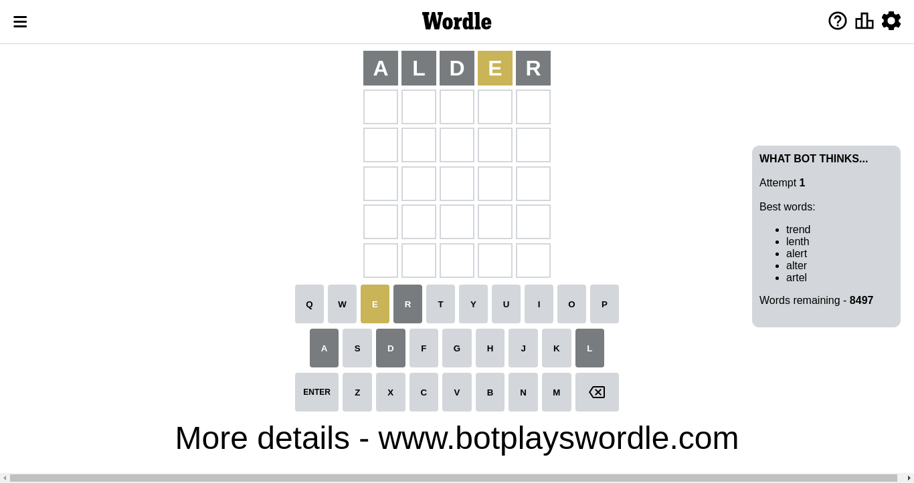
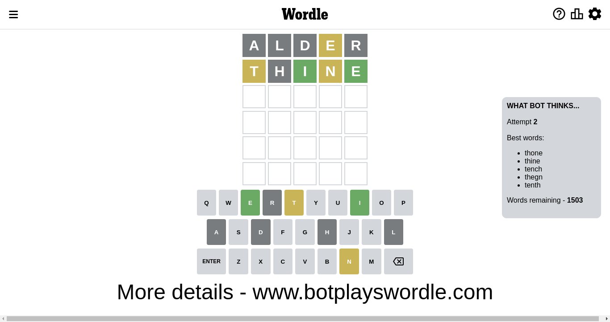
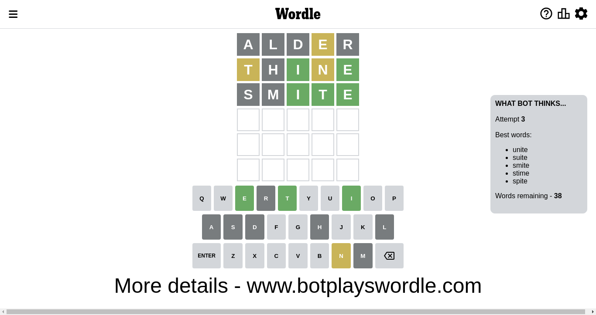
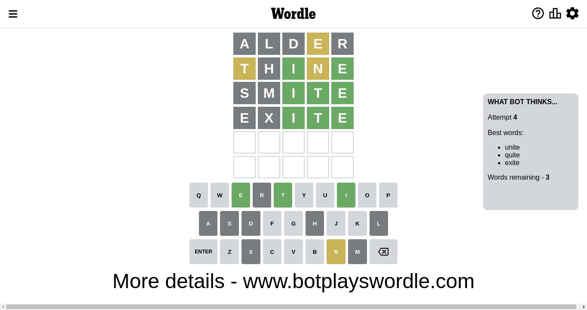
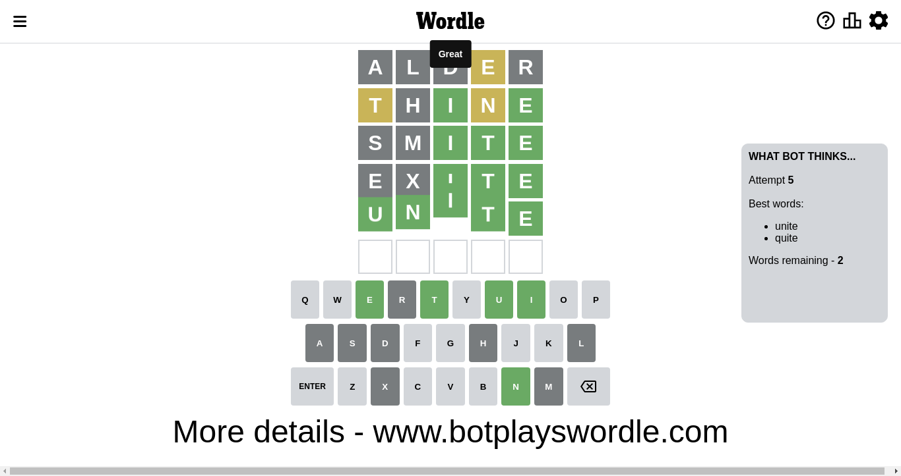

# Wordle for November 10, 2022 - \#509

## Attempt 1

This is the first attempt and we'll choose a random word to start with.

Let's start with word `alder`

Attempt for `alder` gives us 0 correct letters, 1 present letters and 4 wrong letters.

If we look into details, we can see that:

Letter `a` is not present in the word and we will not use it any more

Letter `l` is not present in the word and we will not use it any more

Letter `d` is not present in the word and we will not use it any more

Letter `e` is on a different spot - this means that it cannot be at position 4

Letter `r` is not present in the word and we will not use it any more

Some letters are missing (like `a`, `l`, `d`, `r`) but it's also important piece of information

Word should contain letters `[e]`

Not a bad guess in general

## Attempt 2

Right now we have 1503 words to choose from and best of them seem to be `[thone thine tench thegn tenth]`

So far we know that possible letters are:

At position 1: `[b c e f g h i j k m n o p q s t u v w x y z]`

At position 2: `[b c e f g h i j k m n o p q s t u v w x y z]`

At position 3: `[b c e f g h i j k m n o p q s t u v w x y z]`

At position 4: `[b c f g h i j k m n o p q s t u v w x y z]`

At position 5: `[b c e f g h i j k m n o p q s t u v w x y z]`

Next guess is `thine`, let's see what it gives us

Attempt for `thine` gives us 2 correct letters, 2 present letters and 1 wrong letters.

If we look into details, we can see that:

Letter `t` is on a different spot - this means that it cannot be at position 1

Letter `h` is not present in the word and we will not use it any more

Letter `i` should be at position 3

Letter `n` is on a different spot - this means that it cannot be at position 4

Letter `e` should be at position 5

We got information about the correct letters and it should make next attempt easier

Some letters are missing (like `h`) but it's also important piece of information

Word should contain letters `[e t i n]`

That was a great guess that limited number of remaining words

## Attempt 3

Right now we have 39 words to choose from and best of them seem to be `[snite unite suite smite stime]`

So far we know that possible letters are:

At position 1: `[b c e f g i j k m n o p q s u v w x y z]`

At position 2: `[b c e f g i j k m n o p q s t u v w x y z]`

At position 3: `[i]`

At position 4: `[b c f g i j k m o p q s t u v w x y z]`

At position 5: `[e]`

Next guess is `snite`, let's see what it gives us

Wordle does not know word `snite`, need to try something different

## Attempt 3

Right now we have 38 words to choose from and best of them seem to be `[unite suite smite stime spite]`

So far we know that possible letters are:

At position 1: `[b c e f g i j k m n o p q s u v w x y z]`

At position 2: `[b c e f g i j k m n o p q s t u v w x y z]`

At position 3: `[i]`

At position 4: `[b c f g i j k m o p q s t u v w x y z]`

At position 5: `[e]`

Next guess is `smite`, let's see what it gives us

Attempt for `smite` gives us 3 correct letters, 0 present letters and 2 wrong letters.

If we look into details, we can see that:

Letter `s` is not present in the word and we will not use it any more

Letter `m` is not present in the word and we will not use it any more

Letter `t` should be at position 4

We got information about the correct letters and it should make next attempt easier

Some letters are missing (like `s`, `m`) but it's also important piece of information

Word should contain letters `[e t i n]`

That was a great guess that limited number of remaining words

## Attempt 4

Right now we have 3 words to choose from and best of them seem to be `[unite quite exite]`

So far we know that possible letters are:

At position 1: `[b c e f g i j k n o p q u v w x y z]`

At position 2: `[b c e f g i j k n o p q t u v w x y z]`

At position 3: `[i]`

At position 4: `[t]`

At position 5: `[e]`

Next guess is `exite`, let's see what it gives us

Attempt for `exite` gives us 3 correct letters, 0 present letters and 2 wrong letters.

If we look into details, we can see that:

Letter `e` is not present in the word and we will not use it any more

Letter `x` is not present in the word and we will not use it any more

Some letters are missing (like `e`, `x`) but it's also important piece of information

Word should contain letters `[e t i n]`

That was a great guess that limited number of remaining words

## Attempt 5

Right now we have 2 words to choose from and best of them seem to be `[unite quite]`

So far we know that possible letters are:

At position 1: `[b c f g i j k n o p q u v w y z]`

At position 2: `[b c f g i j k n o p q t u v w y z]`

At position 3: `[i]`

At position 4: `[t]`

At position 5: `[e]`

Next guess is `unite`, let's see what it gives us

That's the correct answer! The word is `unite`!

## Conclusion

Today's word is `unite` and it took 5 attempts to guess it

