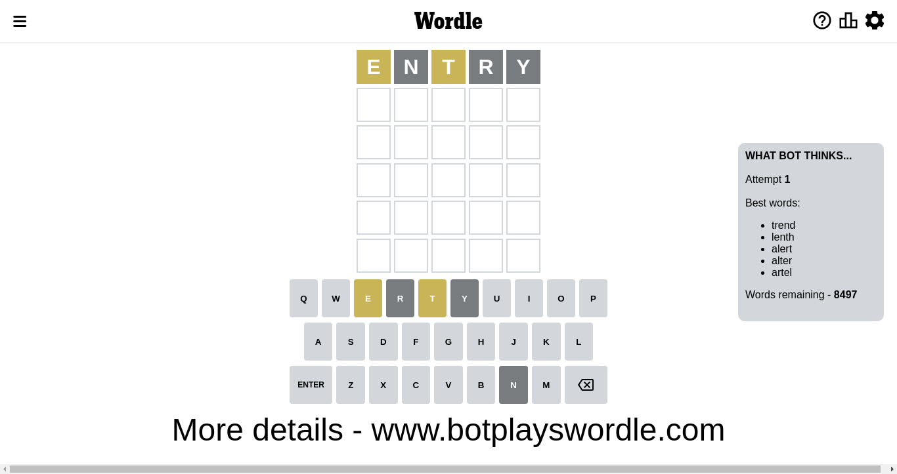
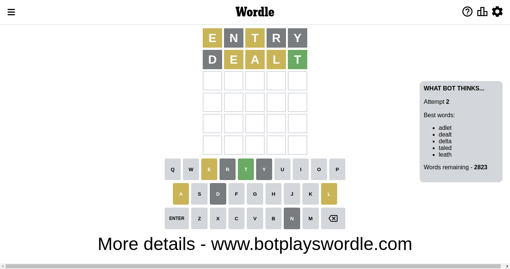
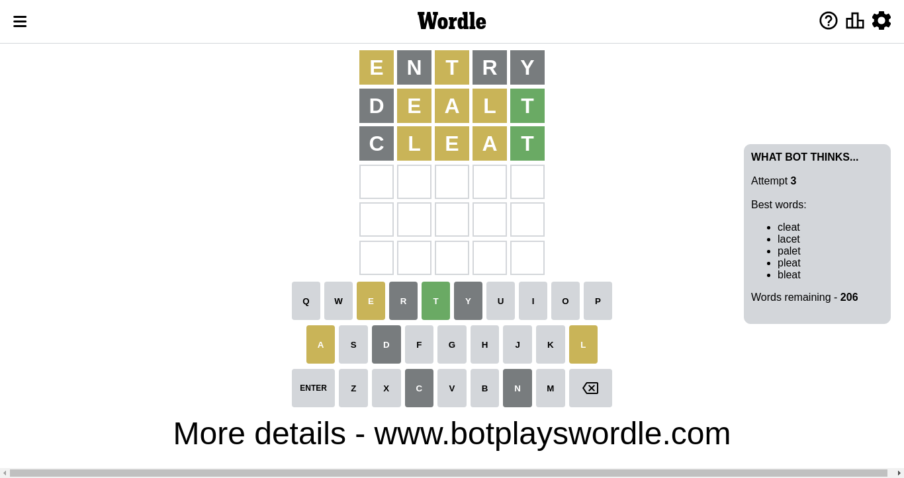
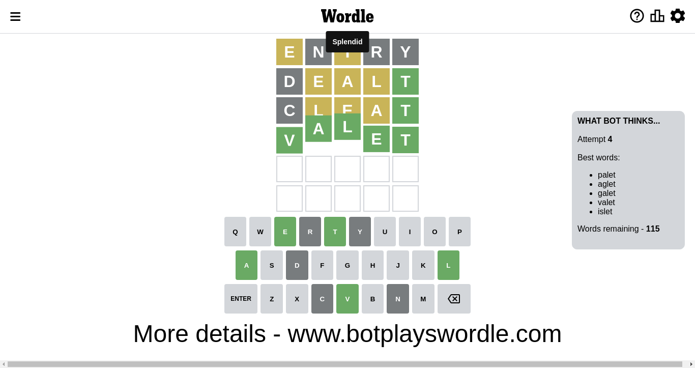

# Wordle for November 12, 2022 - \#511

## Attempt 1

This is the first attempt and we'll choose a random word to start with.

Let's start with word `entry`

Attempt for `entry` gives us 0 correct letters, 2 present letters and 3 wrong letters.

If we look into details, we can see that:

Letter `e` is on a different spot - this means that it cannot be at position 1

Letter `n` is not present in the word and we will not use it any more

Letter `t` is on a different spot - this means that it cannot be at position 3

Letter `r` is not present in the word and we will not use it any more

Letter `y` is not present in the word and we will not use it any more

Some letters are missing (like `n`, `r`, `y`) but it's also important piece of information

Word should contain letters `[e t]`

Could be a better guess

## Attempt 2

Right now we have 2823 words to choose from and best of them seem to be `[adlet dealt delta taled leath]`

So far we know that possible letters are:

At position 1: `[a b c d f g h i j k l m o p q s t u v w x z]`

At position 2: `[a b c d e f g h i j k l m o p q s t u v w x z]`

At position 3: `[a b c d e f g h i j k l m o p q s u v w x z]`

At position 4: `[a b c d e f g h i j k l m o p q s t u v w x z]`

At position 5: `[a b c d e f g h i j k l m o p q s t u v w x z]`

Next guess is `dealt`, let's see what it gives us

Attempt for `dealt` gives us 1 correct letters, 3 present letters and 1 wrong letters.

If we look into details, we can see that:

Letter `d` is not present in the word and we will not use it any more

Letter `e` is on a different spot - this means that it cannot be at position 2

Letter `a` is on a different spot - this means that it cannot be at position 3

Letter `l` is on a different spot - this means that it cannot be at position 4

Letter `t` should be at position 5

We got information about the correct letters and it should make next attempt easier

Some letters are missing (like `d`) but it's also important piece of information

Word should contain letters `[e t a l]`

That was a great guess that limited number of remaining words

## Attempt 3

Right now we have 206 words to choose from and best of them seem to be `[cleat lacet palet pleat bleat]`

So far we know that possible letters are:

At position 1: `[a b c f g h i j k l m o p q s t u v w x z]`

At position 2: `[a b c f g h i j k l m o p q s t u v w x z]`

At position 3: `[b c e f g h i j k l m o p q s u v w x z]`

At position 4: `[a b c e f g h i j k m o p q s t u v w x z]`

At position 5: `[t]`

Next guess is `cleat`, let's see what it gives us

Attempt for `cleat` gives us 1 correct letters, 3 present letters and 1 wrong letters.

If we look into details, we can see that:

Letter `c` is not present in the word and we will not use it any more

Letter `l` is on a different spot - this means that it cannot be at position 2

Letter `e` is on a different spot - this means that it cannot be at position 3

Letter `a` is on a different spot - this means that it cannot be at position 4

Some letters are missing (like `c`) but it's also important piece of information

Word should contain letters `[e t a l]`

That was a great guess that limited number of remaining words

## Attempt 4

Right now we have 115 words to choose from and best of them seem to be `[palet aglet galet valet islet]`

So far we know that possible letters are:

At position 1: `[a b f g h i j k l m o p q s t u v w x z]`

At position 2: `[a b f g h i j k m o p q s t u v w x z]`

At position 3: `[b f g h i j k l m o p q s u v w x z]`

At position 4: `[b e f g h i j k m o p q s t u v w x z]`

At position 5: `[t]`

Next guess is `valet`, let's see what it gives us

That's the correct answer! The word is `valet`!

To be honest that was a pretty lucky guess, but it worked out well.

## Conclusion

Today's word is `valet` and it took 4 attempts to guess it

