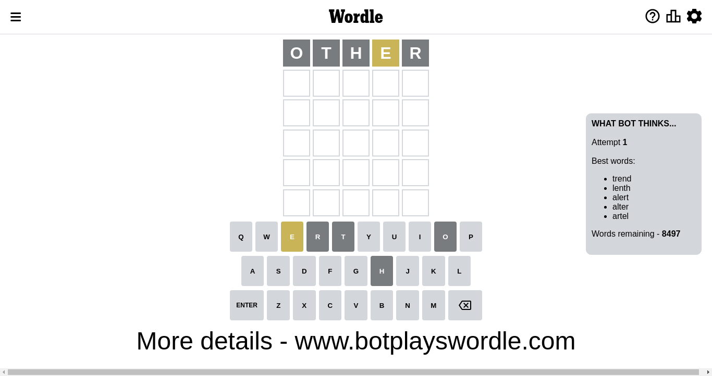

# Wordle for November 14, 2022 - \#513

## Attempt 1

This is the first attempt and we'll choose a random word to start with.

Let's start with word `other`

Attempt for `other` gives us 0 correct letters, 1 present letters and 4 wrong letters.

If we look into details, we can see that:

Letter `o` is not present in the word and we will not use it any more

Letter `t` is not present in the word and we will not use it any more

Letter `h` is not present in the word and we will not use it any more

Letter `e` is on a different spot - this means that it cannot be at position 4

Letter `r` is not present in the word and we will not use it any more

Some letters are missing (like `o`, `t`, `h`, `r`) but it's also important piece of information

Word should contain letters `[e]`

Not a bad guess in general

## Attempt 2

Right now we have 2039 words to choose from and best of them seem to be `[eland lenad eldin blend neeld]`

So far we know that possible letters are:

At position 1: `[a b c d e f g i j k l m n p q s u v w x y z]`

At position 2: `[a b c d e f g i j k l m n p q s u v w x y z]`

At position 3: `[a b c d e f g i j k l m n p q s u v w x y z]`

At position 4: `[a b c d f g i j k l m n p q s u v w x y z]`

At position 5: `[a b c d e f g i j k l m n p q s u v w x y z]`

Next guess is `blend`, let's see what it gives us

Attempt for `blend` gives us 0 correct letters, 2 present letters and 3 wrong letters.

If we look into details, we can see that:

Letter `b` is not present in the word and we will not use it any more

Letter `l` is on a different spot - this means that it cannot be at position 2

Letter `e` is on a different spot - this means that it cannot be at position 3

Letter `n` is not present in the word and we will not use it any more

Letter `d` is not present in the word and we will not use it any more

Some letters are missing (like `b`, `n`, `d`) but it's also important piece of information

Word should contain letters `[e l]`

That was a great guess that limited number of remaining words

## Attempt 3

Right now we have 693 words to choose from and best of them seem to be `[aisle scale mesal agile lapse]`

So far we know that possible letters are:

At position 1: `[a c e f g i j k l m p q s u v w x y z]`

At position 2: `[a c e f g i j k m p q s u v w x y z]`

At position 3: `[a c f g i j k l m p q s u v w x y z]`

At position 4: `[a c f g i j k l m p q s u v w x y z]`

At position 5: `[a c e f g i j k l m p q s u v w x y z]`

Next guess is `agile`, let's see what it gives us

Attempt for `agile` gives us 2 correct letters, 1 present letters and 2 wrong letters.

If we look into details, we can see that:

Letter `a` is on a different spot - this means that it cannot be at position 1

Letter `g` is not present in the word and we will not use it any more

Letter `i` is not present in the word and we will not use it any more

Letter `l` should be at position 4

Letter `e` should be at position 5

We got information about the correct letters and it should make next attempt easier

Some letters are missing (like `g`, `i`) but it's also important piece of information

Word should contain letters `[e l a]`

That was a great guess that limited number of remaining words

## Attempt 4

Right now we have 9 words to choose from and best of them seem to be `[scale saple spale swale macle]`

So far we know that possible letters are:

At position 1: `[c e f j k l m p q s u v w x y z]`

At position 2: `[a c e f j k m p q s u v w x y z]`

At position 3: `[a c f j k l m p q s u v w x y z]`

At position 4: `[l]`

At position 5: `[e]`

Next guess is `saple`, let's see what it gives us

Wordle does not know word `saple`, need to try something different

## Attempt 4

Right now we have 8 words to choose from and best of them seem to be `[scale spale swale macle maple]`

So far we know that possible letters are:

At position 1: `[c e f j k l m p q s u v w x y z]`

At position 2: `[a c e f j k m p q s u v w x y z]`

At position 3: `[a c f j k l m p q s u v w x y z]`

At position 4: `[l]`

At position 5: `[e]`

Next guess is `scale`, let's see what it gives us

Attempt for `scale` gives us 2 correct letters, 1 present letters and 2 wrong letters.

If we look into details, we can see that:

Letter `s` is not present in the word and we will not use it any more

Letter `c` is not present in the word and we will not use it any more

Letter `a` is on a different spot - this means that it cannot be at position 3

Some letters are missing (like `s`, `c`) but it's also important piece of information

Word should contain letters `[e l a]`

That was a great guess that limited number of remaining words

## Attempt 5

Right now we have 1 words to choose from and best of them seem to be `[maple]`

So far we know that possible letters are:

At position 1: `[e f j k l m p q u v w x y z]`

At position 2: `[a e f j k m p q u v w x y z]`

At position 3: `[f j k l m p q u v w x y z]`

At position 4: `[l]`

At position 5: `[e]`

Next guess is `maple`, let's see what it gives us

That's the correct answer! The word is `maple`!

## Conclusion

Today's word is `maple` and it took 5 attempts to guess it

