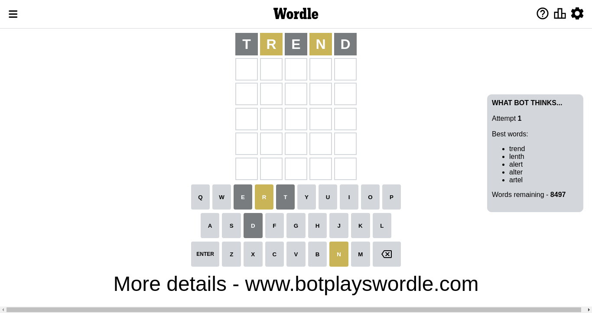
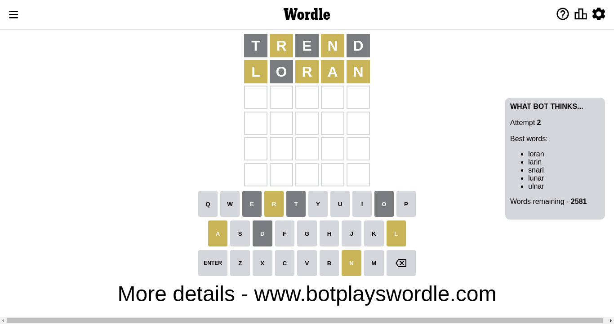
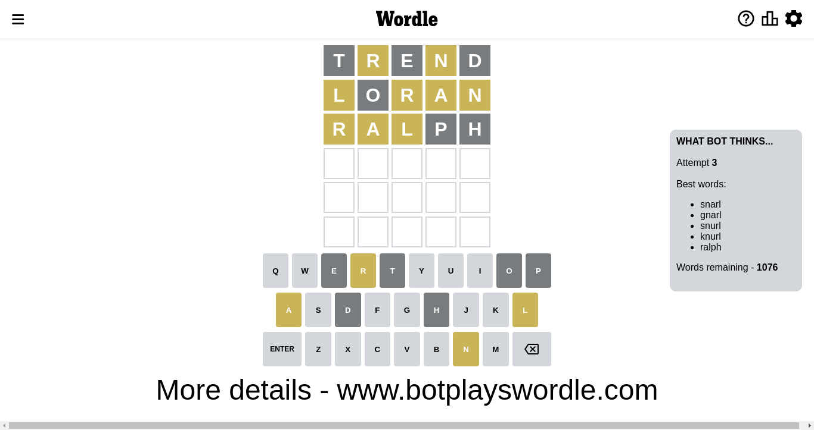
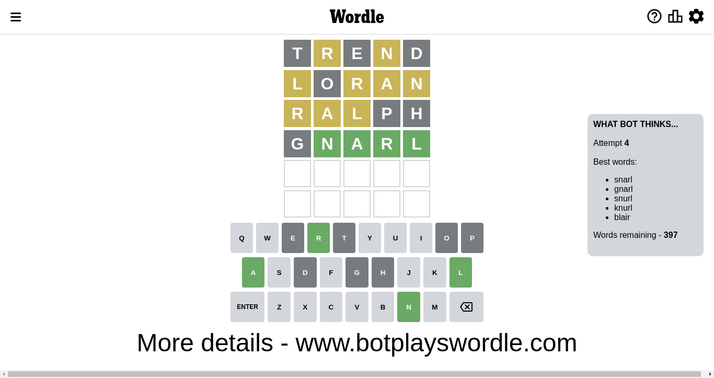
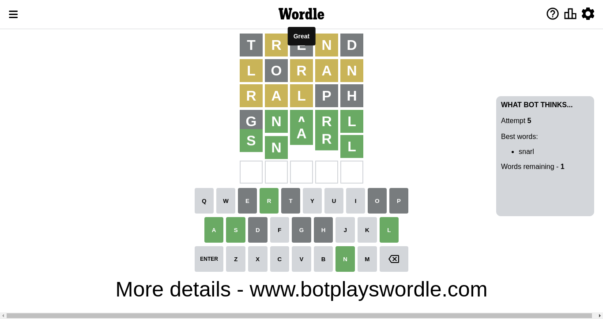

# Wordle for November 15, 2022 - \#514

## Attempt 1

This is the first attempt and we'll choose a random word to start with.

Let's start with word `trend`

Attempt for `trend` gives us 0 correct letters, 2 present letters and 3 wrong letters.

If we look into details, we can see that:

Letter `t` is not present in the word and we will not use it any more

Letter `r` is on a different spot - this means that it cannot be at position 2

Letter `e` is not present in the word and we will not use it any more

Letter `n` is on a different spot - this means that it cannot be at position 4

Letter `d` is not present in the word and we will not use it any more

Some letters are missing (like `t`, `e`, `d`) but it's also important piece of information

Word should contain letters `[r n]`

Could be a better guess

## Attempt 2

Right now we have 2581 words to choose from and best of them seem to be `[loran larin snarl lunar ulnar]`

So far we know that possible letters are:

At position 1: `[a b c f g h i j k l m n o p q r s u v w x y z]`

At position 2: `[a b c f g h i j k l m n o p q s u v w x y z]`

At position 3: `[a b c f g h i j k l m n o p q r s u v w x y z]`

At position 4: `[a b c f g h i j k l m o p q r s u v w x y z]`

At position 5: `[a b c f g h i j k l m n o p q r s u v w x y z]`

Next guess is `loran`, let's see what it gives us

Attempt for `loran` gives us 0 correct letters, 4 present letters and 1 wrong letters.

If we look into details, we can see that:

Letter `l` is on a different spot - this means that it cannot be at position 1

Letter `o` is not present in the word and we will not use it any more

Letter `r` is on a different spot - this means that it cannot be at position 3

Letter `a` is on a different spot - this means that it cannot be at position 4

Letter `n` is on a different spot - this means that it cannot be at position 5

Some letters are missing (like `o`) but it's also important piece of information

Word should contain letters `[r n l a]`

Not a bad guess in general

## Attempt 3

Right now we have 1077 words to choose from and best of them seem to be `[snarl gnarl snirl snurl knurl]`

So far we know that possible letters are:

At position 1: `[a b c f g h i j k m n p q r s u v w x y z]`

At position 2: `[a b c f g h i j k l m n p q s u v w x y z]`

At position 3: `[a b c f g h i j k l m n p q s u v w x y z]`

At position 4: `[b c f g h i j k l m p q r s u v w x y z]`

At position 5: `[a b c f g h i j k l m p q r s u v w x y z]`

Next guess is `snirl`, let's see what it gives us

Wordle does not know word `snirl`, need to try something different

## Attempt 3

Right now we have 1076 words to choose from and best of them seem to be `[snarl gnarl snurl knurl ralph]`

So far we know that possible letters are:

At position 1: `[a b c f g h i j k m n p q r s u v w x y z]`

At position 2: `[a b c f g h i j k l m n p q s u v w x y z]`

At position 3: `[a b c f g h i j k l m n p q s u v w x y z]`

At position 4: `[b c f g h i j k l m p q r s u v w x y z]`

At position 5: `[a b c f g h i j k l m p q r s u v w x y z]`

Next guess is `ralph`, let's see what it gives us

Attempt for `ralph` gives us 0 correct letters, 3 present letters and 2 wrong letters.

If we look into details, we can see that:

Letter `r` is on a different spot - this means that it cannot be at position 1

Letter `a` is on a different spot - this means that it cannot be at position 2

Letter `l` is on a different spot - this means that it cannot be at position 3

Letter `p` is not present in the word and we will not use it any more

Letter `h` is not present in the word and we will not use it any more

Some letters are missing (like `p`, `h`) but it's also important piece of information

Word should contain letters `[r n l a]`

That was a great guess that limited number of remaining words

## Attempt 4

Right now we have 397 words to choose from and best of them seem to be `[snarl gnarl snurl knurl blair]`

So far we know that possible letters are:

At position 1: `[a b c f g i j k m n q s u v w x y z]`

At position 2: `[b c f g i j k l m n q s u v w x y z]`

At position 3: `[a b c f g i j k m n q s u v w x y z]`

At position 4: `[b c f g i j k l m q r s u v w x y z]`

At position 5: `[a b c f g i j k l m q r s u v w x y z]`

Next guess is `gnarl`, let's see what it gives us

Attempt for `gnarl` gives us 4 correct letters, 0 present letters and 1 wrong letters.

If we look into details, we can see that:

Letter `g` is not present in the word and we will not use it any more

Letter `n` should be at position 2

Letter `a` should be at position 3

Letter `r` should be at position 4

Letter `l` should be at position 5

We got information about the correct letters and it should make next attempt easier

Some letters are missing (like `g`) but it's also important piece of information

Word should contain letters `[r n l a]`

That was a great guess that limited number of remaining words

## Attempt 5

Right now we have 1 words to choose from and best of them seem to be `[snarl]`

So far we know that possible letters are:

At position 1: `[a b c f i j k m n q s u v w x y z]`

At position 2: `[n]`

At position 3: `[a]`

At position 4: `[r]`

At position 5: `[l]`

Next guess is `snarl`, let's see what it gives us

That's the correct answer! The word is `snarl`!

## Conclusion

Today's word is `snarl` and it took 5 attempts to guess it

