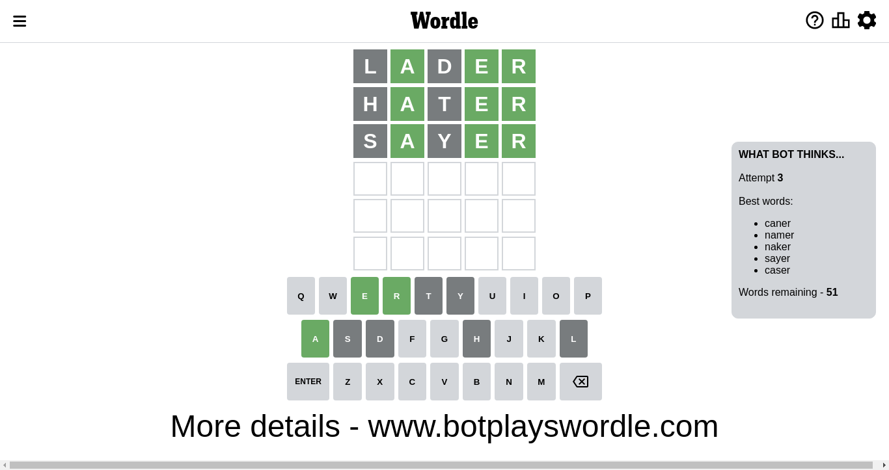

# Wordle for November 16, 2022 - \#515

## Attempt 1

This is the first attempt and we'll choose a random word to start with.

Let's start with word `lader`

Attempt for `lader` gives us 3 correct letters, 0 present letters and 2 wrong letters.

If we look into details, we can see that:

Letter `l` is not present in the word and we will not use it any more

Letter `a` should be at position 2

Letter `d` is not present in the word and we will not use it any more

Letter `e` should be at position 4

Letter `r` should be at position 5

We got information about the correct letters and it should make next attempt easier

Some letters are missing (like `l`, `d`) but it's also important piece of information

Word should contain letters `[a e r]`

That was a great guess that limited number of remaining words

## Attempt 2

Right now we have 71 words to choose from and best of them seem to be `[hater tayer cater mater tamer]`

So far we know that possible letters are:

At position 1: `[a b c e f g h i j k m n o p q r s t u v w x y z]`

At position 2: `[a]`

At position 3: `[a b c e f g h i j k m n o p q r s t u v w x y z]`

At position 4: `[e]`

At position 5: `[r]`

Next guess is `tayer`, let's see what it gives us

Wordle does not know word `tayer`, need to try something different

## Attempt 2

Right now we have 70 words to choose from and best of them seem to be `[hater cater mater tamer pater]`

So far we know that possible letters are:

At position 1: `[a b c e f g h i j k m n o p q r s t u v w x y z]`

At position 2: `[a]`

At position 3: `[a b c e f g h i j k m n o p q r s t u v w x y z]`

At position 4: `[e]`

At position 5: `[r]`

Next guess is `hater`, let's see what it gives us

Attempt for `hater` gives us 3 correct letters, 0 present letters and 2 wrong letters.

If we look into details, we can see that:

Letter `h` is not present in the word and we will not use it any more

Letter `t` is not present in the word and we will not use it any more

Some letters are missing (like `h`, `t`) but it's also important piece of information

Word should contain letters `[a e r]`

That was a great guess that limited number of remaining words

## Attempt 3

Right now we have 51 words to choose from and best of them seem to be `[caner namer naker sayer caser]`

So far we know that possible letters are:

At position 1: `[a b c e f g i j k m n o p q r s u v w x y z]`

At position 2: `[a]`

At position 3: `[a b c e f g i j k m n o p q r s u v w x y z]`

At position 4: `[e]`

At position 5: `[r]`

Next guess is `sayer`, let's see what it gives us

Attempt for `sayer` gives us 3 correct letters, 0 present letters and 2 wrong letters.

If we look into details, we can see that:

Letter `s` is not present in the word and we will not use it any more

Letter `y` is not present in the word and we will not use it any more

Some letters are missing (like `s`, `y`) but it's also important piece of information

Word should contain letters `[a e r]`

That was a great guess that limited number of remaining words

## Attempt 4

Right now we have 42 words to choose from and best of them seem to be `[caner namer naker macer caper]`

So far we know that possible letters are:

At position 1: `[a b c e f g i j k m n o p q r u v w x z]`

At position 2: `[a]`

At position 3: `[a b c e f g i j k m n o p q r u v w x z]`

At position 4: `[e]`

At position 5: `[r]`

Next guess is `caper`, let's see what it gives us

Attempt for `caper` gives us 3 correct letters, 0 present letters and 2 wrong letters.

If we look into details, we can see that:

Letter `c` is not present in the word and we will not use it any more

Letter `p` is not present in the word and we will not use it any more

Some letters are missing (like `c`, `p`) but it's also important piece of information

Word should contain letters `[a e r]`

That was a great guess that limited number of remaining words

## Attempt 5

Right now we have 24 words to choose from and best of them seem to be `[namer naker maker baker wager]`

So far we know that possible letters are:

At position 1: `[a b e f g i j k m n o q r u v w x z]`

At position 2: `[a]`

At position 3: `[a b e f g i j k m n o q r u v w x z]`

At position 4: `[e]`

At position 5: `[r]`

Next guess is `namer`, let's see what it gives us

Attempt for `namer` gives us 3 correct letters, 0 present letters and 2 wrong letters.

If we look into details, we can see that:

Letter `n` is not present in the word and we will not use it any more

Letter `m` is not present in the word and we will not use it any more

Some letters are missing (like `n`, `m`) but it's also important piece of information

Word should contain letters `[a e r]`

That was a great guess that limited number of remaining words

## Attempt 6

Right now we have 20 words to choose from and best of them seem to be `[baker wager fager waker faker]`

So far we know that possible letters are:

At position 1: `[a b e f g i j k o q r u v w x z]`

At position 2: `[a]`

At position 3: `[a b e f g i j k o q r u v w x z]`

At position 4: `[e]`

At position 5: `[r]`

Next guess is `waker`, let's see what it gives us

Attempt for `waker` gives us 4 correct letters, 0 present letters and 1 wrong letters.

If we look into details, we can see that:

Letter `w` is not present in the word and we will not use it any more

Letter `k` should be at position 3

We got information about the correct letters and it should make next attempt easier

Some letters are missing (like `w`) but it's also important piece of information

Word should contain letters `[a e r k]`

That was a great guess that limited number of remaining words

## Conclusion

Today we failed to guess the word after 6 attempts, that was really tricky. Maybe we will be more lucky next time.

