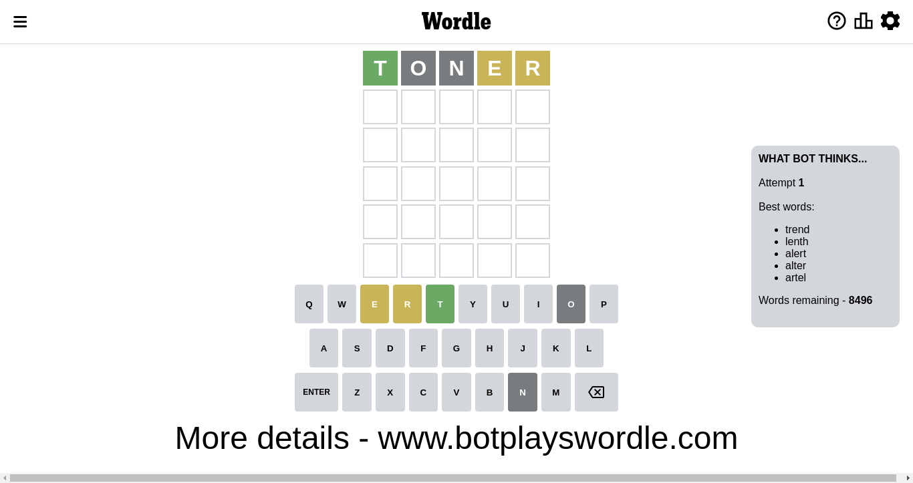
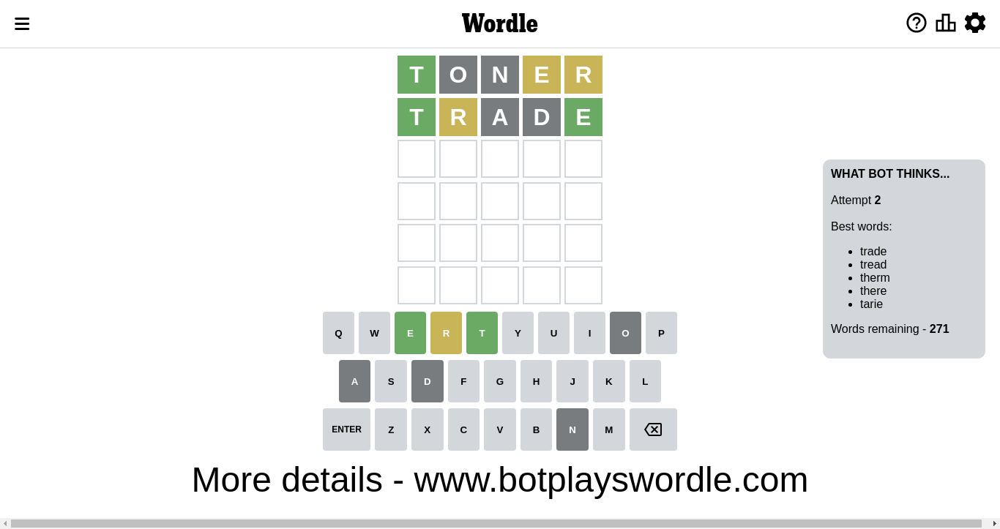
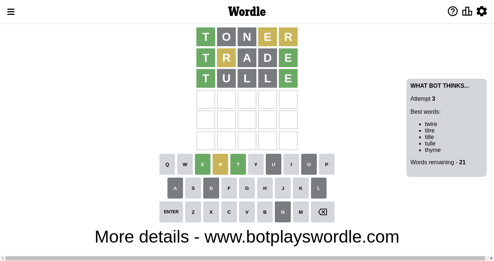
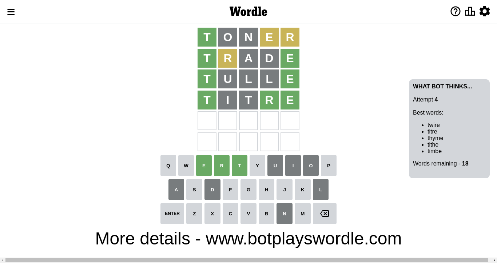
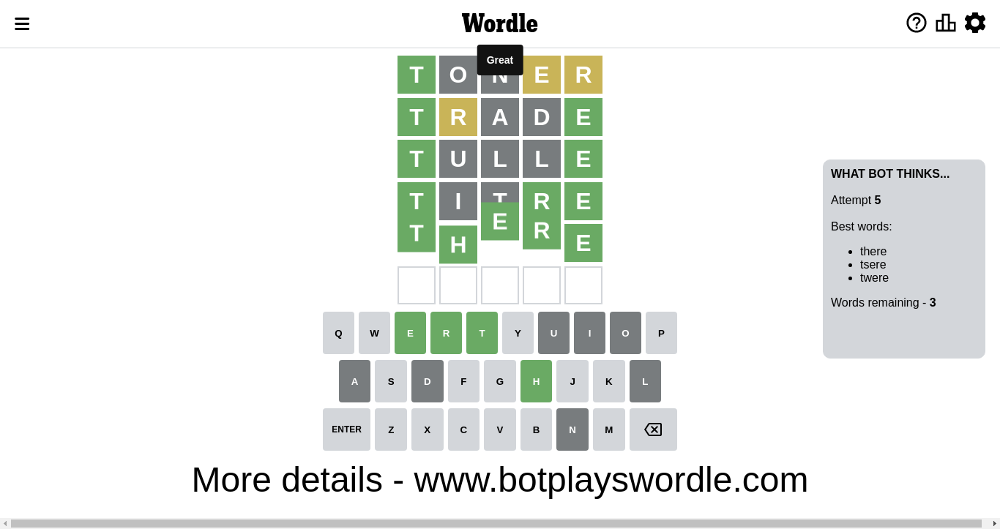

# Wordle for November 17, 2022 - \#516

## Attempt 1

This is the first attempt and we'll choose a random word to start with.

Let's start with word `drate`

Wordle does not know word `drate`, need to try something different

## Attempt 1

This is the first attempt and we'll choose a random word to start with.

Let's start with word `toner`

Attempt for `toner` gives us 1 correct letters, 2 present letters and 2 wrong letters.

If we look into details, we can see that:

Letter `t` should be at position 1

Letter `o` is not present in the word and we will not use it any more

Letter `n` is not present in the word and we will not use it any more

Letter `e` is on a different spot - this means that it cannot be at position 4

Letter `r` is on a different spot - this means that it cannot be at position 5

We got information about the correct letters and it should make next attempt easier

Some letters are missing (like `o`, `n`) but it's also important piece of information

Word should contain letters `[t e r]`

That was a great guess that limited number of remaining words

## Attempt 2

Right now we have 271 words to choose from and best of them seem to be `[trade tread therm there tarie]`

So far we know that possible letters are:

At position 1: `[t]`

At position 2: `[a b c d e f g h i j k l m p q r s t u v w x y z]`

At position 3: `[a b c d e f g h i j k l m p q r s t u v w x y z]`

At position 4: `[a b c d f g h i j k l m p q r s t u v w x y z]`

At position 5: `[a b c d e f g h i j k l m p q s t u v w x y z]`

Next guess is `trade`, let's see what it gives us

Attempt for `trade` gives us 2 correct letters, 1 present letters and 2 wrong letters.

If we look into details, we can see that:

Letter `r` is on a different spot - this means that it cannot be at position 2

Letter `a` is not present in the word and we will not use it any more

Letter `d` is not present in the word and we will not use it any more

Letter `e` should be at position 5

We got information about the correct letters and it should make next attempt easier

Some letters are missing (like `a`, `d`) but it's also important piece of information

Word should contain letters `[t e r]`

That was a great guess that limited number of remaining words

## Attempt 3

Right now we have 24 words to choose from and best of them seem to be `[turse twire tirve titre tiple]`

So far we know that possible letters are:

At position 1: `[t]`

At position 2: `[b c e f g h i j k l m p q s t u v w x y z]`

At position 3: `[b c e f g h i j k l m p q r s t u v w x y z]`

At position 4: `[b c f g h i j k l m p q r s t u v w x y z]`

At position 5: `[e]`

Next guess is `tirve`, let's see what it gives us

Wordle does not know word `tirve`, need to try something different

## Attempt 3

Right now we have 23 words to choose from and best of them seem to be `[turse twire titre tiple title]`

So far we know that possible letters are:

At position 1: `[t]`

At position 2: `[b c e f g h i j k l m p q s t u v w x y z]`

At position 3: `[b c e f g h i j k l m p q r s t u v w x y z]`

At position 4: `[b c f g h i j k l m p q r s t u v w x y z]`

At position 5: `[e]`

Next guess is `tiple`, let's see what it gives us

Wordle does not know word `tiple`, need to try something different

## Attempt 3

Right now we have 22 words to choose from and best of them seem to be `[turse twire titre title tulle]`

So far we know that possible letters are:

At position 1: `[t]`

At position 2: `[b c e f g h i j k l m p q s t u v w x y z]`

At position 3: `[b c e f g h i j k l m p q r s t u v w x y z]`

At position 4: `[b c f g h i j k l m p q r s t u v w x y z]`

At position 5: `[e]`

Next guess is `turse`, let's see what it gives us

Wordle does not know word `turse`, need to try something different

## Attempt 3

Right now we have 21 words to choose from and best of them seem to be `[twire titre title tulle thyme]`

So far we know that possible letters are:

At position 1: `[t]`

At position 2: `[b c e f g h i j k l m p q s t u v w x y z]`

At position 3: `[b c e f g h i j k l m p q r s t u v w x y z]`

At position 4: `[b c f g h i j k l m p q r s t u v w x y z]`

At position 5: `[e]`

Next guess is `tulle`, let's see what it gives us

Attempt for `tulle` gives us 2 correct letters, 0 present letters and 3 wrong letters.

If we look into details, we can see that:

Letter `u` is not present in the word and we will not use it any more

Letter `l` is not present in the word and we will not use it any more

Letter `l` is not present in the word and we will not use it any more

Some letters are missing (like `u`, `l`) but it's also important piece of information

Word should contain letters `[t e r]`

That was a great guess that limited number of remaining words

## Attempt 4

Right now we have 18 words to choose from and best of them seem to be `[twire titre thyme tithe timbe]`

So far we know that possible letters are:

At position 1: `[t]`

At position 2: `[b c e f g h i j k m p q s t v w x y z]`

At position 3: `[b c e f g h i j k m p q r s t v w x y z]`

At position 4: `[b c f g h i j k m p q r s t v w x y z]`

At position 5: `[e]`

Next guess is `titre`, let's see what it gives us

Attempt for `titre` gives us 3 correct letters, 0 present letters and 2 wrong letters.

If we look into details, we can see that:

Letter `i` is not present in the word and we will not use it any more

Letter `t` is not present in the word and we will not use it any more

Letter `r` should be at position 4

We got information about the correct letters and it should make next attempt easier

Some letters are missing (like `i`, `t`) but it's also important piece of information

Word should contain letters `[t e r]`

That was a great guess that limited number of remaining words

## Attempt 5

Right now we have 3 words to choose from and best of them seem to be `[there tsere twere]`

So far we know that possible letters are:

At position 1: `[t]`

At position 2: `[b c e f g h j k m p q s v w x y z]`

At position 3: `[b c e f g h j k m p q r s v w x y z]`

At position 4: `[r]`

At position 5: `[e]`

Next guess is `there`, let's see what it gives us

That's the correct answer! The word is `there`!

## Conclusion

Today's word is `there` and it took 5 attempts to guess it

