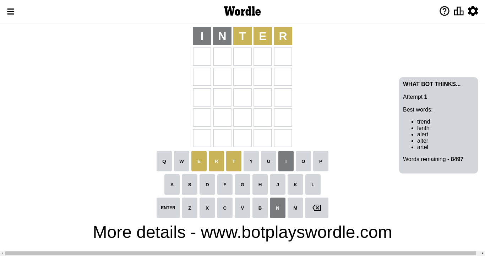
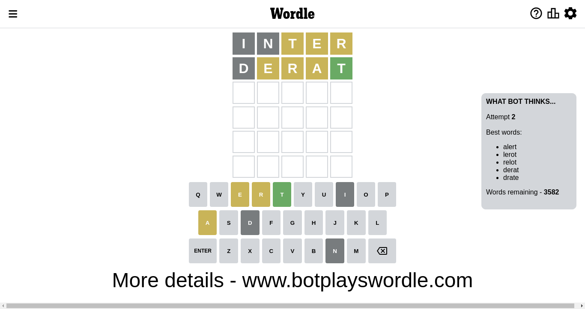
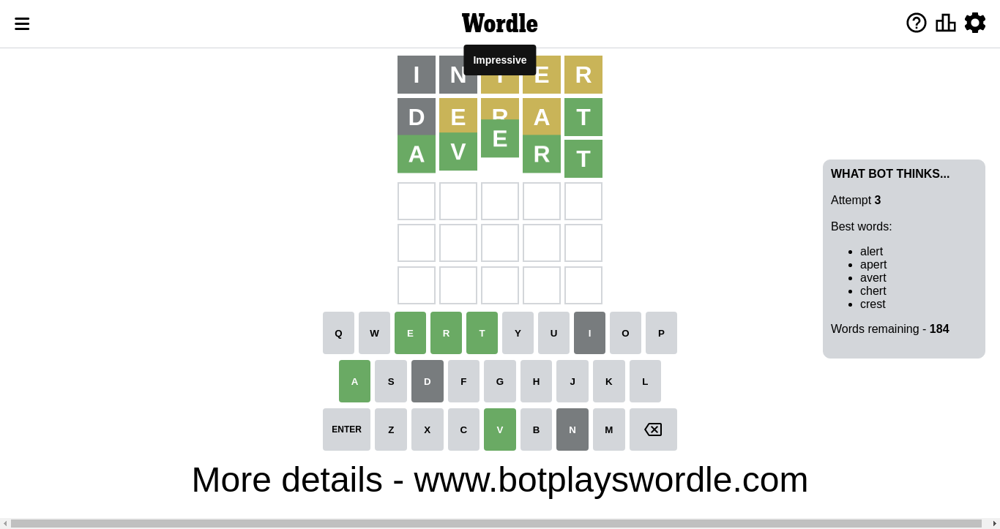

# Wordle for November 19, 2022 - \#518

## Attempt 1

This is the first attempt and we'll choose a random word to start with.

Let's start with word `inter`

Attempt for `inter` gives us 0 correct letters, 3 present letters and 2 wrong letters.

If we look into details, we can see that:

Letter `i` is not present in the word and we will not use it any more

Letter `n` is not present in the word and we will not use it any more

Letter `t` is on a different spot - this means that it cannot be at position 3

Letter `e` is on a different spot - this means that it cannot be at position 4

Letter `r` is on a different spot - this means that it cannot be at position 5

Some letters are missing (like `i`, `n`) but it's also important piece of information

Word should contain letters `[t e r]`

Could be a better guess

## Attempt 2

Right now we have 3582 words to choose from and best of them seem to be `[alert lerot relot derat drate]`

So far we know that possible letters are:

At position 1: `[a b c d e f g h j k l m o p q r s t u v w x y z]`

At position 2: `[a b c d e f g h j k l m o p q r s t u v w x y z]`

At position 3: `[a b c d e f g h j k l m o p q r s u v w x y z]`

At position 4: `[a b c d f g h j k l m o p q r s t u v w x y z]`

At position 5: `[a b c d e f g h j k l m o p q s t u v w x y z]`

Next guess is `derat`, let's see what it gives us

Attempt for `derat` gives us 1 correct letters, 3 present letters and 1 wrong letters.

If we look into details, we can see that:

Letter `d` is not present in the word and we will not use it any more

Letter `e` is on a different spot - this means that it cannot be at position 2

Letter `r` is on a different spot - this means that it cannot be at position 3

Letter `a` is on a different spot - this means that it cannot be at position 4

Letter `t` should be at position 5

We got information about the correct letters and it should make next attempt easier

Some letters are missing (like `d`) but it's also important piece of information

Word should contain letters `[t e r a]`

That was a great guess that limited number of remaining words

## Attempt 3

Right now we have 184 words to choose from and best of them seem to be `[alert apert avert chert crest]`

So far we know that possible letters are:

At position 1: `[a b c e f g h j k l m o p q r s t u v w x y z]`

At position 2: `[a b c f g h j k l m o p q r s t u v w x y z]`

At position 3: `[a b c e f g h j k l m o p q s u v w x y z]`

At position 4: `[b c f g h j k l m o p q r s t u v w x y z]`

At position 5: `[t]`

Next guess is `avert`, let's see what it gives us

That's the correct answer! The word is `avert`!

To be honest that was a pretty lucky guess, but it worked out well.

## Conclusion

Today's word is `avert` and it took 3 attempts to guess it

