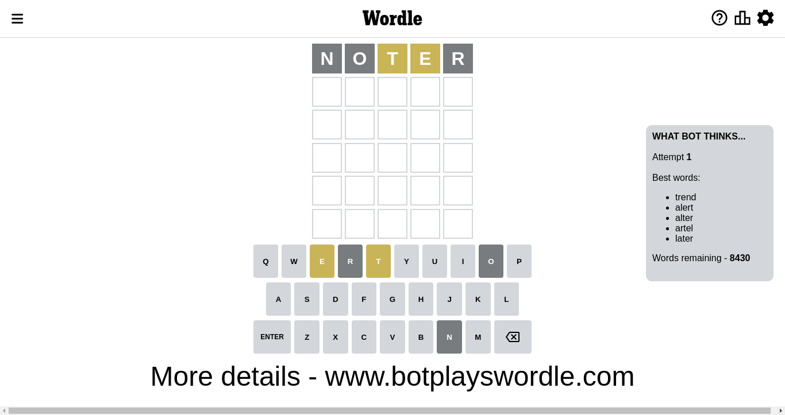
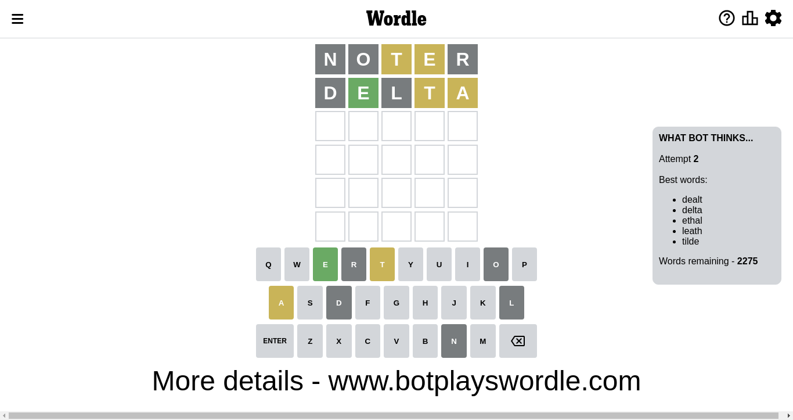
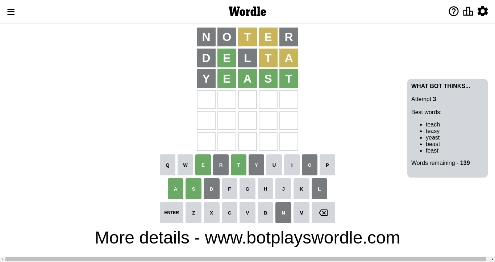
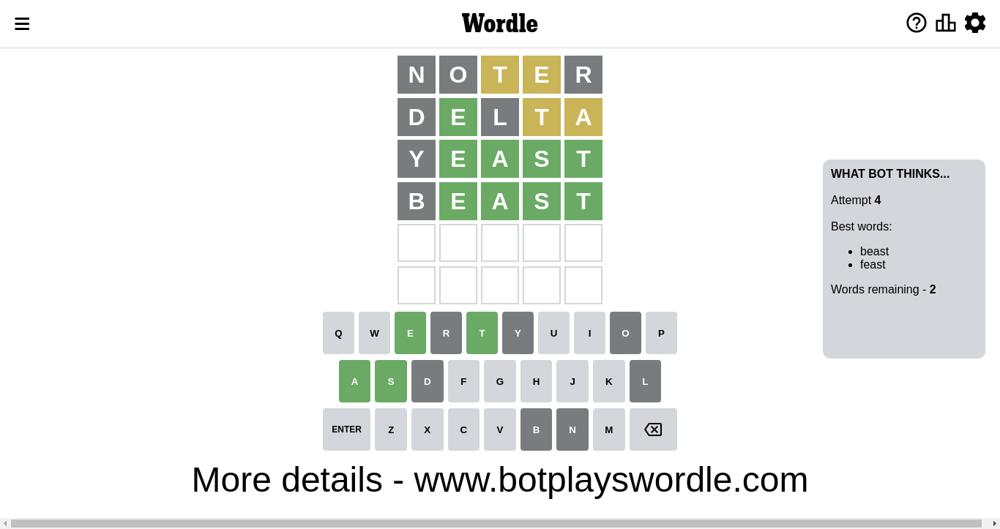
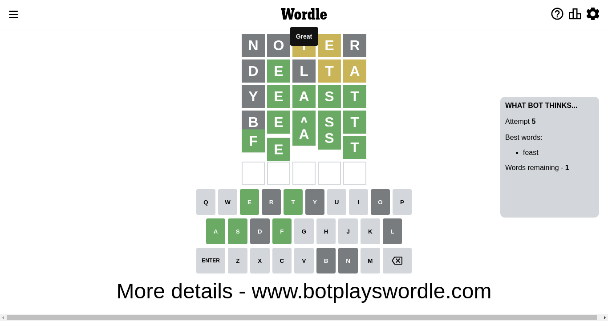

# Wordle for November 24, 2022 - \#523

## Attempt 1

This is the first attempt and we'll choose a random word to start with.

Let's start with word `relot`

Wordle does not know word `relot`, need to try something different

## Attempt 1

This is the first attempt and we'll choose a random word to start with.

Let's start with word `noter`

Attempt for `noter` gives us 0 correct letters, 2 present letters and 3 wrong letters.

If we look into details, we can see that:

Letter `n` is not present in the word and we will not use it any more

Letter `o` is not present in the word and we will not use it any more

Letter `t` is on a different spot - this means that it cannot be at position 3

Letter `e` is on a different spot - this means that it cannot be at position 4

Letter `r` is not present in the word and we will not use it any more

Some letters are missing (like `n`, `o`, `r`) but it's also important piece of information

Word should contain letters `[t e]`

Could be a better guess

## Attempt 2

Right now we have 2275 words to choose from and best of them seem to be `[dealt delta ethal leath tilde]`

So far we know that possible letters are:

At position 1: `[a b c d e f g h i j k l m p q s t u v w x y z]`

At position 2: `[a b c d e f g h i j k l m p q s t u v w x y z]`

At position 3: `[a b c d e f g h i j k l m p q s u v w x y z]`

At position 4: `[a b c d f g h i j k l m p q s t u v w x y z]`

At position 5: `[a b c d e f g h i j k l m p q s t u v w x y z]`

Next guess is `delta`, let's see what it gives us

Attempt for `delta` gives us 1 correct letters, 2 present letters and 2 wrong letters.

If we look into details, we can see that:

Letter `d` is not present in the word and we will not use it any more

Letter `e` should be at position 2

Letter `l` is not present in the word and we will not use it any more

Letter `t` is on a different spot - this means that it cannot be at position 4

Letter `a` is on a different spot - this means that it cannot be at position 5

We got information about the correct letters and it should make next attempt easier

Some letters are missing (like `d`, `l`) but it's also important piece of information

Word should contain letters `[t e a]`

That was a great guess that limited number of remaining words

## Attempt 3

Right now we have 139 words to choose from and best of them seem to be `[teach teasy yeast beast feast]`

So far we know that possible letters are:

At position 1: `[a b c e f g h i j k m p q s t u v w x y z]`

At position 2: `[e]`

At position 3: `[a b c e f g h i j k m p q s u v w x y z]`

At position 4: `[a b c f g h i j k m p q s u v w x y z]`

At position 5: `[b c e f g h i j k m p q s t u v w x y z]`

Next guess is `yeast`, let's see what it gives us

Attempt for `yeast` gives us 4 correct letters, 0 present letters and 1 wrong letters.

If we look into details, we can see that:

Letter `y` is not present in the word and we will not use it any more

Letter `a` should be at position 3

Letter `s` should be at position 4

Letter `t` should be at position 5

We got information about the correct letters and it should make next attempt easier

Some letters are missing (like `y`) but it's also important piece of information

Word should contain letters `[t e a s]`

That was a great guess that limited number of remaining words

## Attempt 4

Right now we have 2 words to choose from and best of them seem to be `[beast feast]`

So far we know that possible letters are:

At position 1: `[a b c e f g h i j k m p q s t u v w x z]`

At position 2: `[e]`

At position 3: `[a]`

At position 4: `[s]`

At position 5: `[t]`

Next guess is `beast`, let's see what it gives us

Attempt for `beast` gives us 4 correct letters, 0 present letters and 1 wrong letters.

If we look into details, we can see that:

Letter `b` is not present in the word and we will not use it any more

Some letters are missing (like `b`) but it's also important piece of information

Word should contain letters `[t e a s]`

That was a great guess that limited number of remaining words

## Attempt 5

Right now we have 1 words to choose from and best of them seem to be `[feast]`

So far we know that possible letters are:

At position 1: `[a c e f g h i j k m p q s t u v w x z]`

At position 2: `[e]`

At position 3: `[a]`

At position 4: `[s]`

At position 5: `[t]`

Next guess is `feast`, let's see what it gives us

That's the correct answer! The word is `feast`!

## Conclusion

Today's word is `feast` and it took 5 attempts to guess it

