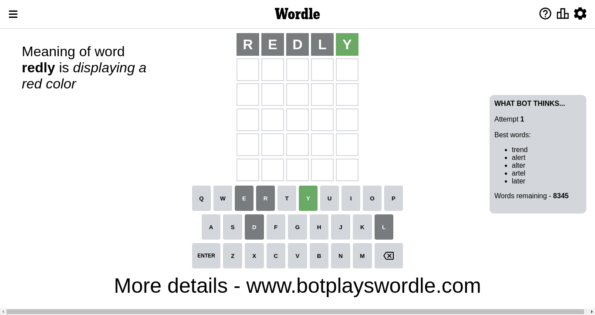
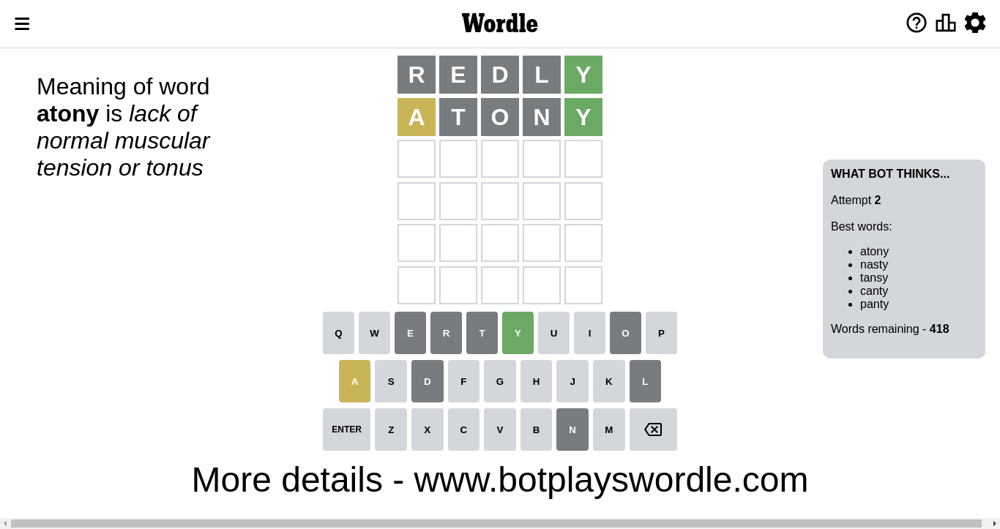
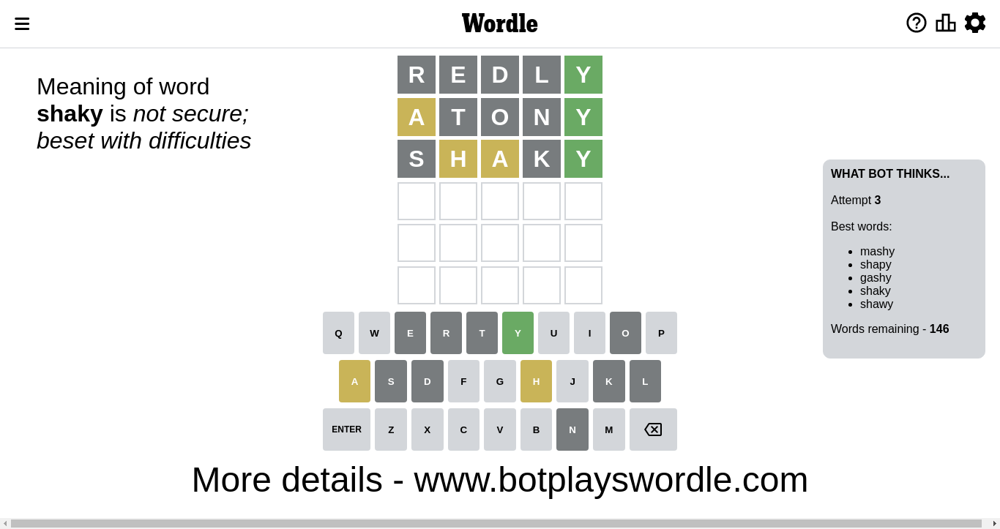
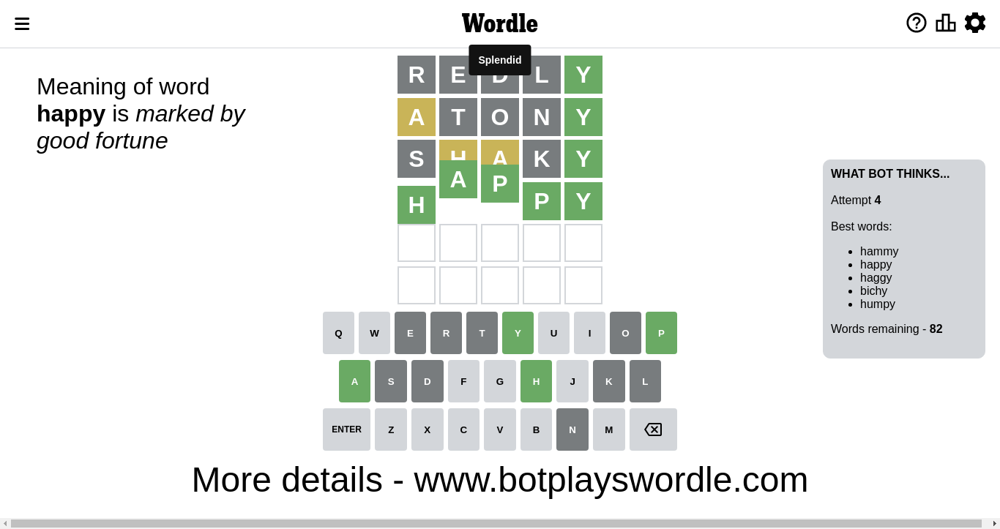

# Wordle for November 27, 2022 - \#526

## Attempt 1

This is the first attempt and we'll choose a random word to start with.

Let's start with word `redly`

Attempt for `redly` gives us 1 correct letters, 0 present letters and 4 wrong letters.

If we look into details, we can see that:

Letter `r` is not present in the word and we will not use it any more

Letter `e` is not present in the word and we will not use it any more

Letter `d` is not present in the word and we will not use it any more

Letter `l` is not present in the word and we will not use it any more

Letter `y` should be at position 5

We got information about the correct letters and it should make next attempt easier

Some letters are missing (like `r`, `e`, `d`, `l`) but it's also important piece of information

Word should contain letters `[y]`

That was a great guess that limited number of remaining words

## Attempt 2

Right now we have 418 words to choose from and best of them seem to be `[atony nasty tansy canty panty]`

So far we know that possible letters are:

At position 1: `[a b c f g h i j k m n o p q s t u v w x y z]`

At position 2: `[a b c f g h i j k m n o p q s t u v w x y z]`

At position 3: `[a b c f g h i j k m n o p q s t u v w x y z]`

At position 4: `[a b c f g h i j k m n o p q s t u v w x y z]`

At position 5: `[y]`

Next guess is `atony`, let's see what it gives us

Attempt for `atony` gives us 1 correct letters, 1 present letters and 3 wrong letters.

If we look into details, we can see that:

Letter `a` is on a different spot - this means that it cannot be at position 1

Letter `t` is not present in the word and we will not use it any more

Letter `o` is not present in the word and we will not use it any more

Letter `n` is not present in the word and we will not use it any more

Some letters are missing (like `t`, `o`, `n`) but it's also important piece of information

Word should contain letters `[y a]`

Could be a better guess

## Attempt 3

Right now we have 147 words to choose from and best of them seem to be `[mashy shapy gashy hasky shaky]`

So far we know that possible letters are:

At position 1: `[b c f g h i j k m p q s u v w x y z]`

At position 2: `[a b c f g h i j k m p q s u v w x y z]`

At position 3: `[a b c f g h i j k m p q s u v w x y z]`

At position 4: `[a b c f g h i j k m p q s u v w x y z]`

At position 5: `[y]`

Next guess is `hasky`, let's see what it gives us

Wordle does not know word `hasky`, need to try something different

## Attempt 3

Right now we have 146 words to choose from and best of them seem to be `[mashy shapy gashy shaky shawy]`

So far we know that possible letters are:

At position 1: `[b c f g h i j k m p q s u v w x y z]`

At position 2: `[a b c f g h i j k m p q s u v w x y z]`

At position 3: `[a b c f g h i j k m p q s u v w x y z]`

At position 4: `[a b c f g h i j k m p q s u v w x y z]`

At position 5: `[y]`

Next guess is `shaky`, let's see what it gives us

Attempt for `shaky` gives us 1 correct letters, 2 present letters and 2 wrong letters.

If we look into details, we can see that:

Letter `s` is not present in the word and we will not use it any more

Letter `h` is on a different spot - this means that it cannot be at position 2

Letter `a` is on a different spot - this means that it cannot be at position 3

Letter `k` is not present in the word and we will not use it any more

Some letters are missing (like `s`, `k`) but it's also important piece of information

Word should contain letters `[y a h]`

This was a waste, almost no valuable information...

## Attempt 4

Right now we have 83 words to choose from and best of them seem to be `[hammy happy bahay haggy bichy]`

So far we know that possible letters are:

At position 1: `[b c f g h i j m p q u v w x y z]`

At position 2: `[a b c f g i j m p q u v w x y z]`

At position 3: `[b c f g h i j m p q u v w x y z]`

At position 4: `[a b c f g h i j m p q u v w x y z]`

At position 5: `[y]`

Next guess is `bahay`, let's see what it gives us

Wordle does not know word `bahay`, need to try something different

## Attempt 4

Right now we have 82 words to choose from and best of them seem to be `[hammy happy haggy bichy humpy]`

So far we know that possible letters are:

At position 1: `[b c f g h i j m p q u v w x y z]`

At position 2: `[a b c f g i j m p q u v w x y z]`

At position 3: `[b c f g h i j m p q u v w x y z]`

At position 4: `[a b c f g h i j m p q u v w x y z]`

At position 5: `[y]`

Next guess is `happy`, let's see what it gives us

That's the correct answer! The word is `happy`!

To be honest that was a pretty lucky guess, but it worked out well.

## Conclusion

Today's word is `happy` and it took 4 attempts to guess it

