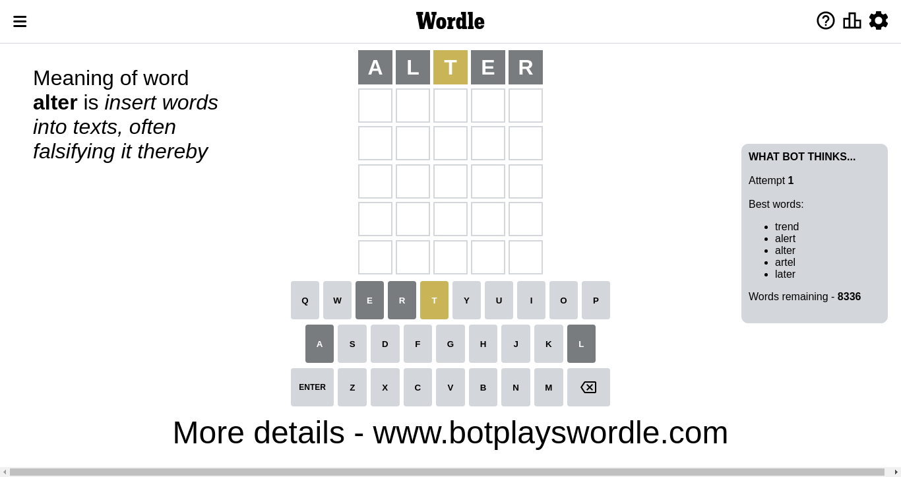
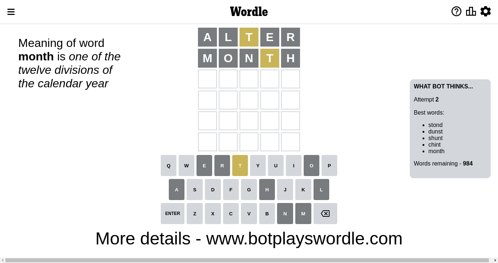
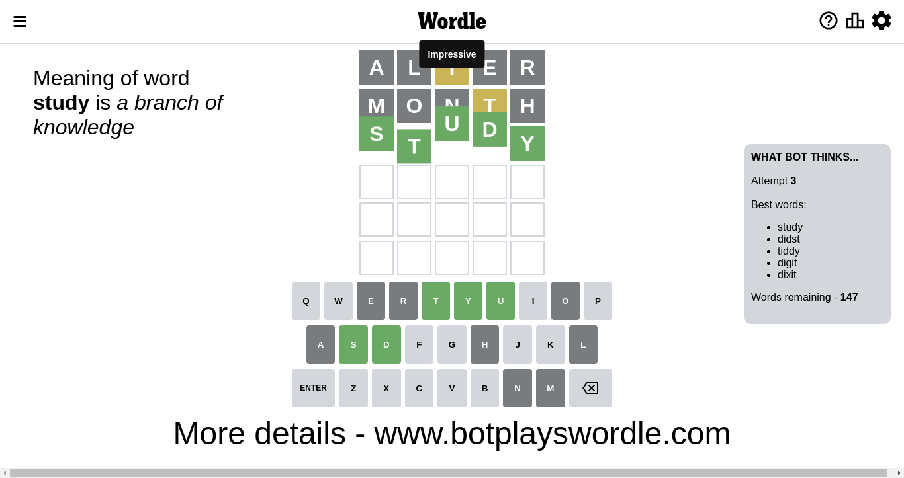

# Wordle for November 30, 2022 - \#529

## Attempt 1

This is the first attempt and we'll choose a random word to start with.

Let's start with word `alter`

Attempt for `alter` gives us 0 correct letters, 1 present letters and 4 wrong letters.

If we look into details, we can see that:

Letter `a` is not present in the word and we will not use it any more

Letter `l` is not present in the word and we will not use it any more

Letter `t` is on a different spot - this means that it cannot be at position 3

Letter `e` is not present in the word and we will not use it any more

Letter `r` is not present in the word and we will not use it any more

Some letters are missing (like `a`, `l`, `e`, `r`) but it's also important piece of information

Word should contain letters `[t]`

That was a great guess that limited number of remaining words

## Attempt 2

Right now we have 987 words to choose from and best of them seem to be `[stond dunst thisn unhot unhit]`

So far we know that possible letters are:

At position 1: `[b c d f g h i j k m n o p q s t u v w x y z]`

At position 2: `[b c d f g h i j k m n o p q s t u v w x y z]`

At position 3: `[b c d f g h i j k m n o p q s u v w x y z]`

At position 4: `[b c d f g h i j k m n o p q s t u v w x y z]`

At position 5: `[b c d f g h i j k m n o p q s t u v w x y z]`

Next guess is `unhot`, let's see what it gives us

Wordle does not know word `unhot`, need to try something different

## Attempt 2

Right now we have 986 words to choose from and best of them seem to be `[stond dunst thisn unhit shunt]`

So far we know that possible letters are:

At position 1: `[b c d f g h i j k m n o p q s t u v w x y z]`

At position 2: `[b c d f g h i j k m n o p q s t u v w x y z]`

At position 3: `[b c d f g h i j k m n o p q s u v w x y z]`

At position 4: `[b c d f g h i j k m n o p q s t u v w x y z]`

At position 5: `[b c d f g h i j k m n o p q s t u v w x y z]`

Next guess is `thisn`, let's see what it gives us

Wordle does not know word `thisn`, need to try something different

## Attempt 2

Right now we have 985 words to choose from and best of them seem to be `[stond dunst unhit shunt chint]`

So far we know that possible letters are:

At position 1: `[b c d f g h i j k m n o p q s t u v w x y z]`

At position 2: `[b c d f g h i j k m n o p q s t u v w x y z]`

At position 3: `[b c d f g h i j k m n o p q s u v w x y z]`

At position 4: `[b c d f g h i j k m n o p q s t u v w x y z]`

At position 5: `[b c d f g h i j k m n o p q s t u v w x y z]`

Next guess is `unhit`, let's see what it gives us

Wordle does not know word `unhit`, need to try something different

## Attempt 2

Right now we have 984 words to choose from and best of them seem to be `[stond dunst shunt chint month]`

So far we know that possible letters are:

At position 1: `[b c d f g h i j k m n o p q s t u v w x y z]`

At position 2: `[b c d f g h i j k m n o p q s t u v w x y z]`

At position 3: `[b c d f g h i j k m n o p q s u v w x y z]`

At position 4: `[b c d f g h i j k m n o p q s t u v w x y z]`

At position 5: `[b c d f g h i j k m n o p q s t u v w x y z]`

Next guess is `month`, let's see what it gives us

Attempt for `month` gives us 0 correct letters, 1 present letters and 4 wrong letters.

If we look into details, we can see that:

Letter `m` is not present in the word and we will not use it any more

Letter `o` is not present in the word and we will not use it any more

Letter `n` is not present in the word and we will not use it any more

Letter `t` is on a different spot - this means that it cannot be at position 4

Letter `h` is not present in the word and we will not use it any more

Some letters are missing (like `m`, `o`, `n`, `h`) but it's also important piece of information

Word should contain letters `[t]`

Not a bad guess in general

## Attempt 3

Right now we have 147 words to choose from and best of them seem to be `[study didst tiddy digit dixit]`

So far we know that possible letters are:

At position 1: `[b c d f g i j k p q s t u v w x y z]`

At position 2: `[b c d f g i j k p q s t u v w x y z]`

At position 3: `[b c d f g i j k p q s u v w x y z]`

At position 4: `[b c d f g i j k p q s u v w x y z]`

At position 5: `[b c d f g i j k p q s t u v w x y z]`

Next guess is `study`, let's see what it gives us

That's the correct answer! The word is `study`!

To be honest that was a pretty lucky guess, but it worked out well.

## Conclusion

Today's word is `study` and it took 3 attempts to guess it

