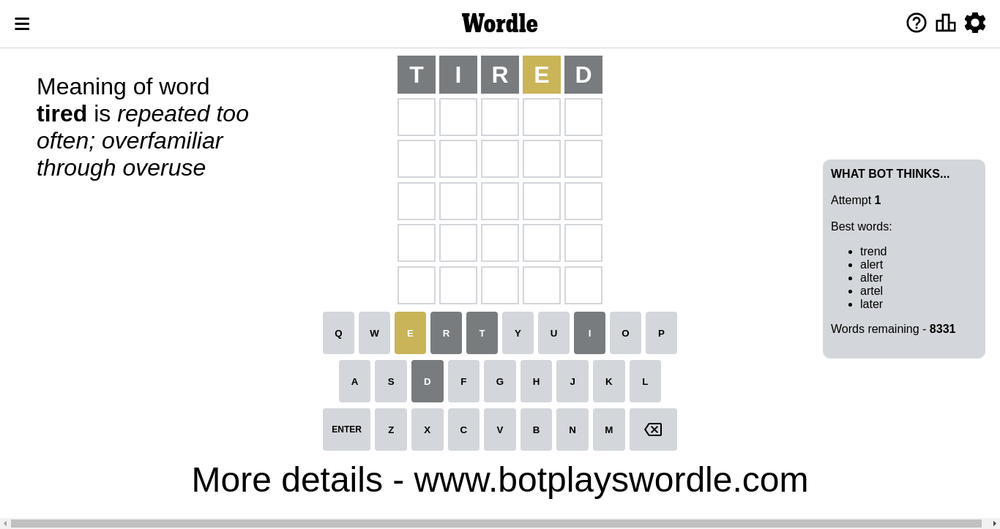
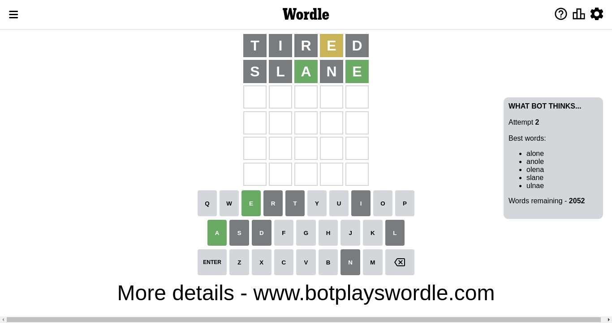
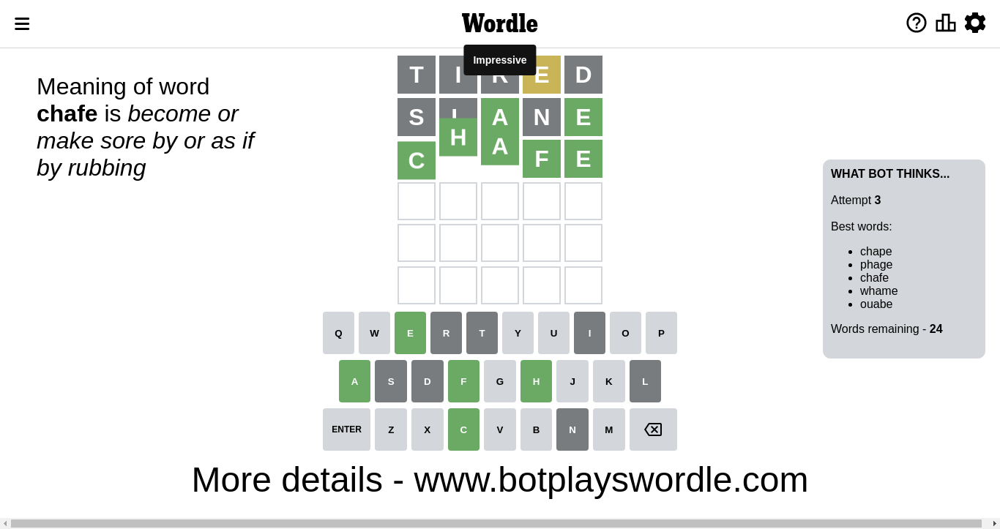

# Wordle for December 2, 2022 - \#531

## Attempt 1

This is the first attempt and we'll choose a random word to start with.

Let's start with word `tired`

Attempt for `tired` gives us 0 correct letters, 1 present letters and 4 wrong letters.

If we look into details, we can see that:

Letter `t` is not present in the word and we will not use it any more

Letter `i` is not present in the word and we will not use it any more

Letter `r` is not present in the word and we will not use it any more

Letter `e` is on a different spot - this means that it cannot be at position 4

Letter `d` is not present in the word and we will not use it any more

Some letters are missing (like `t`, `i`, `r`, `d`) but it's also important piece of information

Word should contain letters `[e]`

Not a bad guess in general

## Attempt 2

Right now we have 2052 words to choose from and best of them seem to be `[alone anole olena slane ulnae]`

So far we know that possible letters are:

At position 1: `[a b c e f g h j k l m n o p q s u v w x y z]`

At position 2: `[a b c e f g h j k l m n o p q s u v w x y z]`

At position 3: `[a b c e f g h j k l m n o p q s u v w x y z]`

At position 4: `[a b c f g h j k l m n o p q s u v w x y z]`

At position 5: `[a b c e f g h j k l m n o p q s u v w x y z]`

Next guess is `slane`, let's see what it gives us

Attempt for `slane` gives us 2 correct letters, 0 present letters and 3 wrong letters.

If we look into details, we can see that:

Letter `s` is not present in the word and we will not use it any more

Letter `l` is not present in the word and we will not use it any more

Letter `a` should be at position 3

Letter `n` is not present in the word and we will not use it any more

Letter `e` should be at position 5

We got information about the correct letters and it should make next attempt easier

Some letters are missing (like `s`, `l`, `n`) but it's also important piece of information

Word should contain letters `[e a]`

That was a great guess that limited number of remaining words

## Attempt 3

Right now we have 24 words to choose from and best of them seem to be `[chape phage chafe whame ouabe]`

So far we know that possible letters are:

At position 1: `[a b c e f g h j k m o p q u v w x y z]`

At position 2: `[a b c e f g h j k m o p q u v w x y z]`

At position 3: `[a]`

At position 4: `[a b c f g h j k m o p q u v w x y z]`

At position 5: `[e]`

Next guess is `chafe`, let's see what it gives us

That's the correct answer! The word is `chafe`!

To be honest that was a pretty lucky guess, but it worked out well.

## Conclusion

Today's word is `chafe` and it took 3 attempts to guess it

