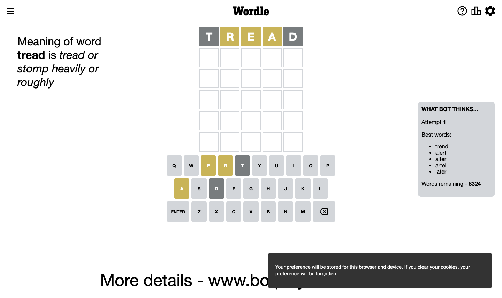
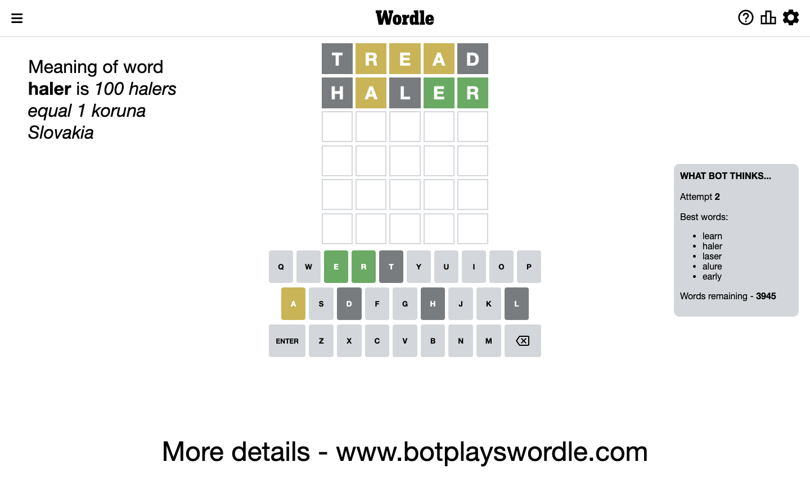
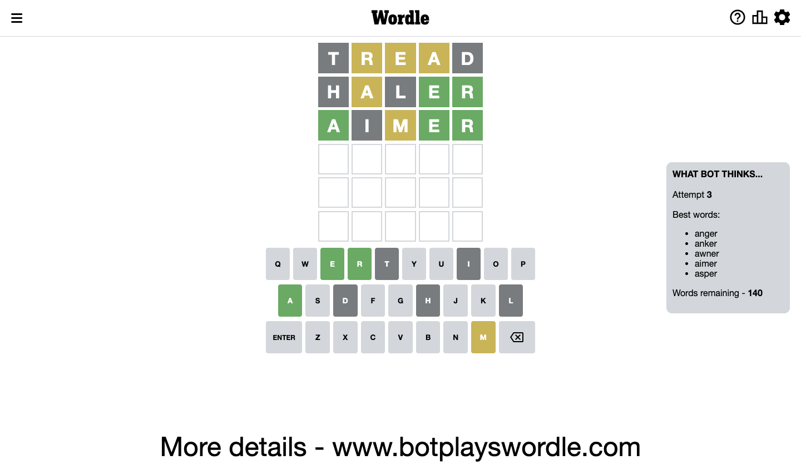
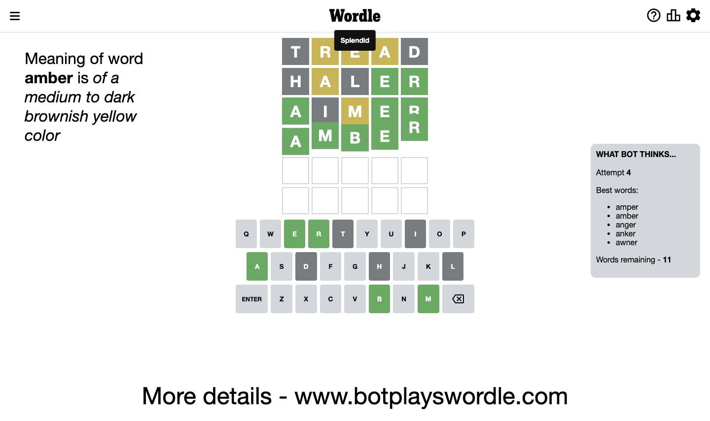

# Wordle for December 6, 2022 - \#535

## Attempt 1

This is the first attempt and we'll choose a random word to start with.

Let's start with word `tread`

Attempt for `tread` gives us 0 correct letters, 3 present letters and 2 wrong letters.

If we look into details, we can see that:

Letter `t` is not present in the word and we will not use it any more

Letter `r` is on a different spot - this means that it cannot be at position 2

Letter `e` is on a different spot - this means that it cannot be at position 3

Letter `a` is on a different spot - this means that it cannot be at position 4

Letter `d` is not present in the word and we will not use it any more

Some letters are missing (like `t`, `d`) but it's also important piece of information

Word should contain letters `[r e a]`

Could be a better guess

## Attempt 2

Right now we have 3946 words to choose from and best of them seem to be `[learn haler laser slare alure]`

So far we know that possible letters are:

At position 1: `[a b c e f g h i j k l m n o p q r s u v w x y z]`

At position 2: `[a b c e f g h i j k l m n o p q s u v w x y z]`

At position 3: `[a b c f g h i j k l m n o p q r s u v w x y z]`

At position 4: `[b c e f g h i j k l m n o p q r s u v w x y z]`

At position 5: `[a b c e f g h i j k l m n o p q r s u v w x y z]`

Next guess is `slare`, let's see what it gives us

Wordle does not know word `slare`, need to try something different

## Attempt 2

Right now we have 3945 words to choose from and best of them seem to be `[learn haler laser alure early]`

So far we know that possible letters are:

At position 1: `[a b c e f g h i j k l m n o p q r s u v w x y z]`

At position 2: `[a b c e f g h i j k l m n o p q s u v w x y z]`

At position 3: `[a b c f g h i j k l m n o p q r s u v w x y z]`

At position 4: `[b c e f g h i j k l m n o p q r s u v w x y z]`

At position 5: `[a b c e f g h i j k l m n o p q r s u v w x y z]`

Next guess is `haler`, let's see what it gives us

Attempt for `haler` gives us 2 correct letters, 1 present letters and 2 wrong letters.

If we look into details, we can see that:

Letter `h` is not present in the word and we will not use it any more

Letter `a` is on a different spot - this means that it cannot be at position 2

Letter `l` is not present in the word and we will not use it any more

Letter `e` should be at position 4

Letter `r` should be at position 5

We got information about the correct letters and it should make next attempt easier

Some letters are missing (like `h`, `l`) but it's also important piece of information

Word should contain letters `[r e a]`

That was a great guess that limited number of remaining words

## Attempt 3

Right now we have 141 words to choose from and best of them seem to be `[anger anker awner acier aimer]`

So far we know that possible letters are:

At position 1: `[a b c e f g i j k m n o p q r s u v w x y z]`

At position 2: `[b c e f g i j k m n o p q s u v w x y z]`

At position 3: `[a b c f g i j k m n o p q r s u v w x y z]`

At position 4: `[e]`

At position 5: `[r]`

Next guess is `acier`, let's see what it gives us

Wordle does not know word `acier`, need to try something different

## Attempt 3

Right now we have 140 words to choose from and best of them seem to be `[anger anker awner aimer asper]`

So far we know that possible letters are:

At position 1: `[a b c e f g i j k m n o p q r s u v w x y z]`

At position 2: `[b c e f g i j k m n o p q s u v w x y z]`

At position 3: `[a b c f g i j k m n o p q r s u v w x y z]`

At position 4: `[e]`

At position 5: `[r]`

Next guess is `aimer`, let's see what it gives us

Attempt for `aimer` gives us 3 correct letters, 1 present letters and 1 wrong letters.

If we look into details, we can see that:

Letter `a` should be at position 1

Letter `i` is not present in the word and we will not use it any more

Letter `m` is on a different spot - this means that it cannot be at position 3

We got information about the correct letters and it should make next attempt easier

Some letters are missing (like `i`) but it's also important piece of information

Word should contain letters `[r e a m]`

That was a great guess that limited number of remaining words

## Attempt 4

Right now we have 11 words to choose from and best of them seem to be `[amper amber anger anker awner]`

So far we know that possible letters are:

At position 1: `[a]`

At position 2: `[b c e f g j k m n o p q s u v w x y z]`

At position 3: `[a b c f g j k n o p q r s u v w x y z]`

At position 4: `[e]`

At position 5: `[r]`

Next guess is `amber`, let's see what it gives us

That's the correct answer! The word is `amber`!

## Conclusion

Today's word is `amber` and it took 4 attempts to guess it

