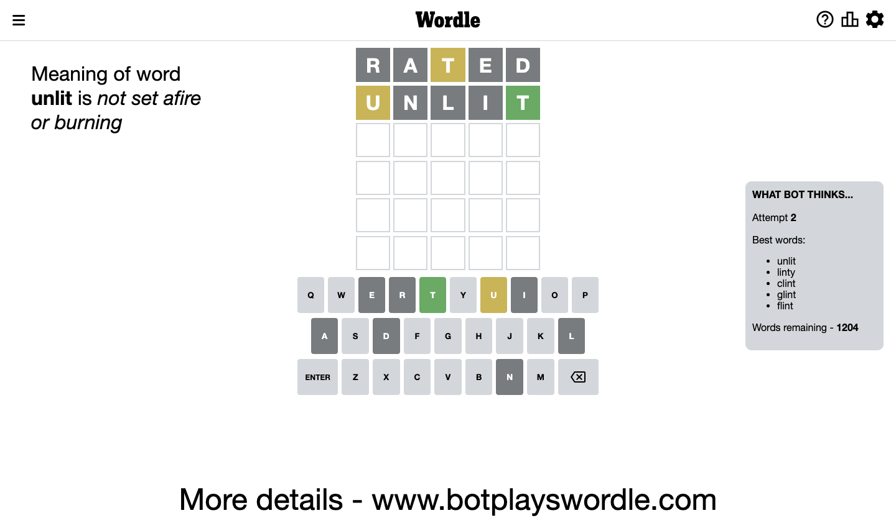

# Wordle for December 7, 2022 - \#536

## Attempt 1

This is the first attempt and we'll choose a random word to start with.

Let's start with word `rated`

Attempt for `rated` gives us 0 correct letters, 1 present letters and 4 wrong letters.

If we look into details, we can see that:

Letter `r` is not present in the word and we will not use it any more

Letter `a` is not present in the word and we will not use it any more

Letter `t` is on a different spot - this means that it cannot be at position 3

Letter `e` is not present in the word and we will not use it any more

Letter `d` is not present in the word and we will not use it any more

Some letters are missing (like `r`, `a`, `e`, `d`) but it's also important piece of information

Word should contain letters `[t]`

Not a bad guess in general

## Attempt 2

Right now we have 1204 words to choose from and best of them seem to be `[unlit linty clint glint flint]`

So far we know that possible letters are:

At position 1: `[b c f g h i j k l m n o p q s t u v w x y z]`

At position 2: `[b c f g h i j k l m n o p q s t u v w x y z]`

At position 3: `[b c f g h i j k l m n o p q s u v w x y z]`

At position 4: `[b c f g h i j k l m n o p q s t u v w x y z]`

At position 5: `[b c f g h i j k l m n o p q s t u v w x y z]`

Next guess is `unlit`, let's see what it gives us

Attempt for `unlit` gives us 1 correct letters, 1 present letters and 3 wrong letters.

If we look into details, we can see that:

Letter `u` is on a different spot - this means that it cannot be at position 1

Letter `n` is not present in the word and we will not use it any more

Letter `l` is not present in the word and we will not use it any more

Letter `i` is not present in the word and we will not use it any more

Letter `t` should be at position 5

We got information about the correct letters and it should make next attempt easier

Some letters are missing (like `n`, `l`, `i`) but it's also important piece of information

Word should contain letters `[t u]`

That was a great guess that limited number of remaining words

## Attempt 3

Right now we have 26 words to choose from and best of them seem to be `[shout ought fusht scout smout]`

So far we know that possible letters are:

At position 1: `[b c f g h j k m o p q s t v w x y z]`

At position 2: `[b c f g h j k m o p q s t u v w x y z]`

At position 3: `[b c f g h j k m o p q s u v w x y z]`

At position 4: `[b c f g h j k m o p q s t u v w x y z]`

At position 5: `[t]`

Next guess is `smout`, let's see what it gives us

Attempt for `smout` gives us 1 correct letters, 3 present letters and 1 wrong letters.

If we look into details, we can see that:

Letter `s` is on a different spot - this means that it cannot be at position 1

Letter `m` is not present in the word and we will not use it any more

Letter `o` is on a different spot - this means that it cannot be at position 3

Letter `u` is on a different spot - this means that it cannot be at position 4

Some letters are missing (like `m`) but it's also important piece of information

Word should contain letters `[t u s o]`

Not a bad guess in general

## Attempt 4

Right now we have 4 words to choose from and best of them seem to be `[joust ought fusht owght]`

So far we know that possible letters are:

At position 1: `[b c f g h j k o p q t v w x y z]`

At position 2: `[b c f g h j k o p q s t u v w x y z]`

At position 3: `[b c f g h j k p q s u v w x y z]`

At position 4: `[b c f g h j k o p q s t v w x y z]`

At position 5: `[t]`

Next guess is `owght`, let's see what it gives us

Wordle does not know word `owght`, need to try something different

## Attempt 4

Right now we have 3 words to choose from and best of them seem to be `[joust ought fusht]`

So far we know that possible letters are:

At position 1: `[b c f g h j k o p q t v w x y z]`

At position 2: `[b c f g h j k o p q s t u v w x y z]`

At position 3: `[b c f g h j k p q s u v w x y z]`

At position 4: `[b c f g h j k o p q s t v w x y z]`

At position 5: `[t]`

Next guess is `fusht`, let's see what it gives us

Wordle does not know word `fusht`, need to try something different

## Attempt 4

Right now we have 2 words to choose from and best of them seem to be `[joust ought]`

So far we know that possible letters are:

At position 1: `[b c f g h j k o p q t v w x y z]`

At position 2: `[b c f g h j k o p q s t u v w x y z]`

At position 3: `[b c f g h j k p q s u v w x y z]`

At position 4: `[b c f g h j k o p q s t v w x y z]`

At position 5: `[t]`

Next guess is `joust`, let's see what it gives us

That's the correct answer! The word is `joust`!

## Conclusion

Today's word is `joust` and it took 4 attempts to guess it

