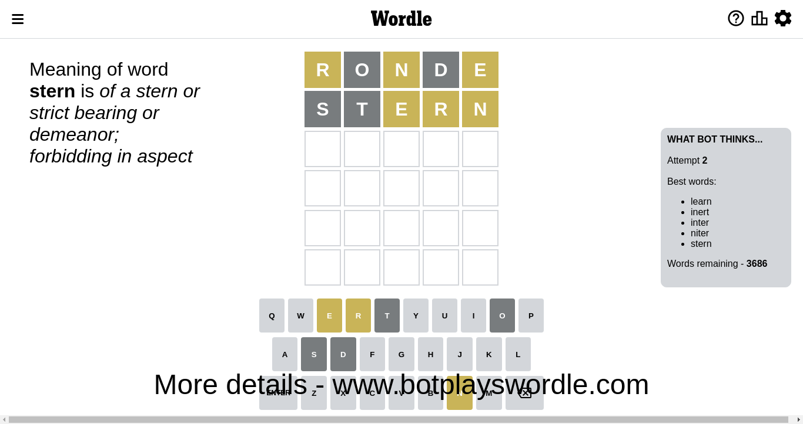

# Wordle for December 8, 2022 - \#537

## Attempt 1

This is the first attempt and we'll choose a random word to start with.

Let's start with word `diter`

Wordle does not know word `diter`, need to try something different

## Attempt 1

This is the first attempt and we'll choose a random word to start with.

Let's start with word `ronde`

Attempt for `ronde` gives us 0 correct letters, 3 present letters and 2 wrong letters.

If we look into details, we can see that:

Letter `r` is on a different spot - this means that it cannot be at position 1

Letter `o` is not present in the word and we will not use it any more

Letter `n` is on a different spot - this means that it cannot be at position 3

Letter `d` is not present in the word and we will not use it any more

Letter `e` is on a different spot - this means that it cannot be at position 5

Some letters are missing (like `o`, `d`) but it's also important piece of information

Word should contain letters `[r n e]`

Could be a better guess

## Attempt 2

Right now we have 3686 words to choose from and best of them seem to be `[learn inert inter niter stern]`

So far we know that possible letters are:

At position 1: `[a b c e f g h i j k l m n p q s t u v w x y z]`

At position 2: `[a b c e f g h i j k l m n p q r s t u v w x y z]`

At position 3: `[a b c e f g h i j k l m p q r s t u v w x y z]`

At position 4: `[a b c e f g h i j k l m n p q r s t u v w x y z]`

At position 5: `[a b c f g h i j k l m n p q r s t u v w x y z]`

Next guess is `stern`, let's see what it gives us

Attempt for `stern` gives us 0 correct letters, 3 present letters and 2 wrong letters.

If we look into details, we can see that:

Letter `s` is not present in the word and we will not use it any more

Letter `t` is not present in the word and we will not use it any more

Letter `e` is on a different spot - this means that it cannot be at position 3

Letter `r` is on a different spot - this means that it cannot be at position 4

Letter `n` is on a different spot - this means that it cannot be at position 5

Some letters are missing (like `s`, `t`) but it's also important piece of information

Word should contain letters `[r n e]`

Could be a better guess

## Attempt 3

Right now we have 1369 words to choose from and best of them seem to be `[enray namer anger anker naker]`

So far we know that possible letters are:

At position 1: `[a b c e f g h i j k l m n p q u v w x y z]`

At position 2: `[a b c e f g h i j k l m n p q r u v w x y z]`

At position 3: `[a b c f g h i j k l m p q r u v w x y z]`

At position 4: `[a b c e f g h i j k l m n p q u v w x y z]`

At position 5: `[a b c f g h i j k l m p q r u v w x y z]`

Next guess is `anger`, let's see what it gives us

Attempt for `anger` gives us 3 correct letters, 0 present letters and 2 wrong letters.

If we look into details, we can see that:

Letter `a` is not present in the word and we will not use it any more

Letter `n` should be at position 2

Letter `g` is not present in the word and we will not use it any more

Letter `e` should be at position 4

Letter `r` should be at position 5

We got information about the correct letters and it should make next attempt easier

Some letters are missing (like `a`, `g`) but it's also important piece of information

Word should contain letters `[r n e]`

That was a great guess that limited number of remaining words

## Attempt 4

Right now we have 2 words to choose from and best of them seem to be `[inker infer]`

So far we know that possible letters are:

At position 1: `[b c e f h i j k l m n p q u v w x y z]`

At position 2: `[n]`

At position 3: `[b c f h i j k l m p q r u v w x y z]`

At position 4: `[e]`

At position 5: `[r]`

Next guess is `infer`, let's see what it gives us

That's the correct answer! The word is `infer`!

## Conclusion

Today's word is `infer` and it took 4 attempts to guess it

