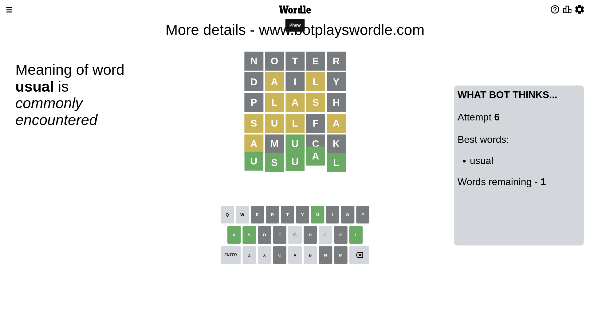

# Wordle for December 14, 2022 - \#543

## Attempt 1

This is the first attempt and we'll choose a random word to start with.

Let's start with word `thore`

Wordle does not know word `thore`, need to try something different

## Attempt 1

This is the first attempt and we'll choose a random word to start with.

Let's start with word `noter`

Attempt for `noter` gives us 0 correct letters, 0 present letters and 5 wrong letters.

If we look into details, we can see that:

Letter `n` is not present in the word and we will not use it any more

Letter `o` is not present in the word and we will not use it any more

Letter `t` is not present in the word and we will not use it any more

Letter `e` is not present in the word and we will not use it any more

Letter `r` is not present in the word and we will not use it any more

Some letters are missing (like `n`, `o`, `t`, `e`, `r`) but it's also important piece of information

So far we don't know any of the letters!

Not a bad guess in general

## Attempt 2

Right now we have 1041 words to choose from and best of them seem to be `[hauld child dulia daily hilsa]`

So far we know that possible letters are:

At position 1: `[a b c d f g h i j k l m p q s u v w x y z]`

At position 2: `[a b c d f g h i j k l m p q s u v w x y z]`

At position 3: `[a b c d f g h i j k l m p q s u v w x y z]`

At position 4: `[a b c d f g h i j k l m p q s u v w x y z]`

At position 5: `[a b c d f g h i j k l m p q s u v w x y z]`

Next guess is `daily`, let's see what it gives us

Attempt for `daily` gives us 0 correct letters, 2 present letters and 3 wrong letters.

If we look into details, we can see that:

Letter `d` is not present in the word and we will not use it any more

Letter `a` is on a different spot - this means that it cannot be at position 2

Letter `i` is not present in the word and we will not use it any more

Letter `l` is on a different spot - this means that it cannot be at position 4

Letter `y` is not present in the word and we will not use it any more

Some letters are missing (like `d`, `i`, `y`) but it's also important piece of information

Word should contain letters `[a l]`

Not a bad guess in general

## Attempt 3

Right now we have 208 words to choose from and best of them seem to be `[shaul clash plash blash shawl]`

So far we know that possible letters are:

At position 1: `[a b c f g h j k l m p q s u v w x z]`

At position 2: `[b c f g h j k l m p q s u v w x z]`

At position 3: `[a b c f g h j k l m p q s u v w x z]`

At position 4: `[a b c f g h j k m p q s u v w x z]`

At position 5: `[a b c f g h j k l m p q s u v w x z]`

Next guess is `plash`, let's see what it gives us

Attempt for `plash` gives us 0 correct letters, 3 present letters and 2 wrong letters.

If we look into details, we can see that:

Letter `p` is not present in the word and we will not use it any more

Letter `l` is on a different spot - this means that it cannot be at position 2

Letter `a` is on a different spot - this means that it cannot be at position 3

Letter `s` is on a different spot - this means that it cannot be at position 4

Letter `h` is not present in the word and we will not use it any more

Some letters are missing (like `p`, `h`) but it's also important piece of information

Word should contain letters `[a l s]`

Not a bad guess in general

## Attempt 4

Right now we have 41 words to choose from and best of them seem to be `[musal sulka sulfa sclaw usual]`

So far we know that possible letters are:

At position 1: `[a b c f g j k l m q s u v w x z]`

At position 2: `[b c f g j k m q s u v w x z]`

At position 3: `[b c f g j k l m q s u v w x z]`

At position 4: `[a b c f g j k m q u v w x z]`

At position 5: `[a b c f g j k l m q s u v w x z]`

Next guess is `musal`, let's see what it gives us

Wordle does not know word `musal`, need to try something different

## Attempt 4

Right now we have 40 words to choose from and best of them seem to be `[sulka sulfa sclaw usual cumal]`

So far we know that possible letters are:

At position 1: `[a b c f g j k l m q s u v w x z]`

At position 2: `[b c f g j k m q s u v w x z]`

At position 3: `[b c f g j k l m q s u v w x z]`

At position 4: `[a b c f g j k m q u v w x z]`

At position 5: `[a b c f g j k l m q s u v w x z]`

Next guess is `sulfa`, let's see what it gives us

Attempt for `sulfa` gives us 0 correct letters, 4 present letters and 1 wrong letters.

If we look into details, we can see that:

Letter `s` is on a different spot - this means that it cannot be at position 1

Letter `u` is on a different spot - this means that it cannot be at position 2

Letter `l` is on a different spot - this means that it cannot be at position 3

Letter `f` is not present in the word and we will not use it any more

Letter `a` is on a different spot - this means that it cannot be at position 5

Some letters are missing (like `f`) but it's also important piece of information

Word should contain letters `[a l s u]`

Not a bad guess in general

## Attempt 5

Right now we have 7 words to choose from and best of them seem to be `[usual ascus amuck agsam abbas]`

So far we know that possible letters are:

At position 1: `[a b c g j k l m q u v w x z]`

At position 2: `[b c g j k m q s v w x z]`

At position 3: `[b c g j k m q s u v w x z]`

At position 4: `[a b c g j k m q u v w x z]`

At position 5: `[b c g j k l m q s u v w x z]`

Next guess is `amuck`, let's see what it gives us

Attempt for `amuck` gives us 1 correct letters, 1 present letters and 3 wrong letters.

If we look into details, we can see that:

Letter `a` is on a different spot - this means that it cannot be at position 1

Letter `m` is not present in the word and we will not use it any more

Letter `u` should be at position 3

Letter `c` is not present in the word and we will not use it any more

Letter `k` is not present in the word and we will not use it any more

We got information about the correct letters and it should make next attempt easier

Some letters are missing (like `m`, `c`, `k`) but it's also important piece of information

Word should contain letters `[a l s u]`

Not a bad guess in general

## Attempt 6

Right now we have 1 words to choose from and best of them seem to be `[usual]`

So far we know that possible letters are:

At position 1: `[b g j l q u v w x z]`

At position 2: `[b g j q s v w x z]`

At position 3: `[u]`

At position 4: `[a b g j q u v w x z]`

At position 5: `[b g j l q s u v w x z]`

It must be `usual`

That's the correct answer! The word is `usual`!

## Conclusion

Today's word is `usual` and it took 6 attempts to guess it

