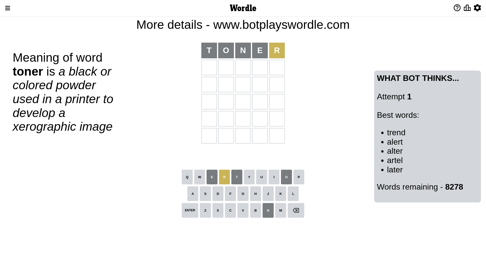
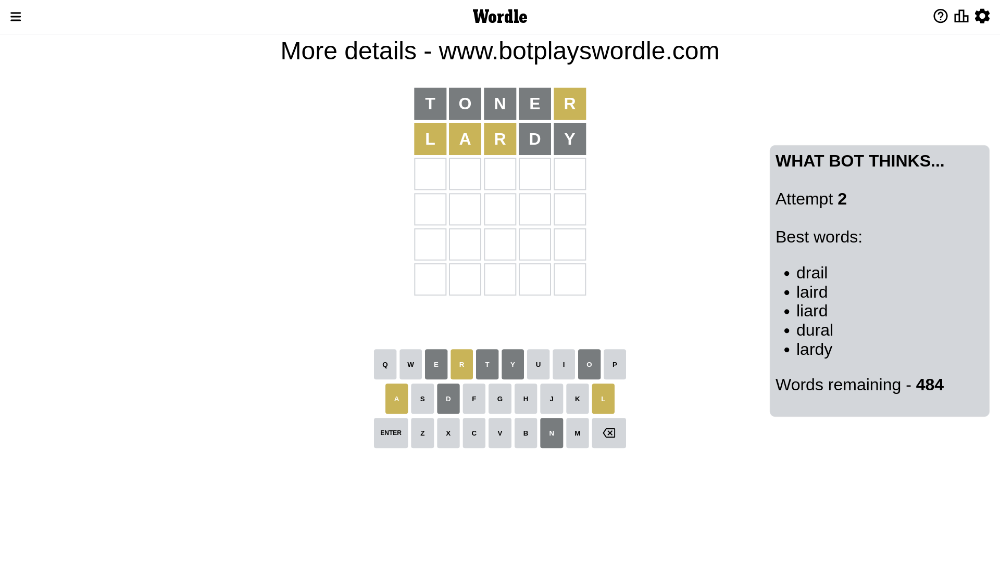
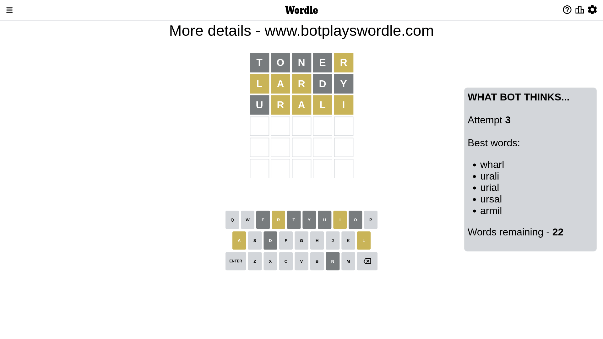
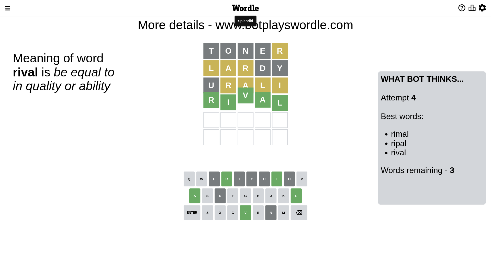

# Wordle for December 15, 2022 - \#544

## Attempt 1

This is the first attempt and we'll choose a random word to start with.

Let's start with word `toner`

Attempt for `toner` gives us 0 correct letters, 1 present letters and 4 wrong letters.

If we look into details, we can see that:

Letter `t` is not present in the word and we will not use it any more

Letter `o` is not present in the word and we will not use it any more

Letter `n` is not present in the word and we will not use it any more

Letter `e` is not present in the word and we will not use it any more

Letter `r` is on a different spot - this means that it cannot be at position 5

Some letters are missing (like `t`, `o`, `n`, `e`) but it's also important piece of information

Word should contain letters `[r]`

That was a great guess that limited number of remaining words

## Attempt 2

Right now we have 484 words to choose from and best of them seem to be `[drail laird liard dural lardy]`

So far we know that possible letters are:

At position 1: `[a b c d f g h i j k l m p q r s u v w x y z]`

At position 2: `[a b c d f g h i j k l m p q r s u v w x y z]`

At position 3: `[a b c d f g h i j k l m p q r s u v w x y z]`

At position 4: `[a b c d f g h i j k l m p q r s u v w x y z]`

At position 5: `[a b c d f g h i j k l m p q s u v w x y z]`

Next guess is `lardy`, let's see what it gives us

Attempt for `lardy` gives us 0 correct letters, 3 present letters and 2 wrong letters.

If we look into details, we can see that:

Letter `l` is on a different spot - this means that it cannot be at position 1

Letter `a` is on a different spot - this means that it cannot be at position 2

Letter `r` is on a different spot - this means that it cannot be at position 3

Letter `d` is not present in the word and we will not use it any more

Letter `y` is not present in the word and we will not use it any more

Some letters are missing (like `d`, `y`) but it's also important piece of information

Word should contain letters `[r l a]`

That was a great guess that limited number of remaining words

## Attempt 3

Right now we have 22 words to choose from and best of them seem to be `[wharl urali urial ursal armil]`

So far we know that possible letters are:

At position 1: `[a b c f g h i j k m p q r s u v w x z]`

At position 2: `[b c f g h i j k l m p q r s u v w x z]`

At position 3: `[a b c f g h i j k l m p q s u v w x z]`

At position 4: `[a b c f g h i j k l m p q r s u v w x z]`

At position 5: `[a b c f g h i j k l m p q s u v w x z]`

Next guess is `urali`, let's see what it gives us

Attempt for `urali` gives us 0 correct letters, 4 present letters and 1 wrong letters.

If we look into details, we can see that:

Letter `u` is not present in the word and we will not use it any more

Letter `r` is on a different spot - this means that it cannot be at position 2

Letter `a` is on a different spot - this means that it cannot be at position 3

Letter `l` is on a different spot - this means that it cannot be at position 4

Letter `i` is on a different spot - this means that it cannot be at position 5

Some letters are missing (like `u`) but it's also important piece of information

Word should contain letters `[r l a i]`

Not a bad guess in general

## Attempt 4

Right now we have 3 words to choose from and best of them seem to be `[rimal ripal rival]`

So far we know that possible letters are:

At position 1: `[a b c f g h i j k m p q r s v w x z]`

At position 2: `[b c f g h i j k l m p q s v w x z]`

At position 3: `[b c f g h i j k l m p q s v w x z]`

At position 4: `[a b c f g h i j k m p q r s v w x z]`

At position 5: `[a b c f g h j k l m p q s v w x z]`

Next guess is `rival`, let's see what it gives us

That's the correct answer! The word is `rival`!

## Conclusion

Today's word is `rival` and it took 4 attempts to guess it

