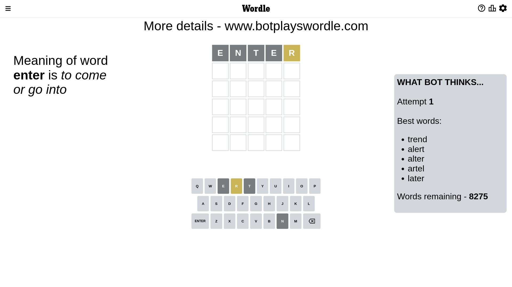
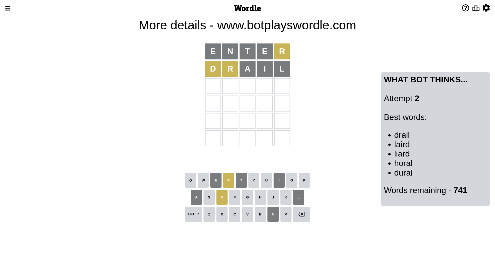
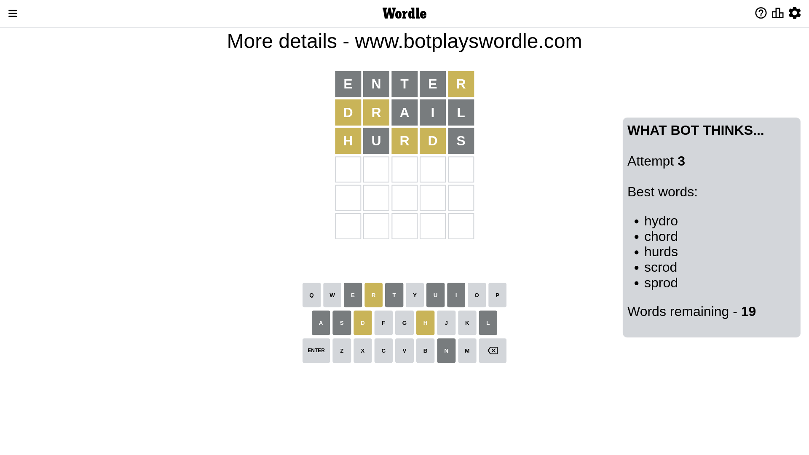
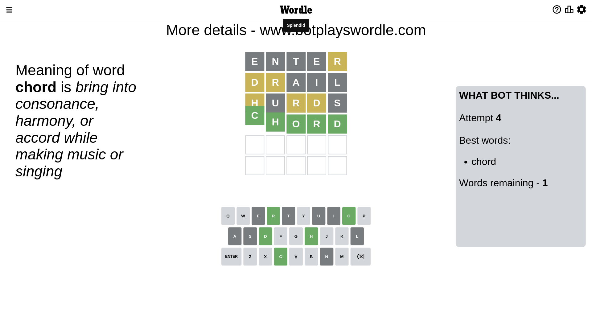

# Wordle for December 17, 2022 - \#546

## Attempt 1

This is the first attempt and we'll choose a random word to start with.

Let's start with word `neter`

Wordle does not know word `neter`, need to try something different

## Attempt 1

This is the first attempt and we'll choose a random word to start with.

Let's start with word `enter`

Attempt for `enter` gives us 0 correct letters, 1 present letters and 4 wrong letters.

If we look into details, we can see that:

Letter `e` is not present in the word and we will not use it any more

Letter `n` is not present in the word and we will not use it any more

Letter `t` is not present in the word and we will not use it any more

Letter `e` is not present in the word and we will not use it any more

Letter `r` is on a different spot - this means that it cannot be at position 5

Some letters are missing (like `e`, `n`, `t`) but it's also important piece of information

Word should contain letters `[r]`

That was a great guess that limited number of remaining words

## Attempt 2

Right now we have 741 words to choose from and best of them seem to be `[drail laird liard horal dural]`

So far we know that possible letters are:

At position 1: `[a b c d f g h i j k l m o p q r s u v w x y z]`

At position 2: `[a b c d f g h i j k l m o p q r s u v w x y z]`

At position 3: `[a b c d f g h i j k l m o p q r s u v w x y z]`

At position 4: `[a b c d f g h i j k l m o p q r s u v w x y z]`

At position 5: `[a b c d f g h i j k l m o p q s u v w x y z]`

Next guess is `drail`, let's see what it gives us

Attempt for `drail` gives us 0 correct letters, 2 present letters and 3 wrong letters.

If we look into details, we can see that:

Letter `d` is on a different spot - this means that it cannot be at position 1

Letter `r` is on a different spot - this means that it cannot be at position 2

Letter `a` is not present in the word and we will not use it any more

Letter `i` is not present in the word and we will not use it any more

Letter `l` is not present in the word and we will not use it any more

Some letters are missing (like `a`, `i`, `l`) but it's also important piece of information

Word should contain letters `[r d]`

That was a great guess that limited number of remaining words

## Attempt 3

Right now we have 19 words to choose from and best of them seem to be `[hydro chord hurds scrod sprod]`

So far we know that possible letters are:

At position 1: `[b c f g h j k m o p q r s u v w x y z]`

At position 2: `[b c d f g h j k m o p q s u v w x y z]`

At position 3: `[b c d f g h j k m o p q r s u v w x y z]`

At position 4: `[b c d f g h j k m o p q r s u v w x y z]`

At position 5: `[b c d f g h j k m o p q s u v w x y z]`

Next guess is `hurds`, let's see what it gives us

Attempt for `hurds` gives us 0 correct letters, 3 present letters and 2 wrong letters.

If we look into details, we can see that:

Letter `h` is on a different spot - this means that it cannot be at position 1

Letter `u` is not present in the word and we will not use it any more

Letter `r` is on a different spot - this means that it cannot be at position 3

Letter `d` is on a different spot - this means that it cannot be at position 4

Letter `s` is not present in the word and we will not use it any more

Some letters are missing (like `u`, `s`) but it's also important piece of information

Word should contain letters `[r d h]`

That was a great guess that limited number of remaining words

## Attempt 4

Right now we have 1 words to choose from and best of them seem to be `[chord]`

So far we know that possible letters are:

At position 1: `[b c f g j k m o p q r v w x y z]`

At position 2: `[b c d f g h j k m o p q v w x y z]`

At position 3: `[b c d f g h j k m o p q v w x y z]`

At position 4: `[b c f g h j k m o p q r v w x y z]`

At position 5: `[b c d f g h j k m o p q v w x y z]`

It must be `chord`

That's the correct answer! The word is `chord`!

## Conclusion

Today's word is `chord` and it took 4 attempts to guess it

