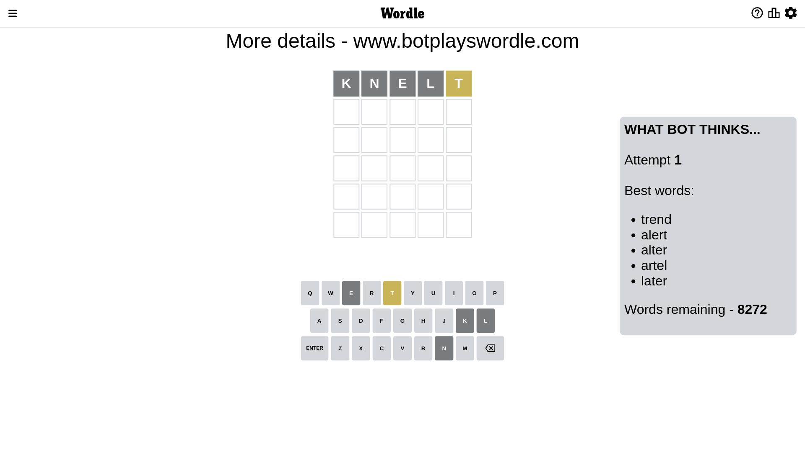
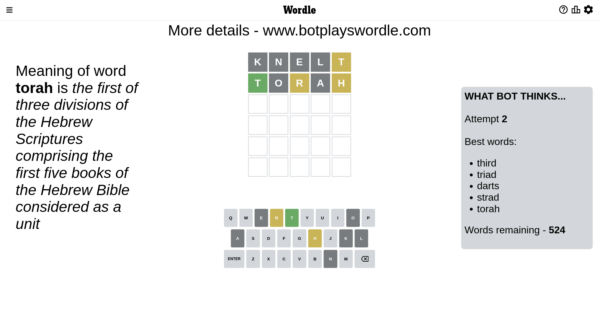
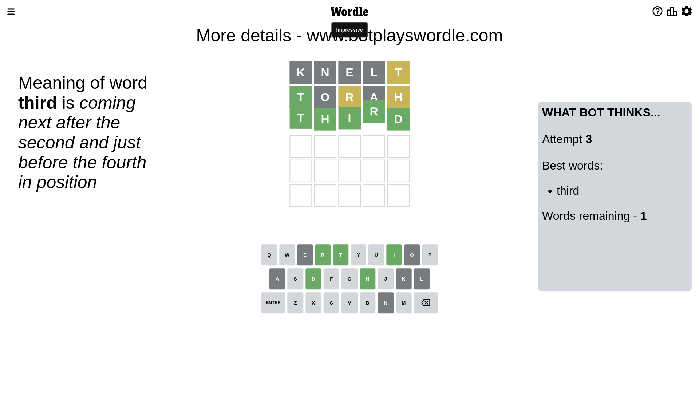

# Wordle for December 20, 2022 - \#549

## Attempt 1

This is the first attempt and we'll choose a random word to start with.

Let's start with word `knelt`

Attempt for `knelt` gives us 0 correct letters, 1 present letters and 4 wrong letters.

If we look into details, we can see that:

Letter `k` is not present in the word and we will not use it any more

Letter `n` is not present in the word and we will not use it any more

Letter `e` is not present in the word and we will not use it any more

Letter `l` is not present in the word and we will not use it any more

Letter `t` is on a different spot - this means that it cannot be at position 5

Some letters are missing (like `k`, `n`, `e`, `l`) but it's also important piece of information

Word should contain letters `[t]`

That was a great guess that limited number of remaining words

## Attempt 2

Right now we have 524 words to choose from and best of them seem to be `[third triad darts strad torah]`

So far we know that possible letters are:

At position 1: `[a b c d f g h i j m o p q r s t u v w x y z]`

At position 2: `[a b c d f g h i j m o p q r s t u v w x y z]`

At position 3: `[a b c d f g h i j m o p q r s t u v w x y z]`

At position 4: `[a b c d f g h i j m o p q r s t u v w x y z]`

At position 5: `[a b c d f g h i j m o p q r s u v w x y z]`

Next guess is `torah`, let's see what it gives us

Attempt for `torah` gives us 1 correct letters, 2 present letters and 2 wrong letters.

If we look into details, we can see that:

Letter `t` should be at position 1

Letter `o` is not present in the word and we will not use it any more

Letter `r` is on a different spot - this means that it cannot be at position 3

Letter `a` is not present in the word and we will not use it any more

Letter `h` is on a different spot - this means that it cannot be at position 5

We got information about the correct letters and it should make next attempt easier

Some letters are missing (like `o`, `a`) but it's also important piece of information

Word should contain letters `[t r h]`

That was a great guess that limited number of remaining words

## Attempt 3

Right now we have 2 words to choose from and best of them seem to be `[third thurm]`

So far we know that possible letters are:

At position 1: `[t]`

At position 2: `[b c d f g h i j m p q r s t u v w x y z]`

At position 3: `[b c d f g h i j m p q s t u v w x y z]`

At position 4: `[b c d f g h i j m p q r s t u v w x y z]`

At position 5: `[b c d f g i j m p q r s u v w x y z]`

Next guess is `thurm`, let's see what it gives us

Wordle does not know word `thurm`, need to try something different

## Attempt 3

Right now we have 1 words to choose from and best of them seem to be `[third]`

So far we know that possible letters are:

At position 1: `[t]`

At position 2: `[b c d f g h i j m p q r s t u v w x y z]`

At position 3: `[b c d f g h i j m p q s t u v w x y z]`

At position 4: `[b c d f g h i j m p q r s t u v w x y z]`

At position 5: `[b c d f g i j m p q r s u v w x y z]`

It must be `third`

That's the correct answer! The word is `third`!

## Conclusion

Today's word is `third` and it took 3 attempts to guess it

