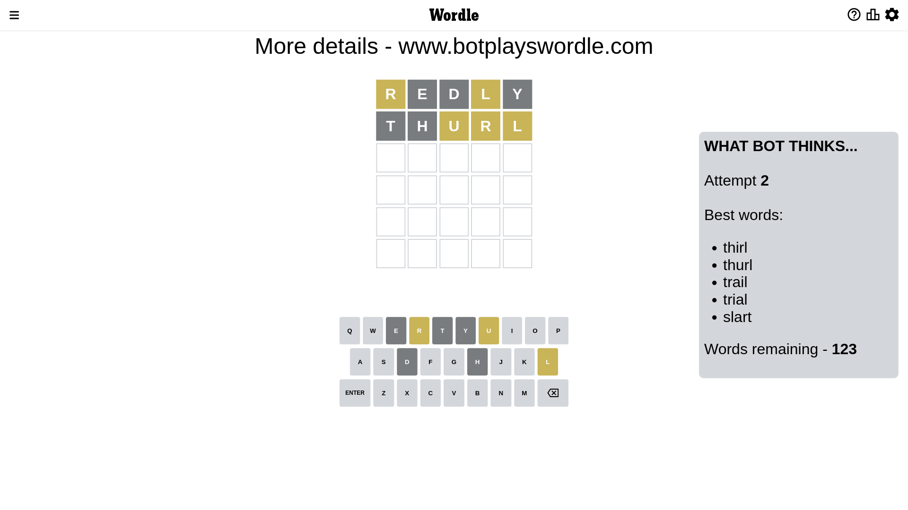
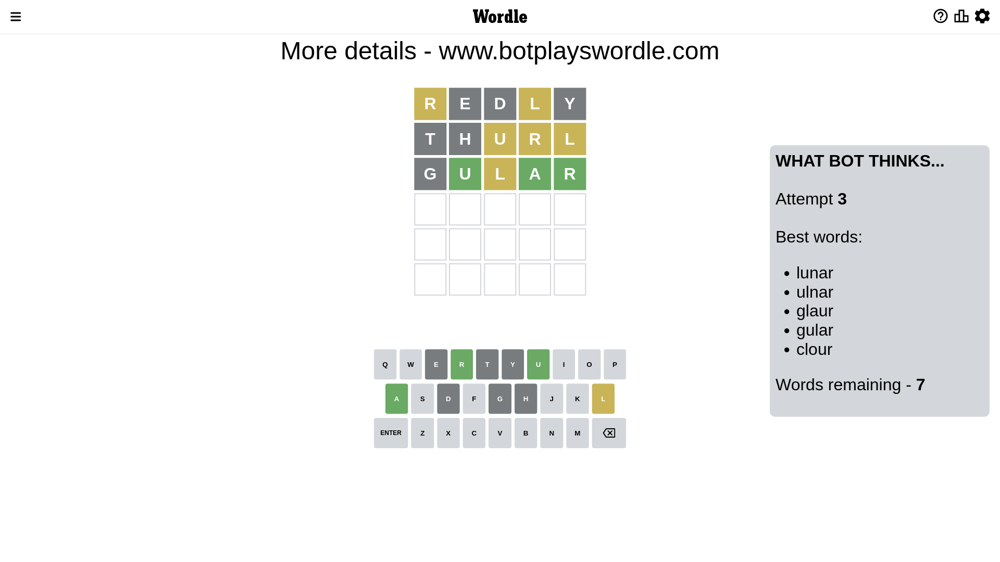
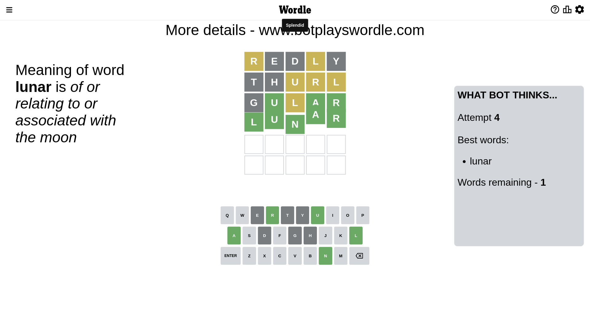

# Wordle for December 21, 2022 - \#550

## Attempt 1

This is the first attempt and we'll choose a random word to start with.

Let's start with word `redly`

Attempt for `redly` gives us 0 correct letters, 2 present letters and 3 wrong letters.

If we look into details, we can see that:

Letter `r` is on a different spot - this means that it cannot be at position 1

Letter `e` is not present in the word and we will not use it any more

Letter `d` is not present in the word and we will not use it any more

Letter `l` is on a different spot - this means that it cannot be at position 4

Letter `y` is not present in the word and we will not use it any more

Some letters are missing (like `e`, `d`, `y`) but it's also important piece of information

Word should contain letters `[r l]`

That was a great guess that limited number of remaining words

## Attempt 2

Right now we have 126 words to choose from and best of them seem to be `[thirl thurl latro toral litra]`

So far we know that possible letters are:

At position 1: `[a b c f g h i j k l m n o p q s t u v w x z]`

At position 2: `[a b c f g h i j k l m n o p q r s t u v w x z]`

At position 3: `[a b c f g h i j k l m n o p q r s t u v w x z]`

At position 4: `[a b c f g h i j k m n o p q r s t u v w x z]`

At position 5: `[a b c f g h i j k l m n o p q r s t u v w x z]`

Next guess is `latro`, let's see what it gives us

Wordle does not know word `latro`, need to try something different

## Attempt 2

Right now we have 125 words to choose from and best of them seem to be `[thirl thurl toral litra trail]`

So far we know that possible letters are:

At position 1: `[a b c f g h i j k l m n o p q s t u v w x z]`

At position 2: `[a b c f g h i j k l m n o p q r s t u v w x z]`

At position 3: `[a b c f g h i j k l m n o p q r s t u v w x z]`

At position 4: `[a b c f g h i j k m n o p q r s t u v w x z]`

At position 5: `[a b c f g h i j k l m n o p q r s t u v w x z]`

Next guess is `toral`, let's see what it gives us

Wordle does not know word `toral`, need to try something different

## Attempt 2

Right now we have 124 words to choose from and best of them seem to be `[thirl thurl litra trail trial]`

So far we know that possible letters are:

At position 1: `[a b c f g h i j k l m n o p q s t u v w x z]`

At position 2: `[a b c f g h i j k l m n o p q r s t u v w x z]`

At position 3: `[a b c f g h i j k l m n o p q r s t u v w x z]`

At position 4: `[a b c f g h i j k m n o p q r s t u v w x z]`

At position 5: `[a b c f g h i j k l m n o p q r s t u v w x z]`

Next guess is `litra`, let's see what it gives us

Wordle does not know word `litra`, need to try something different

## Attempt 2

Right now we have 123 words to choose from and best of them seem to be `[thirl thurl trail trial slart]`

So far we know that possible letters are:

At position 1: `[a b c f g h i j k l m n o p q s t u v w x z]`

At position 2: `[a b c f g h i j k l m n o p q r s t u v w x z]`

At position 3: `[a b c f g h i j k l m n o p q r s t u v w x z]`

At position 4: `[a b c f g h i j k m n o p q r s t u v w x z]`

At position 5: `[a b c f g h i j k l m n o p q r s t u v w x z]`

Next guess is `thurl`, let's see what it gives us

Attempt for `thurl` gives us 0 correct letters, 3 present letters and 2 wrong letters.

If we look into details, we can see that:

Letter `t` is not present in the word and we will not use it any more

Letter `h` is not present in the word and we will not use it any more

Letter `u` is on a different spot - this means that it cannot be at position 3

Letter `r` is on a different spot - this means that it cannot be at position 4

Letter `l` is on a different spot - this means that it cannot be at position 5

Some letters are missing (like `t`, `h`) but it's also important piece of information

Word should contain letters `[r l u]`

That was a great guess that limited number of remaining words

## Attempt 3

Right now we have 8 words to choose from and best of them seem to be `[lunar ulnar glaur gular urlar]`

So far we know that possible letters are:

At position 1: `[a b c f g i j k l m n o p q s u v w x z]`

At position 2: `[a b c f g i j k l m n o p q r s u v w x z]`

At position 3: `[a b c f g i j k l m n o p q r s v w x z]`

At position 4: `[a b c f g i j k m n o p q s u v w x z]`

At position 5: `[a b c f g i j k m n o p q r s u v w x z]`

Next guess is `urlar`, let's see what it gives us

Wordle does not know word `urlar`, need to try something different

## Attempt 3

Right now we have 7 words to choose from and best of them seem to be `[lunar ulnar glaur gular clour]`

So far we know that possible letters are:

At position 1: `[a b c f g i j k l m n o p q s u v w x z]`

At position 2: `[a b c f g i j k l m n o p q r s u v w x z]`

At position 3: `[a b c f g i j k l m n o p q r s v w x z]`

At position 4: `[a b c f g i j k m n o p q s u v w x z]`

At position 5: `[a b c f g i j k m n o p q r s u v w x z]`

Next guess is `gular`, let's see what it gives us

Attempt for `gular` gives us 3 correct letters, 1 present letters and 1 wrong letters.

If we look into details, we can see that:

Letter `g` is not present in the word and we will not use it any more

Letter `u` should be at position 2

Letter `l` is on a different spot - this means that it cannot be at position 3

Letter `a` should be at position 4

Letter `r` should be at position 5

We got information about the correct letters and it should make next attempt easier

Some letters are missing (like `g`) but it's also important piece of information

Word should contain letters `[r l u a]`

Not a bad guess in general

## Attempt 4

Right now we have 1 words to choose from and best of them seem to be `[lunar]`

So far we know that possible letters are:

At position 1: `[a b c f i j k l m n o p q s u v w x z]`

At position 2: `[u]`

At position 3: `[a b c f i j k m n o p q r s v w x z]`

At position 4: `[a]`

At position 5: `[r]`

It must be `lunar`

That's the correct answer! The word is `lunar`!

## Conclusion

Today's word is `lunar` and it took 4 attempts to guess it

