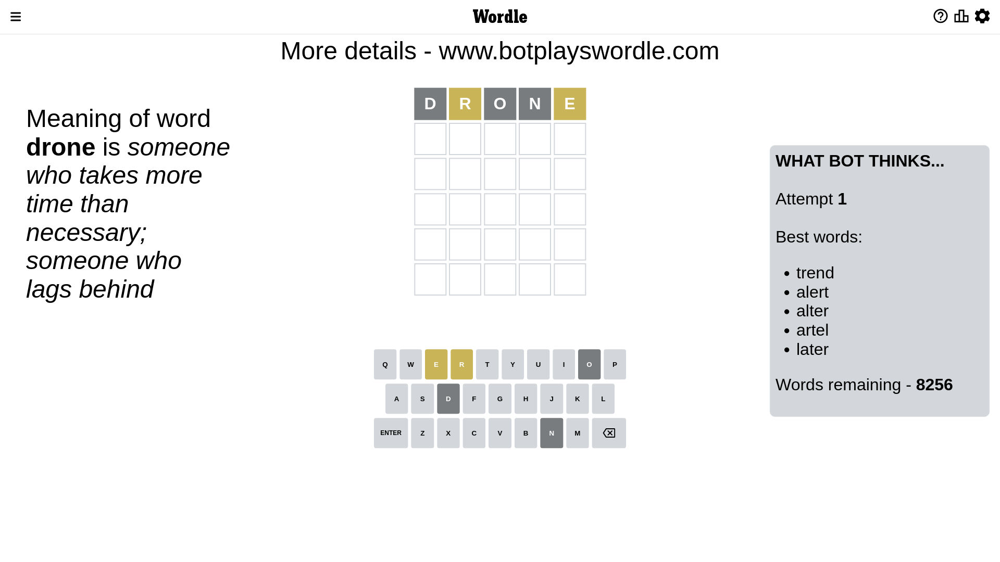
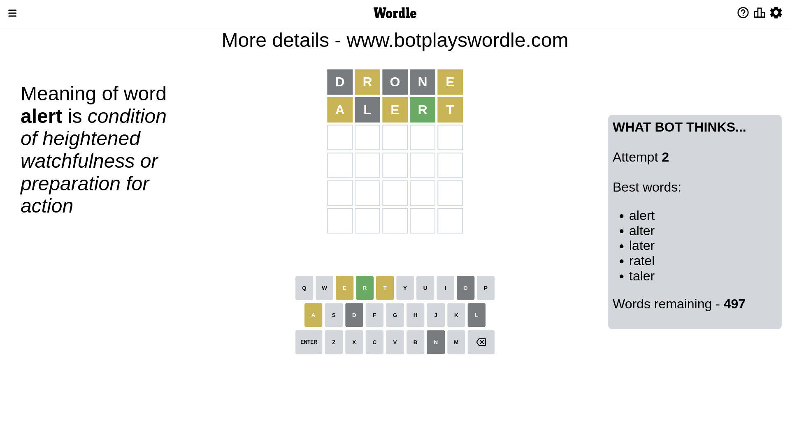
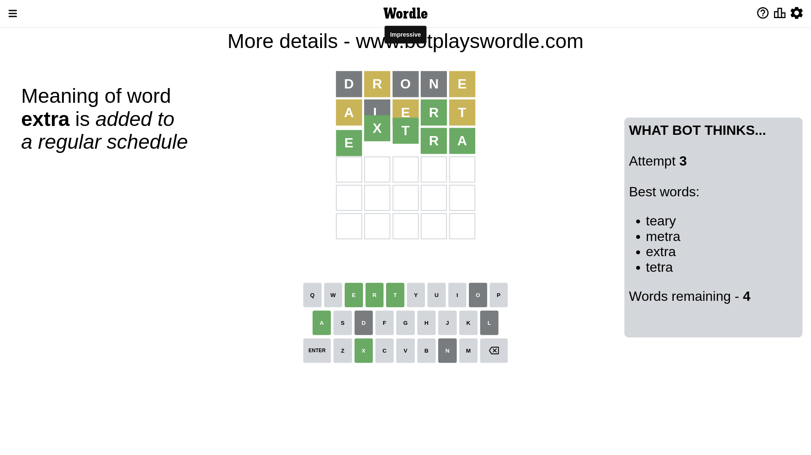

# Wordle for December 25, 2022 - \#554

## Attempt 1

This is the first attempt and we'll choose a random word to start with.

Let's start with word `drone`

Attempt for `drone` gives us 0 correct letters, 2 present letters and 3 wrong letters.

If we look into details, we can see that:

Letter `d` is not present in the word and we will not use it any more

Letter `r` is on a different spot - this means that it cannot be at position 2

Letter `o` is not present in the word and we will not use it any more

Letter `n` is not present in the word and we will not use it any more

Letter `e` is on a different spot - this means that it cannot be at position 5

Some letters are missing (like `d`, `o`, `n`) but it's also important piece of information

Word should contain letters `[r e]`

That was a great guess that limited number of remaining words

## Attempt 2

Right now we have 497 words to choose from and best of them seem to be `[alert alter later ratel taler]`

So far we know that possible letters are:

At position 1: `[a b c e f g h i j k l m p q r s t u v w x y z]`

At position 2: `[a b c e f g h i j k l m p q s t u v w x y z]`

At position 3: `[a b c e f g h i j k l m p q r s t u v w x y z]`

At position 4: `[a b c e f g h i j k l m p q r s t u v w x y z]`

At position 5: `[a b c f g h i j k l m p q r s t u v w x y z]`

Next guess is `alert`, let's see what it gives us

Attempt for `alert` gives us 1 correct letters, 3 present letters and 1 wrong letters.

If we look into details, we can see that:

Letter `a` is on a different spot - this means that it cannot be at position 1

Letter `l` is not present in the word and we will not use it any more

Letter `e` is on a different spot - this means that it cannot be at position 3

Letter `r` should be at position 4

Letter `t` is on a different spot - this means that it cannot be at position 5

We got information about the correct letters and it should make next attempt easier

Some letters are missing (like `l`) but it's also important piece of information

Word should contain letters `[r e a t]`

That was a great guess that limited number of remaining words

## Attempt 3

Right now we have 4 words to choose from and best of them seem to be `[teary metra extra tetra]`

So far we know that possible letters are:

At position 1: `[b c e f g h i j k m p q r s t u v w x y z]`

At position 2: `[a b c e f g h i j k m p q s t u v w x y z]`

At position 3: `[a b c f g h i j k m p q r s t u v w x y z]`

At position 4: `[r]`

At position 5: `[a b c f g h i j k m p q r s u v w x y z]`

Next guess is `extra`, let's see what it gives us

That's the correct answer! The word is `extra`!

## Conclusion

Today's word is `extra` and it took 3 attempts to guess it

