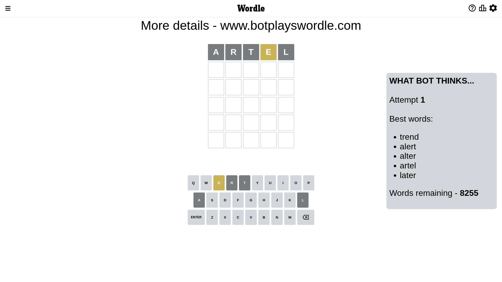
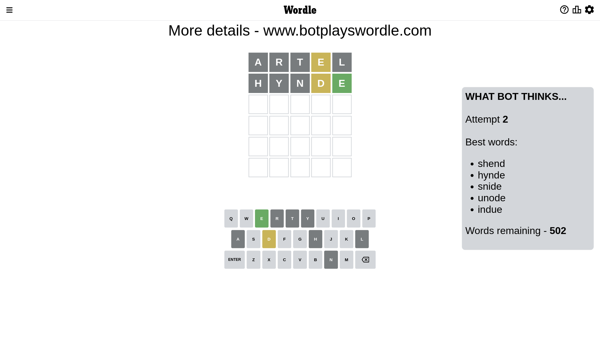
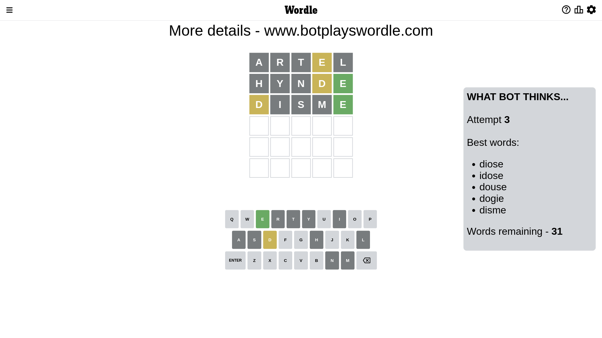
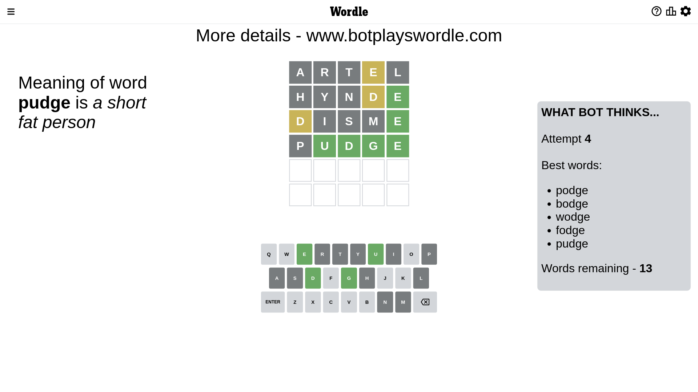
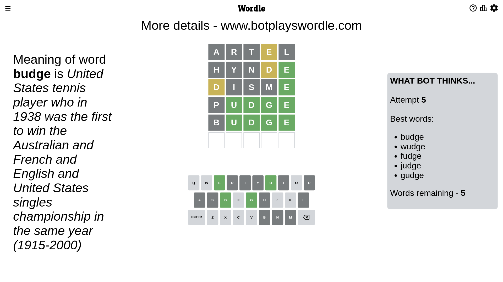
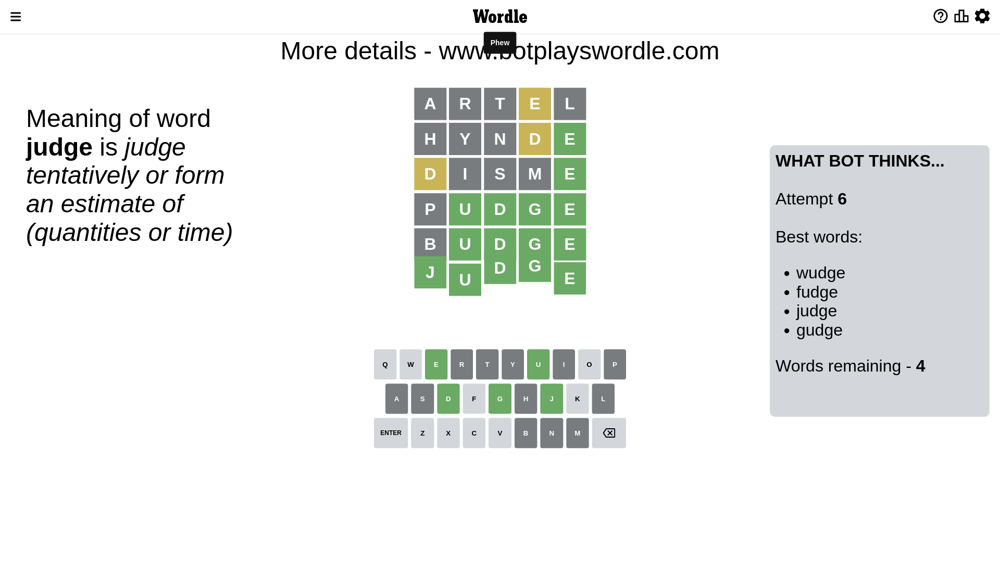

# Wordle for December 26, 2022 - \#555

## Attempt 1

This is the first attempt and we'll choose a random word to start with.

Let's start with word `artel`

Attempt for `artel` gives us 0 correct letters, 1 present letters and 4 wrong letters.

If we look into details, we can see that:

Letter `a` is not present in the word and we will not use it any more

Letter `r` is not present in the word and we will not use it any more

Letter `t` is not present in the word and we will not use it any more

Letter `e` is on a different spot - this means that it cannot be at position 4

Letter `l` is not present in the word and we will not use it any more

Some letters are missing (like `a`, `r`, `t`, `l`) but it's also important piece of information

Word should contain letters `[e]`

That was a great guess that limited number of remaining words

## Attempt 2

Right now we have 502 words to choose from and best of them seem to be `[shend hynde snide unode indue]`

So far we know that possible letters are:

At position 1: `[b c d e f g h i j k m n o p q s u v w x y z]`

At position 2: `[b c d e f g h i j k m n o p q s u v w x y z]`

At position 3: `[b c d e f g h i j k m n o p q s u v w x y z]`

At position 4: `[b c d f g h i j k m n o p q s u v w x y z]`

At position 5: `[b c d e f g h i j k m n o p q s u v w x y z]`

Next guess is `hynde`, let's see what it gives us

Attempt for `hynde` gives us 1 correct letters, 1 present letters and 3 wrong letters.

If we look into details, we can see that:

Letter `h` is not present in the word and we will not use it any more

Letter `y` is not present in the word and we will not use it any more

Letter `n` is not present in the word and we will not use it any more

Letter `d` is on a different spot - this means that it cannot be at position 4

Letter `e` should be at position 5

We got information about the correct letters and it should make next attempt easier

Some letters are missing (like `h`, `y`, `n`) but it's also important piece of information

Word should contain letters `[e d]`

That was a great guess that limited number of remaining words

## Attempt 3

Right now we have 31 words to choose from and best of them seem to be `[diose idose douse dogie disme]`

So far we know that possible letters are:

At position 1: `[b c d e f g i j k m o p q s u v w x z]`

At position 2: `[b c d e f g i j k m o p q s u v w x z]`

At position 3: `[b c d e f g i j k m o p q s u v w x z]`

At position 4: `[b c f g i j k m o p q s u v w x z]`

At position 5: `[e]`

Next guess is `disme`, let's see what it gives us

Attempt for `disme` gives us 1 correct letters, 1 present letters and 3 wrong letters.

If we look into details, we can see that:

Letter `d` is on a different spot - this means that it cannot be at position 1

Letter `i` is not present in the word and we will not use it any more

Letter `s` is not present in the word and we will not use it any more

Letter `m` is not present in the word and we will not use it any more

Some letters are missing (like `i`, `s`, `m`) but it's also important piece of information

Word should contain letters `[e d]`

Could be a better guess

## Attempt 4

Right now we have 13 words to choose from and best of them seem to be `[podge bodge wodge fodge pudge]`

So far we know that possible letters are:

At position 1: `[b c e f g j k o p q u v w x z]`

At position 2: `[b c d e f g j k o p q u v w x z]`

At position 3: `[b c d e f g j k o p q u v w x z]`

At position 4: `[b c f g j k o p q u v w x z]`

At position 5: `[e]`

Next guess is `pudge`, let's see what it gives us

Attempt for `pudge` gives us 4 correct letters, 0 present letters and 1 wrong letters.

If we look into details, we can see that:

Letter `p` is not present in the word and we will not use it any more

Letter `u` should be at position 2

Letter `d` should be at position 3

Letter `g` should be at position 4

We got information about the correct letters and it should make next attempt easier

Some letters are missing (like `p`) but it's also important piece of information

Word should contain letters `[e d u g]`

Could be a better guess

## Attempt 5

Right now we have 5 words to choose from and best of them seem to be `[budge wudge fudge judge gudge]`

So far we know that possible letters are:

At position 1: `[b c e f g j k o q u v w x z]`

At position 2: `[u]`

At position 3: `[d]`

At position 4: `[g]`

At position 5: `[e]`

Next guess is `budge`, let's see what it gives us

Attempt for `budge` gives us 4 correct letters, 0 present letters and 1 wrong letters.

If we look into details, we can see that:

Letter `b` is not present in the word and we will not use it any more

Some letters are missing (like `b`) but it's also important piece of information

Word should contain letters `[e d u g]`

This was a waste, almost no valuable information...

## Attempt 6

Right now we have 4 words to choose from and best of them seem to be `[wudge fudge judge gudge]`

So far we know that possible letters are:

At position 1: `[c e f g j k o q u v w x z]`

At position 2: `[u]`

At position 3: `[d]`

At position 4: `[g]`

At position 5: `[e]`

Next guess is `judge`, let's see what it gives us

That's the correct answer! The word is `judge`!

## Conclusion

Today's word is `judge` and it took 6 attempts to guess it

