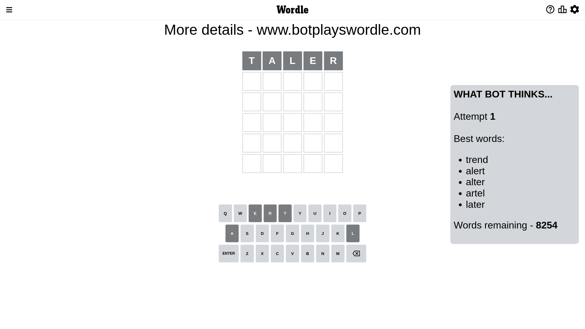
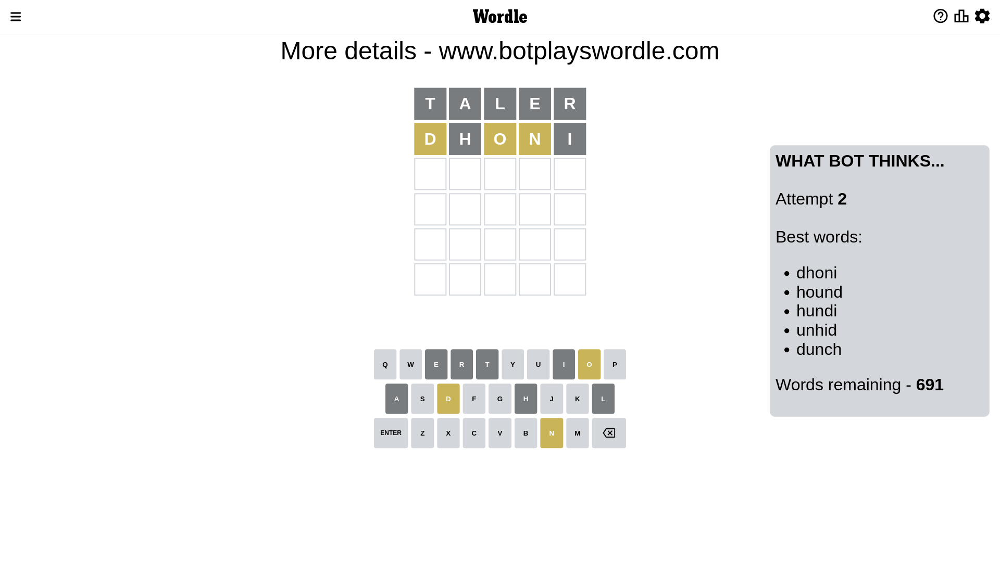
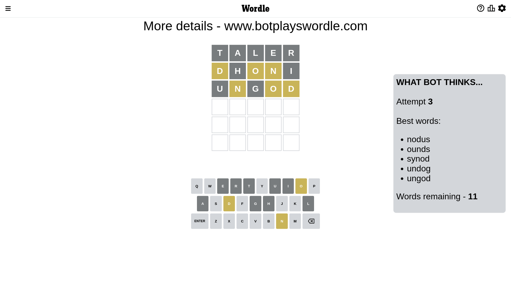
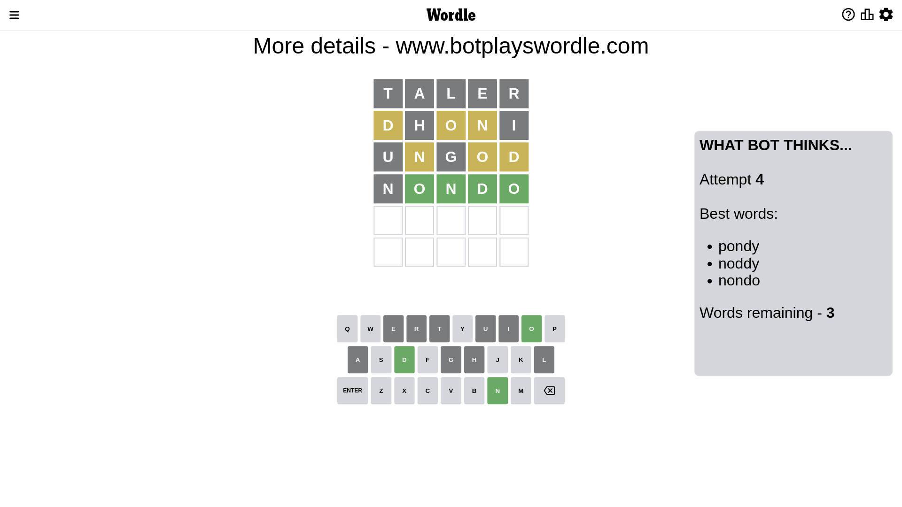
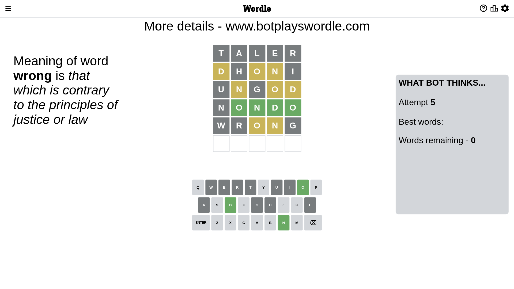
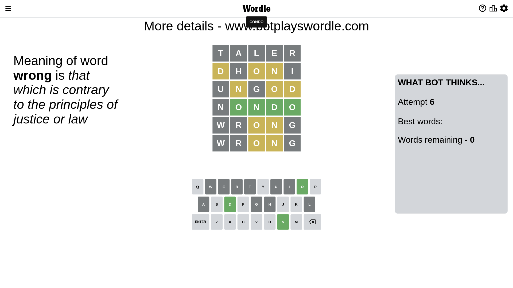

# Wordle for December 27, 2022 - \#556

## Attempt 1

This is the first attempt and we'll choose a random word to start with.

Let's start with word `taler`

Attempt for `taler` gives us 0 correct letters, 0 present letters and 5 wrong letters.

If we look into details, we can see that:

Letter `t` is not present in the word and we will not use it any more

Letter `a` is not present in the word and we will not use it any more

Letter `l` is not present in the word and we will not use it any more

Letter `e` is not present in the word and we will not use it any more

Letter `r` is not present in the word and we will not use it any more

Some letters are missing (like `t`, `a`, `l`, `e`, `r`) but it's also important piece of information

So far we don't know any of the letters!

That was a great guess that limited number of remaining words

## Attempt 2

Right now we have 691 words to choose from and best of them seem to be `[dhoni hound hundi unhid dunch]`

So far we know that possible letters are:

At position 1: `[b c d f g h i j k m n o p q s u v w x y z]`

At position 2: `[b c d f g h i j k m n o p q s u v w x y z]`

At position 3: `[b c d f g h i j k m n o p q s u v w x y z]`

At position 4: `[b c d f g h i j k m n o p q s u v w x y z]`

At position 5: `[b c d f g h i j k m n o p q s u v w x y z]`

Next guess is `dhoni`, let's see what it gives us

Attempt for `dhoni` gives us 0 correct letters, 3 present letters and 2 wrong letters.

If we look into details, we can see that:

Letter `d` is on a different spot - this means that it cannot be at position 1

Letter `h` is not present in the word and we will not use it any more

Letter `o` is on a different spot - this means that it cannot be at position 3

Letter `n` is on a different spot - this means that it cannot be at position 4

Letter `i` is not present in the word and we will not use it any more

Some letters are missing (like `h`, `i`) but it's also important piece of information

Word should contain letters `[d o n]`

That was a great guess that limited number of remaining words

## Attempt 3

Right now we have 11 words to choose from and best of them seem to be `[nodus ounds synod undog ungod]`

So far we know that possible letters are:

At position 1: `[b c f g j k m n o p q s u v w x y z]`

At position 2: `[b c d f g j k m n o p q s u v w x y z]`

At position 3: `[b c d f g j k m n p q s u v w x y z]`

At position 4: `[b c d f g j k m o p q s u v w x y z]`

At position 5: `[b c d f g j k m n o p q s u v w x y z]`

Next guess is `ungod`, let's see what it gives us

Attempt for `ungod` gives us 0 correct letters, 3 present letters and 2 wrong letters.

If we look into details, we can see that:

Letter `u` is not present in the word and we will not use it any more

Letter `n` is on a different spot - this means that it cannot be at position 2

Letter `g` is not present in the word and we will not use it any more

Letter `o` is on a different spot - this means that it cannot be at position 4

Letter `d` is on a different spot - this means that it cannot be at position 5

Some letters are missing (like `u`, `g`) but it's also important piece of information

Word should contain letters `[d o n]`

Could be a better guess

## Attempt 4

Right now we have 3 words to choose from and best of them seem to be `[pondy noddy nondo]`

So far we know that possible letters are:

At position 1: `[b c f j k m n o p q s v w x y z]`

At position 2: `[b c d f j k m o p q s v w x y z]`

At position 3: `[b c d f j k m n p q s v w x y z]`

At position 4: `[b c d f j k m p q s v w x y z]`

At position 5: `[b c f j k m n o p q s v w x y z]`

Next guess is `nondo`, let's see what it gives us

Attempt for `nondo` gives us 4 correct letters, 0 present letters and 1 wrong letters.

If we look into details, we can see that:

Letter `n` is not present in the word and we will not use it any more

Letter `o` should be at position 2

Letter `n` should be at position 3

Letter `d` should be at position 4

Letter `o` should be at position 5

We got information about the correct letters and it should make next attempt easier

Some letters are missing (like `n`) but it's also important piece of information

Word should contain letters `[d o n]`

That was a great guess that limited number of remaining words

## Attempt 5

Something went wrong and we are out of possible guesses. Just use some dummy word and loose the game

Next guess is `wrong`, let's see what it gives us

Attempt for `wrong` gives us 0 correct letters, 2 present letters and 3 wrong letters.

If we look into details, we can see that:

Letter `w` is not present in the word and we will not use it any more

Letter `r` is not present in the word and we will not use it any more

Letter `o` is on a different spot - this means that it cannot be at position 3

Letter `n` is on a different spot - this means that it cannot be at position 4

Letter `g` is not present in the word and we will not use it any more

Some letters are missing (like `w`, `r`, `g`) but it's also important piece of information

Word should contain letters `[d o n]`

This was a waste, almost no valuable information...

## Attempt 6

Something went wrong and we are out of possible guesses. Just use some dummy word and loose the game

Next guess is `wrong`, let's see what it gives us

Attempt for `wrong` gives us 0 correct letters, 2 present letters and 3 wrong letters.

If we look into details, we can see that:

Letter `w` is not present in the word and we will not use it any more

Letter `r` is not present in the word and we will not use it any more

Letter `o` is on a different spot - this means that it cannot be at position 3

Letter `n` is on a different spot - this means that it cannot be at position 4

Letter `g` is not present in the word and we will not use it any more

Some letters are missing (like `w`, `r`, `g`) but it's also important piece of information

Word should contain letters `[d o n]`

This was a waste, almost no valuable information...

## Conclusion

Today we failed to guess the word after 6 attempts, that was really tricky. Maybe we will be more lucky next time.

