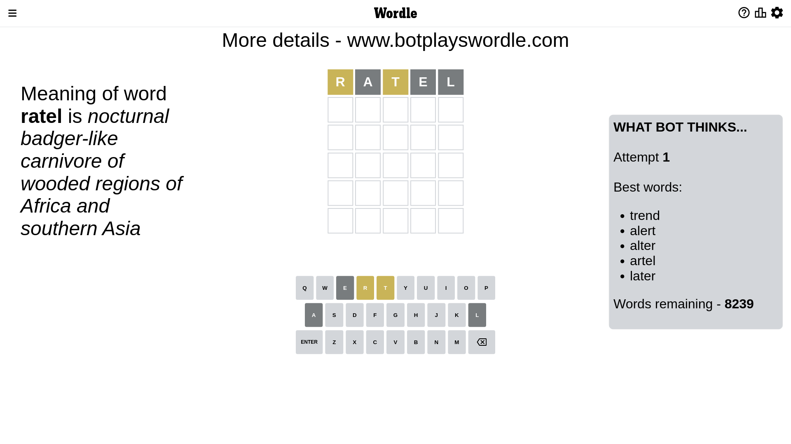
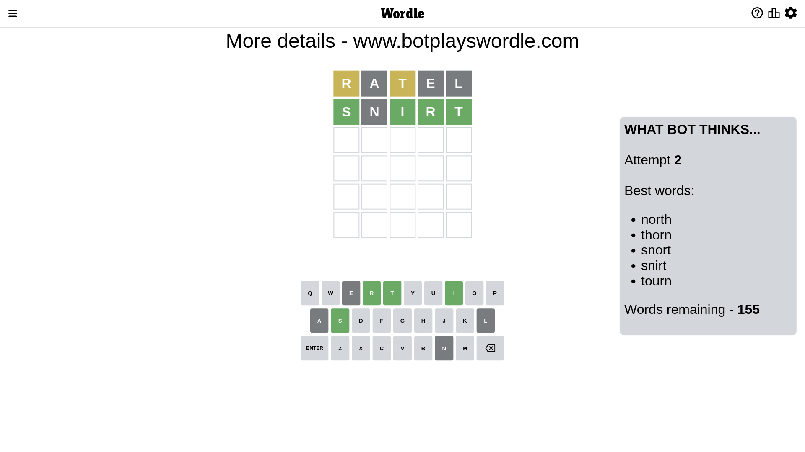
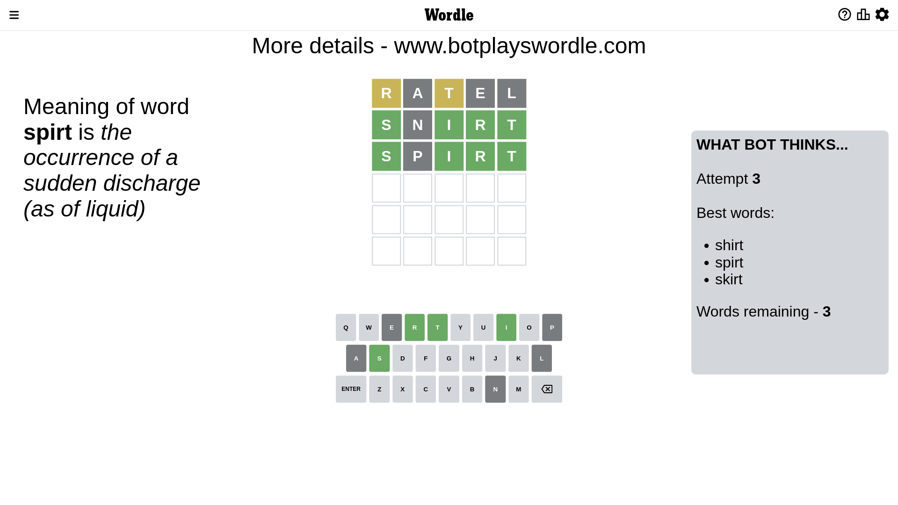
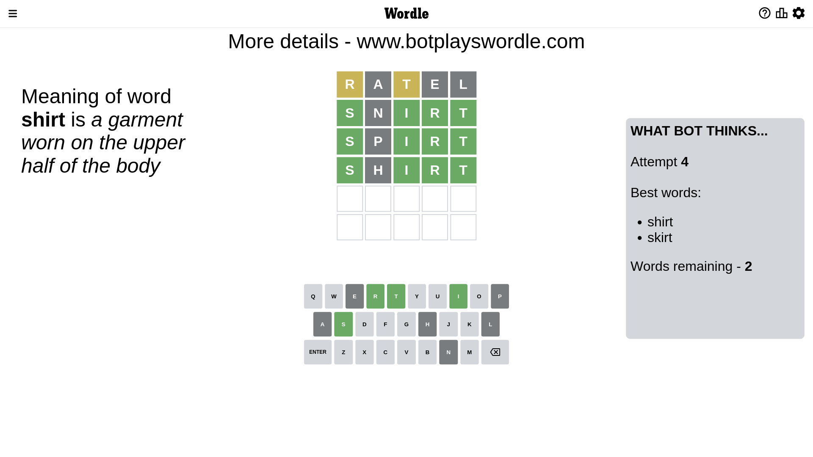
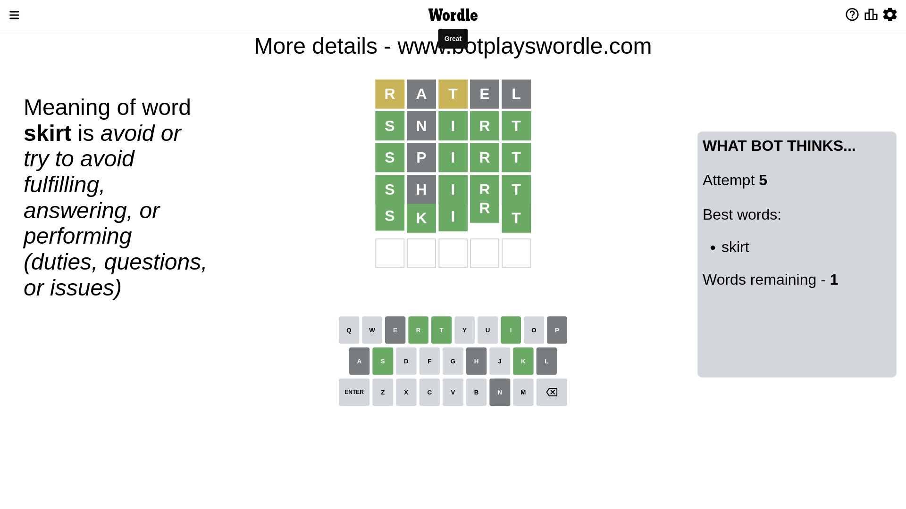

# Wordle for January 2, 2023 - \#562

## Attempt 1

This is the first attempt and we'll choose a random word to start with.

Let's start with word `ratel`

Attempt for `ratel` gives us 0 correct letters, 2 present letters and 3 wrong letters.

If we look into details, we can see that:

Letter `r` is on a different spot - this means that it cannot be at position 1

Letter `a` is not present in the word and we will not use it any more

Letter `t` is on a different spot - this means that it cannot be at position 3

Letter `e` is not present in the word and we will not use it any more

Letter `l` is not present in the word and we will not use it any more

Some letters are missing (like `a`, `e`, `l`) but it's also important piece of information

Word should contain letters `[r t]`

That was a great guess that limited number of remaining words

## Attempt 2

Right now we have 155 words to choose from and best of them seem to be `[north thorn snort snirt tourn]`

So far we know that possible letters are:

At position 1: `[b c d f g h i j k m n o p q s t u v w x y z]`

At position 2: `[b c d f g h i j k m n o p q r s t u v w x y z]`

At position 3: `[b c d f g h i j k m n o p q r s u v w x y z]`

At position 4: `[b c d f g h i j k m n o p q r s t u v w x y z]`

At position 5: `[b c d f g h i j k m n o p q r s t u v w x y z]`

Next guess is `snirt`, let's see what it gives us

Attempt for `snirt` gives us 4 correct letters, 0 present letters and 1 wrong letters.

If we look into details, we can see that:

Letter `s` should be at position 1

Letter `n` is not present in the word and we will not use it any more

Letter `i` should be at position 3

Letter `r` should be at position 4

Letter `t` should be at position 5

We got information about the correct letters and it should make next attempt easier

Some letters are missing (like `n`) but it's also important piece of information

Word should contain letters `[r t s i]`

That was a great guess that limited number of remaining words

## Attempt 3

Right now we have 3 words to choose from and best of them seem to be `[shirt spirt skirt]`

So far we know that possible letters are:

At position 1: `[s]`

At position 2: `[b c d f g h i j k m o p q r s t u v w x y z]`

At position 3: `[i]`

At position 4: `[r]`

At position 5: `[t]`

Next guess is `spirt`, let's see what it gives us

Attempt for `spirt` gives us 4 correct letters, 0 present letters and 1 wrong letters.

If we look into details, we can see that:

Letter `p` is not present in the word and we will not use it any more

Some letters are missing (like `p`) but it's also important piece of information

Word should contain letters `[r t s i]`

This was a waste, almost no valuable information...

## Attempt 4

Right now we have 2 words to choose from and best of them seem to be `[shirt skirt]`

So far we know that possible letters are:

At position 1: `[s]`

At position 2: `[b c d f g h i j k m o q r s t u v w x y z]`

At position 3: `[i]`

At position 4: `[r]`

At position 5: `[t]`

Next guess is `shirt`, let's see what it gives us

Attempt for `shirt` gives us 4 correct letters, 0 present letters and 1 wrong letters.

If we look into details, we can see that:

Letter `h` is not present in the word and we will not use it any more

Some letters are missing (like `h`) but it's also important piece of information

Word should contain letters `[r t s i]`

This was a waste, almost no valuable information...

## Attempt 5

Right now we have 1 words to choose from and best of them seem to be `[skirt]`

So far we know that possible letters are:

At position 1: `[s]`

At position 2: `[b c d f g i j k m o q r s t u v w x y z]`

At position 3: `[i]`

At position 4: `[r]`

At position 5: `[t]`

It must be `skirt`

That's the correct answer! The word is `skirt`!

## Conclusion

Today's word is `skirt` and it took 5 attempts to guess it

